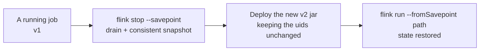
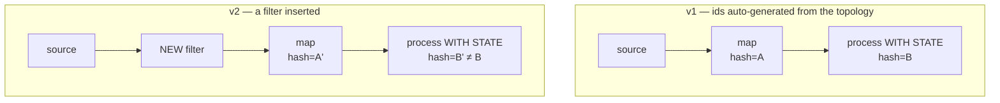
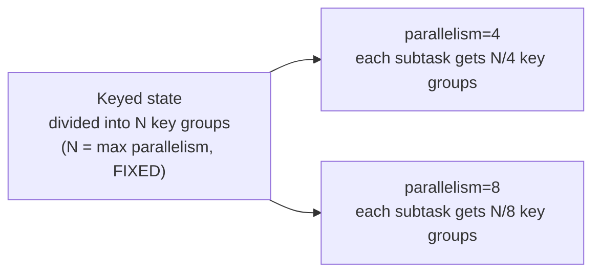

# Savepoints and upgrading a job

> **Takeaway:** to change streaming code without losing state, you need a **savepoint** plus a
> **fixed** `.uid("...")` on every stateful operator. Without a uid, Flink generates ids from the
> topology — change one thing and the whole state mapping breaks.

A streaming job keeps state alive for months. "Deploying a new version" without thinking about state
means throwing that state away, or the job refusing to start again.

## Savepoints vs checkpoints

| | Checkpoint | Savepoint |
|---|---|---|
| Who triggers it | Flink, automatically and periodically | A person, manually |
| Purpose | **Fault tolerance** — automatic recovery from a crash | **Upgrading / moving / A-B testing / archiving** |
| Lifecycle | Flink cleans old ones itself | You keep it until you don't need it |
| Format | Native (speed-optimised, can be incremental) | Canonical (portable) or native |
| Ownership / cleanup | Managed by Flink; deleted past the configured retain count | Managed by **you**; Flink never deletes it |
| Snapshot speed | Fast (incremental, close to the state backend's mechanism) | Slower (canonical has to normalise the format) |

Both use the same state-snapshot mechanism (see
[state and checkpoints](../reference/state-and-checkpoint.md)) but differ in **intent**.
Checkpoints let the machine save itself; savepoints let **you** intervene deliberately.

**Canonical vs native format:** a canonical savepoint is a state-backend-independent format —
snapshot with RocksDB and you can restore into the heap, and it's more durable across versions. Native format is faster
(close to the backend's mechanism) but binds you to the backend. For upgrading across versions or changing backend,
use canonical.

## The upgrade procedure



```bash
# 1) Dừng job, chụp savepoint trong một bước (drain + stop nhất quán)
flink stop --savepoint /savepoints/my-job <jobId>
#   -> in ra đường dẫn savepoint, ví dụ: /savepoints/my-job/savepoint-abc123-...

# 2) Deploy artifact code mới (jar mới), giữ nguyên uid các operator

# 3) Khởi động lại từ savepoint
flink run --fromSavepoint /savepoints/my-job/savepoint-abc123-... my-job-v2.jar
```

Use `flink stop --savepoint` rather than `cancel` followed by a snapshot — `stop` guarantees stopping at a
consistent point (it emits a final `MAX_WATERMARK` watermark to close every open window
before snapshotting, called a **drain**). Cancel-then-snapshot can leave state half-finished. (The exact
flags can differ between Flink versions — check with `flink --help`, don't trust your memory of a
flag.)

## Why every stateful operator needs a fixed `.uid()`

Flink stores state by **operator ID**. If you don't set a uid, it **generates the id from the operator's
position in the topology** (a hash of the graph structure — based on the operator chain and its
connections). The consequence:



- Add a `map` in the middle, swap two operators' order, or insert a filter → the generated id
  **changes** → the old savepoint can't find state for the "new" operator → **state lost**,
  or the job refuses to start because of unmatched state.

Setting the uid manually separates an operator's **identity** from its **position**:

```java
// Code minh hoạ, chưa chạy
stream
  .keyBy(e -> e.userId)
  .process(new DedupFunction())
  .uid("dedup-by-user")        // BẮT BUỘC trên MỌI operator có state
  .name("dedup");              // name chỉ để hiển thị UI, KHÔNG thay uid
```

The rule: set uids **from v1**, before there's state to lose. A uid is a stable string, and you should never
change it once it's in production — changing a uid is equivalent to deleting that operator's state.

### `allowNonRestoredState` — a double-edged sword

```bash
flink run --fromSavepoint <path> --allowNonRestoredState my-job.jar
```

This flag tells Flink: *"if state in the savepoint doesn't map to any operator, just drop it, don't
report an error"*. Useful when you **deliberately delete** an operator. Dangerous because it also **swallows uid
mistakes** — if you accidentally change a uid, the state that should have been restored is silently thrown away and the
job starts as if nothing happened. Only enable it when you *know for certain* which state is being dropped and why.

It only handles one direction: state in the savepoint with **no** operator to receive it. The reverse —
a new operator with **no** state in the savepoint — is always permitted (a new operator initialises
empty state), needing no flag.

## State schema evolution

State doesn't sit still when you change your data types:

| Serializer | Adding a field | Removing a field | Changing a type / renaming a field | Suitable for long-lived state? |
|---|---|---|---|---|
| **POJO** | OK (the new field gets its default) | OK (the dropped field is elided) | **Not** safe | Yes, with care |
| **Avro** | OK (a field with a default) | OK | Per Avro's rules, more durable than POJO | **The best** |
| **Kryo** | No | No | No | **Avoid** — treat it as non-evolvable |

- **POJO** — Flink supports adding/removing fields. Changing a field's type or renaming it must be handled
  by a manual migration.
- **Avro** — evolution per Avro's rules (adding a field with a default is OK, with aliases for renaming).
  The most durable for long-lived state.
- **Kryo** — treat it as **not** evolvable. Kryo serializes by internal ordering, so changing the class
  breaks it. Avoid Kryo for any state you intend to keep across an upgrade.

Choose Avro (or a carefully managed POJO) for state that must survive many deploys.

## Changing parallelism through a savepoint

You can change parallelism on restore, but you're bounded by the **max parallelism** (the fixed key-group
count set when the job first ran):



- Keyed state is divided into **key groups**; the key-group count = max parallelism, **fixed**
  from the first run and **not changeable** through a savepoint.
- Actual parallelism scales freely within `1..maxParallelism`.
- Set max parallelism large enough from the start (Flink picks it from the initial parallelism by default —
  if you know you'll scale up, set it higher by hand). Too small → later you can't scale up without
  creating fresh state from scratch. Too large → a little metadata overhead (usually
  acceptable), so lean towards being generous.

## The State Processor API — reading/editing a savepoint

When you need to **edit** the state in a savepoint (bootstrapping initial state, fixing corrupt data, reading
state to debug), use the State Processor API — it treats a savepoint as a dataset readable/writable by
a batch job.

```java
// Code minh hoạ, chưa chạy — đọc state của operator "dedup-by-user" ra để kiểm tra
SavepointReader sp = SavepointReader.read(env, savepointPath, new HashMapStateBackend());
DataStream<KeyedState> state = sp.readKeyedState("dedup-by-user", new MyReaderFunction());
```

This is the only route to **editing** state outside a running job — for example loading initial
state from a batch table before starting a streaming job for the first time.

## Common Mistakes

| Trap | Consequence |
|---|---|
| Not setting `.uid()` from v1 | The first refactor wipes all the state |
| Changing a running operator's uid | That operator's state is deleted, silently |
| Using `.name()` thinking it's the uid | name has no effect on state mapping |
| Enabling `allowNonRestoredState` routinely | It swallows uid mistakes and loses state without reporting |
| Kryo-typed state kept across an upgrade | It won't restore after the class changes |
| Leaving max parallelism at the default and later needing to scale big | Stuck, having to rebuild the state |
| `cancel` followed by a savepoint | Half-finished state, windows undrained |
| Not cleaning up old savepoints | Storage fills — Flink never deletes savepoints itself |

## FAQ

<details>
<summary>Do stateless operators (a plain map or filter) need uids?</summary>

Not required state-wise, but setting them everywhere for **consistency** is a good habit — it saves you
wondering which ones have state as the topology grows. The cost is zero.

</details>

<details>
<summary>Can a savepoint be reused across Flink versions?</summary>

Usually yes (savepoints use a portable canonical format), but always check the target version's
compatibility matrix before upgrading Flink — don't assume. Test on a staging
environment first, never jump straight to production.

</details>

<details>
<summary>Can I restore from a checkpoint, or only from a savepoint?</summary>

You can restore from a retained checkpoint (`flink run --fromSavepoint <checkpoint-path>` accepts a
checkpoint too), but checkpoints use the native format so they're more backend-bound and
Flink may clean them at any time. For a planned upgrade, take a savepoint deliberately —
you control its lifecycle.

</details>

## Related Topics

- [State and checkpoints](../reference/state-and-checkpoint.md) — the snapshot mechanism underneath
- [Backpressure and tuning](backpressure-tuning.md) — max parallelism and scaling
- [Case: state bloating for want of a TTL](../case-studies/state-phinh-thieu-ttl.md)
- [Skills — Flink](../index.md)
