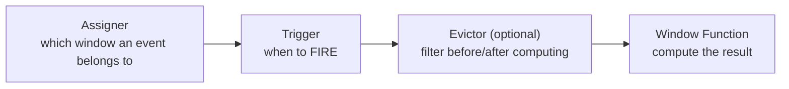
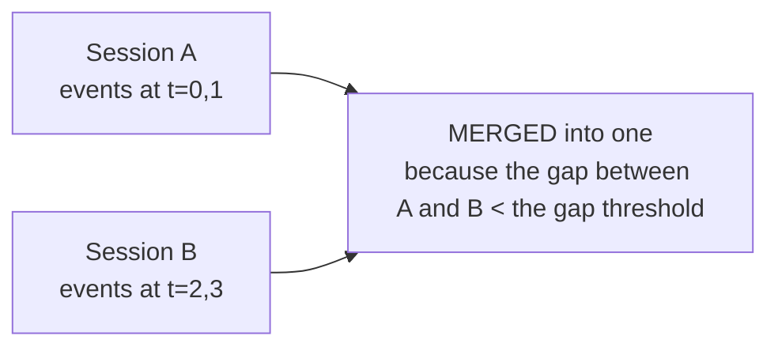

# Windows in Flink

> **Takeaway:** on an unbounded stream, every aggregation has to be cut into **windows**; choosing the window
> type chooses the *semantics*, while watermarks decide *when* a window closes. Get either wrong and the
> numbers come out quietly wrong.

A stream never ends, so a `COUNT` or `SUM` over "everything" is meaningless — you have to ask
"over what interval". Windows are the answer.

## The anatomy of a window: four components

A window operation isn't a monolith — it's a chain of four components, each replaceable
independently:



| Component | The question it answers | Default |
|---|---|---|
| **Assigner** | Which window(s) does this event fall into? | Determined by the window type you choose |
| **Trigger** | When does the window fire its result? | `EventTimeTrigger` — fires when the watermark passes the end edge |
| **Evictor** | Should elements be dropped before/after computing? | None (most don't need one) |
| **Window Function** | What to compute over the elements? | You provide it |

Understanding these four explains almost every "strange" window behaviour: a late result = the
trigger hasn't fired (the watermark hasn't arrived); a result being updated = the trigger firing several times (allowed
lateness); bloating state = the function buffering instead of aggregating incrementally.

## The three window types (assigners)

| Type | Definition | Overlapping | Use when |
|---|---|---|---|
| **Tumbling** | Fixed windows of `size`, no overlap | No | Reports on fixed minutes/hours |
| **Sliding (hop)** | `size` + `slide`; each event lands in several windows | Yes | "The last 5 minutes, updated every minute" |
| **Session** | Groups events, breaking after silence longer than `gap` | No, with a dynamic length | User sessions, activity sequences |

```mermaid
gantt
    title Assigner — the same event stream, three ways of cutting it
    dateFormat X
    axisFormat %s
    section Tumbling
    W1 :0, 4
    W2 :4, 4
    section Sliding size4 slide2
    S1 :0, 4
    S2 :2, 4
    S3 :4, 4
    section Session gap2
    P1 :0, 3
    P2 :6, 3
```



Sliding windows overlap, so **one event sits in several windows** → state and computation multiply
by `size/slide`. `size=1h, slide=1m` means each event belongs to 60 windows. This is the most common
state-bloat trap.

Each assigner has two variants: **event-time** (`TumblingEventTimeWindows`) and
**processing-time** (`TumblingProcessingTimeWindows`). Processing-time is fast and needs no
watermarks, but the numbers are **not reproducible** — re-running the same data gives a different result because it
depends on the wall clock. Use event time unless you genuinely only need "recently, by real
time" and accept being wrong when data arrives late.

## Triggers — when to fire

The default `EventTimeTrigger` fires **exactly once** when the watermark passes the window's end edge. You
can customise it to fire early (early firing — emitting a preliminary result before the window closes) or to fire
again (late firing — updating when a late event arrives).

```java
// Code minh hoạ, chưa chạy — fire sớm mỗi 10s để ra kết quả xấp xỉ, rồi fire chính khi đóng
stream.keyBy(...)
  .window(TumblingEventTimeWindows.of(Time.minutes(1)))
  .trigger(ContinuousEventTimeTrigger.of(Time.seconds(10)))
  .aggregate(new SumAgg());
```

The `allowedLateness` below is really **fitting an additional re-firing trigger**: after the window closes,
each late event arriving inside the lateness window makes the trigger fire once more, emitting an updated
result.

## Keyed vs non-keyed

- **Keyed windows** (`keyBy(...).window(...)`) — the window is computed **independently per key**,
  running in parallel across subtasks. This is the default you should use.
- **Non-keyed** (`windowAll(...)`) — the whole stream is merged into one flow, with **parallelism = 1**. It bottlenecks
  the moment traffic is high. Only for a small global total.

## Window functions: light vs heavy

| Kind | How it runs | Cost | Has context? |
|---|---|---|---|
| `ReduceFunction` | **Incremental** — merges two elements of the same type, keeping one value | The lightest | No |
| `AggregateFunction` | **Incremental** — its own accumulator, with in/out types differing | Light | No |
| `ProcessWindowFunction` | Buffers **all** the events until the window closes, then processes | Heavy, bloating state | Yes (`window_start`, key, timers, side outputs) |

`ReduceFunction` is the special case of `AggregateFunction` where the input, accumulator and output
are the same type (e.g. a numeric `SUM`). `AggregateFunction` is more flexible: the accumulator can be a
different struct (e.g. computing an average needs both `sum` and `count`).

Default to `AggregateFunction`. Only use `ProcessWindowFunction` when you need to see all the events or the
window's metadata. Best is to **combine them**: `AggregateFunction` merges
incrementally and the merged result goes into a `ProcessWindowFunction` to attach context — light and with
all the information you need.

```java
// Code minh hoạ, chưa chạy
// AggregateFunction gộp incremental (state chỉ là accumulator),
// ProcessWindowFunction nhận KẾT QUẢ gộp + context để gắn window_start / key
stream.keyBy(e -> e.key)
  .window(TumblingEventTimeWindows.of(Time.minutes(1)))
  .aggregate(new SumAgg(), new AttachWindowMeta());  // incremental + context
```

With a `ProcessWindowFunction` alone, Flink has to keep **every element** of the window
in state until it closes — a 1-hour window at high traffic easily OOMs. Combined, the state is just one
small accumulator.

## Watermarks decide when it closes

An **event-time window closes when the watermark passes the window's end edge** — not when the wall
clock reaches it. A late watermark means results come out slowly; a watermark advancing too fast (too small a
bound) means late-arriving events are treated as "late" and dropped. The mechanism is detailed in
[event time and watermarks](../reference/event-time-watermark.md) — read that before this file.

## Late data: allowedLateness and side outputs

The watermark has closed the window and an event still arrives (genuinely late). Two lines of defence:

```java
// Code minh hoạ, chưa chạy
stream.keyBy(...)
  .window(TumblingEventTimeWindows.of(Time.minutes(1)))
  .allowedLateness(Time.minutes(5))          // giữ state thêm 5' để cập nhật lại
  .sideOutputLateData(lateTag)               // muộn hơn cả thế → rẽ ra side output
  .aggregate(new SumAgg());

DataStream<Event> tooLate = result.getSideOutput(lateTag);  // hứng, log, reprocess
```

- `allowedLateness` — after the window closes, state is kept for this further period; a late event arriving
  makes the window **fire again**, emitting an updated result. The trade-off: state lives longer, and
  the downstream receives **several versions** for the same window — it must handle updates (upserting
  by `window_start` + key), not accumulate.
- `sideOutputLateData` — an event later than even allowedLateness isn't **silently dropped** but
  routed into a separate stream for you to count/log/handle later. Without it, too-late data disappears
  without a trace.

## Session window merging

Session windows are special because their length is **dynamic**: you don't know in advance when they'll close. When two
adjacent sessions are closer together than the `gap`, Flink **merges** them into one.



The consequence: a session window has to hold state to merge, and a `ReduceFunction`/`AggregateFunction`
used with sessions must be **mergeable** (a `merge` on the accumulator). This is why session windows
cost more state than tumbling ones — they can't fire-and-forget each element.

## Windows in Flink SQL — windowing TVFs

The modern (recommended) syntax is a **Table-Valued Function**: `TUMBLE`, `HOP`, `CUMULATE`,
`SESSION` wrapped around the table, adding `window_start`/`window_end` columns.

```sql
-- TUMBLE: cửa sổ cố định 1 phút
SELECT window_start, window_end, SUM(amount)
FROM TABLE(TUMBLE(TABLE orders, DESCRIPTOR(event_time), INTERVAL '1' MINUTE))
GROUP BY window_start, window_end;

-- HOP = sliding: size 10', slide 5'
FROM TABLE(HOP(TABLE orders, DESCRIPTOR(event_time), INTERVAL '5' MINUTE, INTERVAL '10' MINUTE))

-- CUMULATE: cửa sổ tích luỹ — bước 1', trần 1h (dùng cho "tổng từ đầu giờ tới giờ")
FROM TABLE(CUMULATE(TABLE orders, DESCRIPTOR(event_time), INTERVAL '1' MINUTE, INTERVAL '1' HOUR))

-- SESSION theo gap 30'
FROM TABLE(SESSION(TABLE orders PARTITION BY user_id, DESCRIPTOR(event_time), INTERVAL '30' MINUTE))
```

```text
Output minh hoạ, chưa chạy:
window_start          window_end            EXPR$2
2026-08-11 10:00:00   2026-08-11 10:01:00   1530.00
```

`CUMULATE` is a SQL type with no direct ready-made equivalent in the DataStream API: it emits
an incrementally accumulating result within a max window (e.g. "revenue accumulated since 00:00, updated
every minute") — perfect for an intraday dashboard.

## Common Mistakes

| Trap | Consequence | How to avoid it |
|---|---|---|
| Sliding with a large `size` and small `slide` | State multiplies `size/slide` times and bloats | Consider tumbling or a larger slide |
| Using **processing time** windows | Wrong numbers with late/uneven data, and no error reported | Event time + watermarks |
| `windowAll` for high traffic | Parallelism 1, a bottleneck | `keyBy` first |
| Forgetting `sideOutputLateData` | Too-late events dropped silently | Always catch the side output when the numbers must be right |
| `ProcessWindowFunction` for a large window | Buffering everything → OOM | Combine it with an `AggregateFunction` |
| A downstream that accumulates when a window re-fires | Double-counting because allowedLateness fires several times | Upsert by `window_start` + key |

## FAQ

<details>
<summary>Do sliding windows cause double-counting?</summary>

No — each window is its own result for its own time interval. An event *appearing*
in several windows is exactly the semantics of sliding ("every minute, compute the last 10 minutes").
The downstream needs to understand that it's receiving several overlapping windows, not one total.

</details>

<details>
<summary>How does a session window know when to close?</summary>

When there's no event for that key within the `gap` (measured by event time + the watermark). Two
adjacent sessions closer together than the gap are **merged** — so a session window
has to hold state to merge, and its length can't be predicted in advance.

</details>

<details>
<summary>What does the downstream receive when a trigger fires several times?</summary>

Several result versions for the same window (early firing or late firing). The downstream must
treat each version as "the latest result for this window" and overwrite by the `window_start` key, not
accumulate. With an append-only sink, the numbers multiply.

</details>

## Related Topics

- [Event time and watermarks](../reference/event-time-watermark.md) — what decides when a window closes
- [DataStream vs Table/SQL API](datastream-vs-table-sql.md) — windows in both APIs
- [Case: a window not firing because of an idle partition](../case-studies/cua-so-khong-chay-idle-partition.md)
- [Case: wrong numbers from processing time](../case-studies/so-sai-vi-processing-time.md)
- [Skills — Flink](../index.md)
