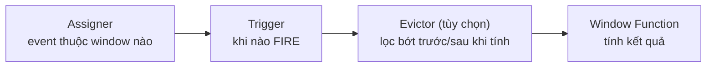
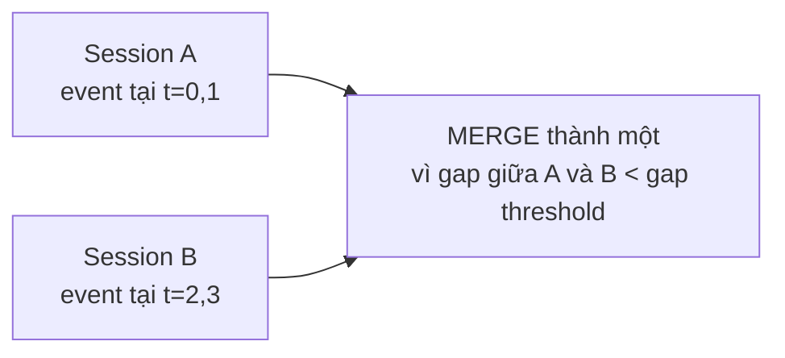

# Window trong Flink

> **Chốt:** Trên unbounded stream, mọi aggregation phải cắt thành **window**; chọn kiểu
> window là chọn *ngữ nghĩa*, còn watermark quyết định *khi nào* window đóng. Sai một
> trong hai thì số ra sai lặng lẽ.

Stream không bao giờ kết thúc, nên `COUNT` hay `SUM` "toàn bộ" là vô nghĩa — phải hỏi
"trong khoảng nào". Window là câu trả lời.

## Giải phẫu một window: bốn thành phần

Một window operation không phải một khối liền — nó là chuỗi bốn thành phần, mỗi cái thay
được độc lập:



| Thành phần | Trả lời câu hỏi | Mặc định |
|---|---|---|
| **Assigner** | Event này rơi vào (những) window nào? | Do kiểu window bạn chọn |
| **Trigger** | Khi nào window fire ra kết quả? | `EventTimeTrigger` — fire khi watermark vượt mép cuối |
| **Evictor** | Có bỏ bớt element trước/sau khi tính không? | Không có (đa số không cần) |
| **Window Function** | Tính gì trên các element? | Bạn cung cấp |

Hiểu bốn thành phần này giải thích được gần như mọi hành vi window "kỳ lạ": số ra chậm =
trigger chưa fire (watermark chưa tới); số cập nhật lại = trigger fire nhiều lần (allowed
lateness); state phình = function giữ buffer thay vì incremental.

## Ba kiểu window (assigner)

| Kiểu | Định nghĩa | Chồng lấn | Dùng khi |
|---|---|---|---|
| **Tumbling** | Cửa sổ cố định `size`, không chồng | Không | Báo cáo theo phút/giờ cố định |
| **Sliding (hop)** | `size` + `slide`; mỗi event vào nhiều cửa sổ | Có | "5 phút gần nhất, cập nhật mỗi phút" |
| **Session** | Nhóm event, ngắt khi im lặng quá `gap` | Không, độ dài động | Phiên người dùng, chuỗi hoạt động |

```mermaid
gantt
    title Assigner — cùng dòng event, ba cách cắt
    dateFormat X
    axisFormat %s
    section Tumbling
    W1 :0, 4
    W2 :4, 4
    section Sliding size4 slide2
    S1 :0, 4
    S2 :2, 4
    S3 :4, 4
    section Session gap2
    P1 :0, 3
    P2 :6, 3
```



Sliding chồng lấn nên **một event nằm trong nhiều window** → state và tính toán nhân lên
theo `size/slide`. `size=1h, slide=1m` nghĩa mỗi event thuộc 60 window. Đây là bẫy phình
state phổ biến nhất.

Mỗi assigner có hai biến thể: **event-time** (`TumblingEventTimeWindows`) và
**processing-time** (`TumblingProcessingTimeWindows`). Processing-time nhanh và không cần
watermark, nhưng số **không tái lập được** — chạy lại cùng dữ liệu cho kết quả khác vì
phụ thuộc đồng hồ tường. Dùng event-time trừ khi bạn thật sự chỉ cần "gần đây theo giờ
thực" và chấp nhận sai khi dữ liệu đến muộn.

## Trigger — khi nào fire

`EventTimeTrigger` mặc định fire **đúng một lần** khi watermark vượt mép cuối window. Bạn
custom được để fire sớm (early firing — ra kết quả sơ bộ trước khi window đóng) hoặc fire
lại (late firing — cập nhật khi event muộn tới).

```java
// Code minh hoạ, chưa chạy — fire sớm mỗi 10s để ra kết quả xấp xỉ, rồi fire chính khi đóng
stream.keyBy(...)
  .window(TumblingEventTimeWindows.of(Time.minutes(1)))
  .trigger(ContinuousEventTimeTrigger.of(Time.seconds(10)))
  .aggregate(new SumAgg());
```

`allowedLateness` bên dưới thực chất **lắp thêm trigger fire lại**: sau khi window đóng,
mỗi event muộn tới trong khoảng lateness làm trigger fire thêm một lần, phát bản kết quả
cập nhật.

## Keyed vs non-keyed

- **Keyed window** (`keyBy(...).window(...)`) — window tính **độc lập cho mỗi khoá**,
  chạy song song trên nhiều subtask. Đây là mặc định nên dùng.
- **Non-keyed** (`windowAll(...)`) — cả stream gộp một luồng, **parallelism = 1**. Nghẽn
  ngay khi lưu lượng lớn. Chỉ dùng cho tổng toàn cục nhỏ.

## Window function: nhẹ vs nặng

| Loại | Cách chạy | Chi phí | Có context? |
|---|---|---|---|
| `ReduceFunction` | **Incremental** — gộp hai element cùng kiểu, giữ một giá trị | Nhẹ nhất | Không |
| `AggregateFunction` | **Incremental** — accumulator riêng, in/out khác kiểu | Nhẹ | Không |
| `ProcessWindowFunction` | Giữ **cả buffer** event tới khi window đóng rồi mới xử | Nặng, phình state | Có (`window_start`, key, timer, side output) |

`ReduceFunction` là ca đặc biệt của `AggregateFunction` khi input, accumulator, output
cùng kiểu (ví dụ `SUM` số). `AggregateFunction` linh hoạt hơn: accumulator có thể là
struct khác (ví dụ tính trung bình cần giữ cả `sum` và `count`).

Mặc định chọn `AggregateFunction`. Chỉ khi cần thấy toàn bộ event hoặc metadata window
mới dùng `ProcessWindowFunction`. Tốt nhất là **kết hợp**: `AggregateFunction` gộp
incremental, kết quả gộp đưa vào `ProcessWindowFunction` để gắn context — vừa nhẹ vừa có
đủ thông tin.

```java
// Code minh hoạ, chưa chạy
// AggregateFunction gộp incremental (state chỉ là accumulator),
// ProcessWindowFunction nhận KẾT QUẢ gộp + context để gắn window_start / key
stream.keyBy(e -> e.key)
  .window(TumblingEventTimeWindows.of(Time.minutes(1)))
  .aggregate(new SumAgg(), new AttachWindowMeta());  // incremental + context
```

Nếu chỉ dùng `ProcessWindowFunction` một mình, Flink phải giữ **mọi element** của window
trong state tới lúc đóng — window 1 giờ traffic cao dễ OOM. Kết hợp thì state chỉ còn một
accumulator nhỏ.

## Watermark quyết định lúc đóng

Window **event-time đóng khi watermark vượt qua mép cuối window** — không phải khi đồng
hồ tường tới đó. Watermark trễ thì kết quả ra chậm; watermark nhảy quá nhanh (bound quá
nhỏ) thì event đến muộn bị coi là "muộn" và rớt. Chi tiết cơ chế ở
[event time và watermark](../reference/event-time-watermark.md) — đọc trước file này.

## Dữ liệu đến muộn: allowedLateness và side output

Watermark đã đóng window mà event vẫn tới (muộn thật). Hai tầng phòng thủ:

```java
// Code minh hoạ, chưa chạy
stream.keyBy(...)
  .window(TumblingEventTimeWindows.of(Time.minutes(1)))
  .allowedLateness(Time.minutes(5))          // giữ state thêm 5' để cập nhật lại
  .sideOutputLateData(lateTag)               // muộn hơn cả thế → rẽ ra side output
  .aggregate(new SumAgg());

DataStream<Event> tooLate = result.getSideOutput(lateTag);  // hứng, log, reprocess
```

- `allowedLateness` — sau khi window đóng vẫn giữ state thêm khoảng này; event muộn tới
  làm window **fire lại**, phát bản kết quả cập nhật. Đánh đổi: state sống lâu hơn, và
  downstream nhận **nhiều bản** cho cùng một window — phải xử lý được cập nhật (upsert
  theo `window_start` + key), không cộng dồn.
- `sideOutputLateData` — event muộn hơn cả allowedLateness không bị **âm thầm rớt** mà
  rẽ vào một stream riêng để bạn đếm/log/xử lý sau. Không có nó, dữ liệu quá muộn biến
  mất không dấu vết.

## Session window merge

Session window đặc biệt vì độ dài **động**: không biết trước khi nào đóng. Khi hai session
kề nhau mà khoảng cách nhỏ hơn `gap`, Flink **merge** chúng thành một.



Hệ quả: session window phải giữ state để gộp, và `ReduceFunction`/`AggregateFunction`
dùng với session phải **kết hợp được** (`merge` accumulator). Đây là lý do session window
tốn nhiều state hơn tumbling — nó không thể fire-and-forget từng element.

## Window trong Flink SQL — windowing TVF

Cú pháp hiện đại (khuyến nghị) là **Table-Valued Function**: `TUMBLE`, `HOP`, `CUMULATE`,
`SESSION` bọc quanh bảng, thêm cột `window_start`/`window_end`.

```sql
-- TUMBLE: cửa sổ cố định 1 phút
SELECT window_start, window_end, SUM(amount)
FROM TABLE(TUMBLE(TABLE orders, DESCRIPTOR(event_time), INTERVAL '1' MINUTE))
GROUP BY window_start, window_end;

-- HOP = sliding: size 10', slide 5'
FROM TABLE(HOP(TABLE orders, DESCRIPTOR(event_time), INTERVAL '5' MINUTE, INTERVAL '10' MINUTE))

-- CUMULATE: cửa sổ tích luỹ — bước 1', trần 1h (dùng cho "tổng từ đầu giờ tới giờ")
FROM TABLE(CUMULATE(TABLE orders, DESCRIPTOR(event_time), INTERVAL '1' MINUTE, INTERVAL '1' HOUR))

-- SESSION theo gap 30'
FROM TABLE(SESSION(TABLE orders PARTITION BY user_id, DESCRIPTOR(event_time), INTERVAL '30' MINUTE))
```

```text
Output minh hoạ, chưa chạy:
window_start          window_end            EXPR$2
2026-08-11 10:00:00   2026-08-11 10:01:00   1530.00
```

`CUMULATE` là kiểu SQL không có tương đương trực tiếp ở DataStream API dựng sẵn: nó phát
kết quả tích luỹ tăng dần trong một max window (ví dụ "doanh thu tích luỹ từ 00:00, cập
nhật mỗi phút") — rất hợp cho dashboard chạy trong ngày.

## Common Mistakes

| Bẫy | Hậu quả | Cách tránh |
|---|---|---|
| Sliding với `size` lớn, `slide` nhỏ | State nhân lên `size/slide` lần, phình | Cân nhắc tumbling hoặc slide lớn hơn |
| Dùng **processing time** window | Số sai khi dữ liệu đến muộn/không đều, không lỗi báo | Event time + watermark |
| `windowAll` cho lưu lượng lớn | Parallelism 1, nghẽn | `keyBy` trước |
| Quên `sideOutputLateData` | Event quá muộn rớt âm thầm | Luôn hứng side output khi số phải đúng |
| `ProcessWindowFunction` cho window lớn | Giữ cả buffer → OOM | Kết hợp với `AggregateFunction` |
| Downstream cộng dồn khi window fire lại | Đếm trùng do allowedLateness fire nhiều lần | Upsert theo `window_start` + key |

## FAQ

<details>
<summary>Sliding window có làm số bị đếm trùng không?</summary>

Không — mỗi window là một kết quả riêng cho một khoảng thời gian riêng. Một event *xuất
hiện* trong nhiều window là đúng ngữ nghĩa sliding ("mỗi phút, tính 10 phút gần nhất").
Downstream cần hiểu là nó nhận nhiều window chồng nhau, không phải một tổng.

</details>

<details>
<summary>Session window sao biết khi nào đóng?</summary>

Khi không có event nào của khoá đó trong `gap` (tính theo event time + watermark). Hai
session kề nhau mà khoảng cách nhỏ hơn gap sẽ được **merge** lại — nên session window
phải giữ state để gộp, không dự đoán được độ dài trước.

</details>

<details>
<summary>Trigger fire nhiều lần thì downstream nhận gì?</summary>

Nhiều bản kết quả cho cùng một window (early firing hoặc late firing). Downstream phải
coi mỗi bản là "kết quả mới nhất cho window này" và ghi đè theo khoá `window_start`, không
cộng dồn. Nếu sink append-only, số sẽ nhân lên.

</details>

## Related Topics

- [Event time và watermark](../reference/event-time-watermark.md) — cái quyết định lúc window đóng
- [DataStream vs Table/SQL API](datastream-vs-table-sql.md) — window ở hai API
- [Case: cửa sổ không chạy vì idle partition](../case-studies/cua-so-khong-chay-idle-partition.md)
- [Case: số sai vì processing time](../case-studies/so-sai-vi-processing-time.md)
- [Kỹ năng — Flink](../index.md)
