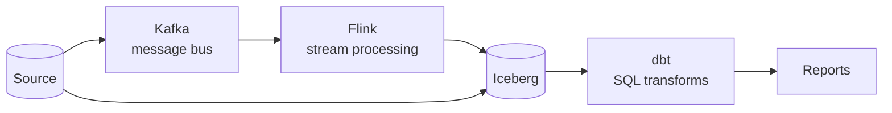

# ETL & Streaming

| Technology | Role | Status |
|---|---|---|
| [**dbt**](dbt/) | The **T** in ELT — SQL transforms with a DAG and tests | 🔄 learning |
| [Kafka](kafka/) | A message bus — a log, not a queue | ⬜ not started |
| [Flink](flink/) | Stateful stream processing, on event time | ⬜ not started |

**dbt before Kafka/Flink.** dbt is usable immediately with the SQL you already know, and
its mistakes are cheap. Kafka/Flink are distributed systems running continuously — one
wrong setting costs you an afternoon with no obvious suspect.

## Related Topics

- [Data Modeling](../data-modeling/) — design the tables before transforming
- [Iceberg](../storage/iceberg/) · [Trino](../query-engines/trino/) — where the data lands
