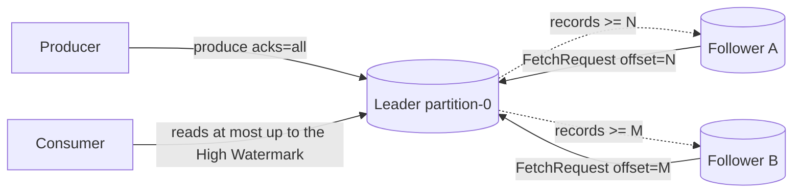

# Replication and durability

> **Takeaway:** durability doesn't come from one parameter but from the **pair** `acks=all` **and** `min.insync.replicas>=2` — missing either one, you still lose data when the leader dies at the wrong moment.

This is where people tend to think they're safe and aren't. `acks=1` sounds like "it's been confirmed", but it only confirms the **leader** wrote it — if the leader dies before a follower has copied it, that message evaporates without any error reaching the producer.

## Replication factor, leader, follower

Each partition is replicated into **replication factor (RF)** copies, placed on different brokers. Among those RF copies:

- One is the **leader** — serving **all** reads and writes for that partition.
- The rest are **followers** — only copying data from the leader, not serving clients (in the classic model).

Clients always talk to the leader. Followers continuously fetch from the leader to keep up. When the leader dies, a follower is elected as the new leader.

## The replication protocol: a follower is "a special kind of consumer"

What makes Kafka's replication surprisingly simple: **followers don't receive pushed data**, they **actively fetch** from the leader — using exactly the same mechanism as a consumer. Each follower's loop:

1. The follower sends a **`FetchRequest`** to the leader, carrying the offset it wants to read next (the offset of the record after the last one it has).
2. The leader returns the records from that offset onwards (or waits up to `replica.fetch.wait.max.ms` if there's nothing new — a long poll).
3. The follower writes those records into its own log, then loops back to fetch with a newer offset.

That offset in the `FetchRequest` is exactly how the leader **knows how far the follower has copied**: a follower fetching from offset `N` means it has every record `< N`. The leader stores, for each follower, its **`LogEndOffset` (LEO)** — the offset just after the last record that follower has confirmed having.



### High Watermark (HW) — the boundary of what consumers may read

The **High Watermark** is the highest offset copied to **every replica in the ISR**. Specifically: `HW = min(the LEO of every replica in the ISR)`. Two core consequences:

- **A consumer can only read records `< HW`.** A record written to the leader but not yet copied to every ISR member (sitting between the HW and the leader's LEO) is **invisible** to consumers — because if the leader died right then, that record might not exist on the new leader. Forbidding the read avoids consumers seeing data and then losing it.
- **The HW only advances once the ISR has caught up.** The leader pushes the HW up after it sees the smallest LEO in the ISR pass it. Followers learn the new HW via a field in the `FetchResponse` of their next fetch — so a follower's HW always trails the leader's by one round trip.

An illustrative numeric example (not run):

```text
Ví dụ minh hoạ — chưa chạy
Leader LEO = 105  (đã ghi tới offset 104)
Follower A LEO = 105  (bắt kịp)
Follower B LEO = 102  (tụt 3)
ISR = {Leader, A, B}
=> HW = min(105, 105, 102) = 102
=> Consumer đọc được tới offset 101; offset 102..104 còn "chưa an toàn", ẩn.
Khi B fetch xong tới 105 => HW nhảy lên 105 => consumer thấy tiếp 102..104.
```

## ISR — in-sync replicas

The **ISR** is the set of replicas currently **keeping up with** the leader (fetching within the `replica.lag.time.max.ms` window). The leader is always in the ISR. A follower that lags too long is **removed from the ISR**; catching up again gets it added back.

The ISR is the central concept of durability because the guarantees are expressed in terms of the ISR, not the RF. The RF is "how many copies exist"; the ISR is "how many copies are genuinely in sync *right now*".

### How the ISR is managed — `replica.lag.time.max.ms`

Kafka does **not** measure lag in messages (the old `replica.lag.max.messages` was dropped, because one produce burst made every follower falsely "lag"). It measures in **time**: a follower stays in the ISR if, within the last `replica.lag.time.max.ms`, it has **either** fetched up to the leader's LEO **or** kept sending fetches regularly and making progress. Specifically:

- A follower is **removed from the ISR** when `replica.lag.time.max.ms` passes without it fetching up to the leader's LEO as of the moment it started lagging (a slow broker, a long GC pause, network congestion, a slow disk).
- Once removed, the leader **shrinks the ISR** and records the change through the controller (metadata). The HW is recomputed over the remaining ISR only — so **removing a lagging follower can make the HW jump up**, because `min(LEO)` no longer counts the slow one.
- A follower **rejoins the ISR** when its fetches catch up to the leader's LEO again. The leader expands the ISR and records it through the controller.

| Config | Default | What it does | When to change it |
|---|---|---|---|
| `replica.lag.time.max.ms` | `30000` (default) | A follower lagging longer than this gets pushed out of the ISR | Increase it if the cluster has GC pauses/network jitter making the ISR flap; decrease it to detect a slow broker sooner |
| `replica.fetch.max.bytes` | broker default | The maximum size returned per partition on a follower fetch | Increase it with large messages so followers catch up faster |
| `num.replica.fetchers` | `1` (default) | The number of replication fetch threads per broker | Increase it when one broker is a follower of very many partitions and replication is the bottleneck |
| `replica.fetch.wait.max.ms` | broker default | Long poll: how long the leader waits at most when there's no new data for a follower | Rarely changed |

## Leader epoch — preventing a "diverging log" on leader change

This is the most subtle mechanism here, and the reason modern Kafka **no longer uses the HW to truncate** the way it once did.

### The problem: HW-based log truncation loses/skews data

The old mechanism (before KIP-101): when a follower came back and became leader, or an old leader came back as a follower, it would **truncate its log to its own HW** and re-fetch from there. The problem: a follower's HW always trails the leader's HW (as noted above). With several leader changes in a row, two replicas could **truncate to two different points** and then write different content at the same offset → a **diverging log**: the same offset `102` holds record `a` on replica X and record `b` on replica Y. That's silent data loss/corruption.

### The solution: leader epoch

Every time a new leader is elected, the controller issues a **leader epoch** — a monotonically increasing integer (epoch 0, 1, 2, …). The leader stamps the current epoch onto **every record batch** it writes. The result is that each replica holds a **leader-epoch file**: a map of `epoch -> the offset that epoch starts at`.

When a follower needs to know where to cut its log (after a leader change), it **no longer** uses the HW but asks the leader via **`OffsetsForLeaderEpoch`**:

1. The follower asks: "for my last leader epoch `E`, what is that epoch's end offset?"
2. The leader returns epoch `E`'s end offset **according to the leader's log**.
3. If the follower's log goes past that point (it has records belonging to epoch `E` that the leader doesn't), the follower **truncates exactly to the divergence point** — no more, no less.

The reconciliation scenario (illustrative — not run):

```text
Ví dụ minh hoạ — chưa chạy
Follower cũ (từng là leader epoch 5) có: ...offset 100(e5) 101(e5) 102(e5)
Leader mới (epoch 6) chỉ nhận được tới offset 101 trước khi lên làm leader:
   log leader: ...100(e5) 101(e5) 102(e6-new) 103(e6-new)
Follower hỏi OffsetsForLeaderEpoch(epoch=5) => leader trả 102 (epoch 5 kết ở offset 102, tức record cuối của e5 là 101).
Follower thấy nó có 102(e5) là "thừa" so với ranh giới => truncate offset 102 trở đi,
rồi fetch lại 102(e6-new), 103(e6-new) từ leader. Hai log hội tụ, không phân kỳ.
```

The crucial point: leader epochs let a follower know **exactly which record belongs to which branch of history**, rather than guessing blindly from a round-trip-stale HW.

## The controller and leader election

The **controller** is a broker holding the role of coordinating cluster metadata: tracking which brokers are alive/dead, managing the ISR, and **electing leaders** for partitions when the old leader dies.

- **With ZooKeeper (the old model):** the controller is a broker elected through ZK; it reads/writes partition state into ZK. When a broker dies, the controller notices through the expiry of its ZK session and then elects new leaders for every partition that broker led.
- **With KRaft (the new, ZK-free model):** cluster metadata lives in an internal **metadata topic** agreed on by a set of **controller nodes** using Raft. That controller quorum elects leaders and writes ISR changes into the metadata log. Dropping ZK makes leader election and metadata propagation much faster on large clusters.

### Preferred leader election

When a partition is created, the **first** replica in the assignment list is treated as the **preferred leader**. After rounds of failover, leadership can pile up on a few brokers (unbalanced load). **Preferred leader election** returns leadership to the preferred replica to spread it evenly. It can be automatic (`auto.leader.rebalance.enable=true`) or run by hand.

| Config | Default | What it does |
|---|---|---|
| `auto.leader.rebalance.enable` | `true` (default) | Periodically returns leadership to the preferred leader |
| `leader.imbalance.check.interval.seconds` | `300` (default) | How often leader imbalance is checked |
| `leader.imbalance.per.broker.percentage` | `10` (default) | The % imbalance threshold that triggers a rebalance |

### Rack awareness — `broker.rack`

Set `broker.rack` on each broker (the rack/AZ name). When spreading a partition's replicas, Kafka **tries to place replicas on different racks** — so losing a whole rack/AZ still leaves a live copy. Without rack awareness, even RF=3 can land entirely in one rack, and one rack incident loses the partition.

## The full matrix: `acks` × `min.insync.replicas` × RF

The pragmatic question: **"how many broker failures does this configuration survive while (a) losing no data, (b) still accepting writes?"** The table below is for RF=3 (illustrative numbers, not run — but following Kafka's semantics exactly):

| RF | acks | min.ISR | No data loss when | Still writable when | Comment |
|---|---|---|---|---|---|
| 3 | `all` | `2` | you lose at most 1 broker | you lose at most 1 broker | **The standard durable configuration** — balances durability/availability |
| 3 | `all` | `3` | you lose at most 2 brokers (data-wise) | you lose **0** brokers | The most durable for re-reading, but one broker in maintenance blocks writes immediately |
| 3 | `all` | `1` | **no** guarantee (an ISR shrunk to 1 = acks=1) | you lose at most 2 brokers | Fake durability — `min.ISR=1` nullifies `acks=all` |
| 3 | `1` | (any) | **no** — the leader dying in the gap loses data | you lose at most 2 brokers | min.ISR has no effect with acks=1 |
| 3 | `0` | (any) | **no** — free-form loss | always "writable" (no waiting) | Fire-and-forget |
| 2 | `all` | `2` | you lose at most 1 broker | you lose **0** brokers | One broker dying blocks writes — no safety margin |

The general rule: with `acks=all`, **the number of broker failures you survive while still writing = RF − min.ISR**, and **the number you survive without losing data = min.ISR − 1** (each record needs at least min.ISR copies). Pick RF=3, min.ISR=2 because it makes both sides 1 — losing one broker leaves you both writable and safe.

## The deciding pair: `acks=all` + `min.insync.replicas`

`min.insync.replicas` (short: **min.ISR**) is the minimum number of replicas in the ISR for a write with `acks=all` to be accepted. If the in-sync replica count drops below that threshold, a producer with `acks=all` gets an error (`NotEnoughReplicas`) — the write is refused rather than silently less durable.

**Why you need BOTH:**

- `acks=all` alone with `min.insync.replicas=1`: "all" here means "all replicas *in the ISR*". If the ISR shrinks to exactly 1 (the leader alone), then `acks=all` = waiting for exactly the leader to write = **identical to acks=1**. The leader dies right after → data lost. So `min.insync.replicas=1` makes `acks=all` meaningless durability-wise.
- `min.insync.replicas=2` alone with `acks=1`: the producer doesn't wait for 2 copies, only for the leader. `min.ISR` has no effect because it only blocks writes when `acks=all` is in use.

The typical durable configuration: **RF=3, `min.insync.replicas=2`, `acks=all`**. Meaning every write must be confirmed by the leader plus at least 1 follower; it survives 1 broker dying with neither data loss nor loss of writability.

```properties
# Cấu hình bền điển hình (giá trị minh hoạ mặc định phổ biến — kiểm trên cluster thật)
# broker / topic
replication.factor=3
min.insync.replicas=2
# producer
acks=all
enable.idempotence=true
```

## The acks × consequences table

| acks | The producer waits for | You get | The risk |
|---|---|---|---|
| `0` | nothing at all | the highest throughput, the lowest latency | free-form data loss — you don't know whether it arrived |
| `1` | the leader having written | speed | the leader dying before a follower copies → **data loss**, while the producer thinks it succeeded |
| `all` (`-1`) | every replica **in the ISR** having written | maximum durability | higher latency; and genuinely durable only with `min.insync.replicas>=2` |

See the [case study on losing data with acks=1](../case-studies/mat-du-lieu-acks-1.md) — exactly the scenario of the leader dying inside the replication gap.

## `unclean.leader.election.enable` — trading availability against data loss

When every replica in the ISR has died and one replica **outside the ISR** (lagging, missing the newest data) is still alive:

- `unclean.leader.election.enable=false` (recommended for durability): that stale replica is **not** elected leader. The partition goes **offline** until an in-sync replica returns. Choosing **consistency/durability** over availability.
- `unclean.leader.election.enable=true`: the stale replica is elected leader so the partition becomes **available** again immediately — but the messages that only existed on the dead in-sync replicas are **lost permanently** (truncated). Choosing **availability** over durability.

There's no free option here; this is CAP laid bare. A system that cares about not losing data leaves it `false` and accepts the partition being offline sometimes.

### The data-loss scenario step by step with `unclean=true`

Walk it slowly to see exactly where the messages evaporate (illustrative numbers — not run):

```text
Ví dụ minh hoạ — chưa chạy. RF=3: broker B1(leader), B2, B3. min.ISR=2, acks=all.

t0  ISR = {B1, B2, B3}. HW = 100.
t1  Producer ghi offset 100..149 với acks=all.
    B1 và B2 đã sao chép tới 149; B3 đang GC pause, tụt lại ở 100.
    HW = min(149,149,100)=100 ban đầu... B3 tụt quá replica.lag.time.max.ms
    => B3 bị loại khỏi ISR. ISR = {B1, B2}. HW nhảy lên 149.
    Producer nhận ack cho 100..149 (đủ 2 bản trong ISR).
t2  B2 chết (mất điện rack). ISR = {B1}. Vì min.ISR=2, mọi acks=all mới bị từ chối
    (NotEnoughReplicas) — nhưng 100..149 ĐÃ ack trước đó, coi như bền.
t3  B1 chết luôn. Giờ chỉ B3 còn sống — nhưng B3 chỉ có tới offset 100.
t4a unclean=false: partition OFFLINE. Chờ B1 hoặc B2 quay lại. 100..149 an toàn.
t4b unclean=true : B3 (lạc hậu, chỉ có tới 100) được bầu làm leader.
    Log mới bắt đầu ghi tiếp từ offset 101 với NỘI DUNG KHÁC.
    => offset 100..149 mà producer đã được ack coi như thành công GIỜ MẤT VĨNH VIỄN.
       Producer không hề biết. Consumer đã đọc 100..149 giờ thấy dữ liệu khác nếu đọc lại.
```

This is why `unclean.leader.election.enable=false` is the safe default: it would rather leave the partition offline than "swallow" messages that were already acknowledged.

## When you DON'T need maximum durability

- **Metrics/telemetry where losing a few records is fine**: `acks=1` or even `0` in exchange for throughput/latency is reasonable. Forcing `acks=all` + RF=3 on a high-frequency monitoring log pays a latency price for nothing.
- **Data reproducible from another source**: if it's lost you replay from the source, so maximum durability is redundant.

Don't default to "the most durable is always the best" — it costs real latency and throughput.

## Common Mistakes

| Mistake | Consequence | Prevented by |
|---|---|---|
| `acks=all` but `min.insync.replicas=1` | Fake durability — when the ISR shrinks to 1 it's identical to acks=1 | Setting `min.insync.replicas=2` with RF=3 |
| RF=2 + `min.insync.replicas=2` | One broker dying → writes stop (the ISR falls below the minimum) | RF=3, so you survive one broker dying and still write |
| Turning on `unclean.leader.election` to "reduce downtime" | Silent data loss when a stale leader is elected | Leaving it `false` if you care about durability |
| Thinking `acks=1` is "durable" | Losing messages when the leader dies in exactly the wrong gap | Understanding that acks=1 only confirms the leader |
| Not setting `broker.rack` | Even RF=3 lands in one rack, and losing the rack loses the partition | Setting `broker.rack` per AZ to spread replicas |
| `min.insync.replicas=3` with RF=3 | One broker in maintenance blocks all writes | Using min.ISR=2 unless you genuinely need more |

## FAQ

<details>
<summary>Why min.insync.replicas=2 with RF=3, not 3?</summary>

So you survive one broker dying and **still accept writes**. With min.ISR=3=RF, one broker in maintenance or down drops the ISR to 2 < 3 → every acks=all write is refused. min.ISR=2 gives a safety margin: lose one and you still write, with 2 copies enough to avoid data loss.

</details>

<details>
<summary>Do followers serve reads to take load off the leader?</summary>

In the classic model, no — the leader serves all reads/writes. There is a fetch-from-follower feature for rack/geography optimisation, but don't assume it's on; check the real cluster configuration before relying on it.

</details>

<details>
<summary>Can a consumer read a record the leader has written but the followers haven't copied yet?</summary>

No. Consumers only read up to the **High Watermark** — the offset copied to every replica in the ISR. Records between the HW and the leader's LEO (written to the leader, not fully copied) are invisible to consumers. That's so that if the leader dies, consumers never glimpse data and then lose it.

</details>

<details>
<summary>What does the leader epoch solve that the old HW truncation couldn't?</summary>

A follower's HW always trails the leader's by a round trip. Truncating by HW across several leader changes in a row can make two replicas cut their logs at different points and then write different content at the same offset — a diverging log. Leader epochs stamp an epoch number onto every batch, letting a follower ask `OffsetsForLeaderEpoch` and truncate **exactly to the divergence point** rather than guessing blindly from the HW.

</details>

## Related Topics

- [Delivery semantics](delivery-semantics.md) — the idempotent producer, acks in the EOS context
- [Topic, partition, offset](topic-partition-offset.md) — leader/follower per partition
- [Losing data with acks=1](../case-studies/mat-du-lieu-acks-1.md) — the leader-dies scenario
- [Producer tuning](../skills/producer-tuning.md) — tuning acks, idempotence, batching
- [Kafka](../index.md) — the parent topic
