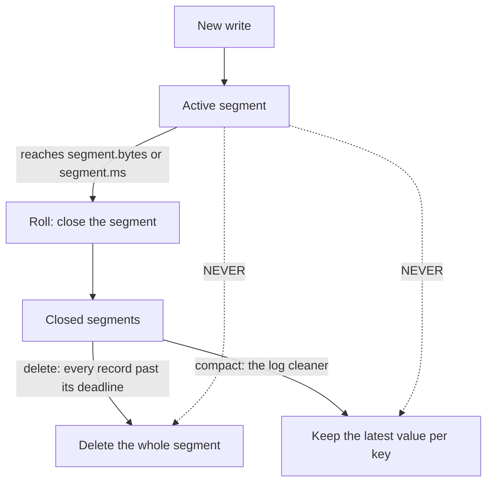

# Retention and log compaction

> **Takeaway:** `cleanup.policy=delete` cleans by **time/size** (deleting whole segments, never individual messages); `cleanup.policy=compact` keeps **the latest value per key** — choosing the wrong policy is choosing the wrong semantics for your data.

A log can't grow forever, so Kafka has to clean it. There are exactly two mechanisms, and they answer different questions: "how long is this data still needed?" (delete) vs "I only need the latest state of each entity" (compact).

## The segment lifecycle — the foundation of both mechanisms

Before you can understand retention or compaction you have to understand **segments**. Each partition isn't one enormous file but a chain of size-limited **segment files**. At any moment exactly **one** segment is the **active segment** — where all new writes are appended. The rest are **closed** and immutable.

```text
partition-0/
  00000000000000000000.log   <- segment đã đóng (base offset 0)
  00000000000000050000.log   <- segment đã đóng (base offset 50000)
  00000000000000097000.log   <- ACTIVE segment (đang append)  <== không bị xoá/compact
  ...cùng các file .index, .timeindex đi kèm
```

Segment **rolling** (closing the old one, opening a new one) happens when one of these conditions is met:

| Config | Default | What it does | When to change it |
|---|---|---|---|
| `segment.bytes` | `1073741824` (1 GiB, default) | The active segment reaching this size rolls to a new segment | Lower it for low-traffic topics so segments close sooner (only then can retention/compaction touch them) |
| `segment.ms` | `604800000` (7 days, default) | An active segment open longer than this rolls even when not full | Lower it when a topic writes slowly but needs cleaning sooner |

**The golden rule to remember:** both `delete` and `compact` **only touch closed segments**, never the active one. This is the root of almost every "why hasn't the data been deleted/compacted?".



## `cleanup.policy=delete` — cleaning by time/size

This is the default. Kafka deletes old data by:

- `retention.ms` — how long to keep messages (by time).
- `retention.bytes` — the maximum bytes to keep per partition (by size).

The crucial point about **how it deletes**: Kafka deletes by **segment**, never an individual message. A partition consists of several segment files; Kafka only deletes **a whole segment** when *every* message in it is past its deadline. Specifically, a closed segment qualifies for deletion when:

- **By time:** the timestamp of the **newest** record in the segment is older than `retention.ms`. Because it takes the newest record, the entire segment has to "ripen" before it's deleted.
- **By size:** the partition's total bytes exceed `retention.bytes`, and Kafka deletes the oldest segments (by base offset) until it's back under the threshold.

Which means:

- You **cannot** delete a single message by content.
- A message can live a little longer than `retention.ms` — until the whole segment containing it qualifies for deletion. So **`retention.ms` is a lower bound, not an exact one**: data lives *at least* that long, usually longer, until its segment closes and ripens.

An illustrative numeric example (not run):

```text
Ví dụ minh hoạ — chưa chạy. retention.ms = 3600000 (1 giờ). segment.ms = 24h.
- Record R ghi lúc 10:00, nằm trong active segment mở từ 09:00.
- Lúc 11:00 R đã "quá 1 giờ" nhưng active segment CHƯA roll (mở chưa đủ 24h/chưa đầy).
- Active segment không bị xoá => R vẫn còn, đọc được, dù đã quá retention.ms.
- Segment chỉ roll lúc 09:00 hôm sau (đủ segment.ms). Sau đó, khi record MỚI NHẤT
  trong segment đó quá 1 giờ, cả segment mới bị xoá.
=> R sống lâu hơn retention.ms rất nhiều. retention.ms là cận DƯỚI.
```

Use it for: event streams where you care about *history within a time window* — logs, clickstream, metrics.

## `cleanup.policy=compact` — keeping the latest value per key

Compaction keeps **the latest value for each key**, deleting older values of the same key. The result: the log becomes a "current state table" — for each key, the last record is the truth.

Use it for **"current state"** topics: CDC (changes from a DB), Kafka Streams changelogs, per-key configuration, table snapshots. You don't need a key's full history, only its current value — but you still want to replay the whole state from the start of the topic.

### How the log cleaner works — two passes

Compaction is performed by background **cleaner threads** (`log.cleaner.threads`). The cleaner doesn't compact a whole partition at once but picks the **dirtiest partition** to work on, based on the **dirty ratio**.

**Dirty ratio** = (the bytes in the "dirty" part, i.e. never compacted) / (the total compactable log bytes). The cleaner only touches a partition when this ratio exceeds `min.cleanable.dirty.ratio`. The idea: don't waste I/O compacting a log that's already nearly clean.

Once a partition is chosen, the cleaner makes **two passes** over the dirty part (the closed, not-yet-compacted segments):

1. **Pass 1 — build the offset map:** scan the entire dirty part, building an in-memory map of `key -> that key's latest offset`. This is the "truth": for each key, the largest offset is the value to keep. The map's size is bounded by `log.cleaner.dedupe.buffer.size` — if there are too many keys, the cleaner works in chunks.
2. **Pass 2 — copy, keeping the latest:** read the log sequentially again, writing out to a new segment **only** those records whose offset **matches** the offset in the map (i.e. that key's latest value). Older values are dropped. The new segment replaces the old one.

The result: the log after compaction still preserves **offset ordering**, and each key retains only its latest value within the compacted part.

| Config | Default | What it does | When to change it |
|---|---|---|---|
| `min.cleanable.dirty.ratio` | `0.5` (default) | The minimum dirty ratio for the cleaner to touch a partition | Lower it (e.g. 0.1) to compact more eagerly (duplicates disappear sooner, more I/O); raise it to ease the load |
| `min.compaction.lag.ms` | `0` (default) | A record must "live" at least this long before it may be compacted | Set it `>0` so slow consumers see every value before it's compacted away |
| `max.compaction.lag.ms` | very large (default ~`Long.MAX`) | An upper bound: a dirty record must be compacted within this window regardless of the dirty ratio | Set it to guarantee tombstones/new values are compacted within an SLA (e.g. data-deletion compliance) |
| `log.cleaner.threads` | `1` (default) | The number of cleaner threads per broker | Increase it with many large compacted partitions |
| `log.cleaner.dedupe.buffer.size` | broker default | The memory for the offset map | Increase it when each partition has very many distinct keys |

### A numeric example: before/after compaction

Illustrative numbers (not run) — a compacted topic storing account state by `user_id`:

```text
Ví dụ minh hoạ — chưa chạy. Log TRƯỚC compaction (offset : key -> value):
  0 : u1 -> {balance:100}
  1 : u2 -> {balance:50}
  2 : u1 -> {balance:120}
  3 : u3 -> {balance:0}
  4 : u2 -> {balance:75}
  5 : u1 -> {balance:120}     <- u1 mới nhất ở offset 5
  6 : u3 -> null              <- tombstone: xoá u3

Offset map sau lượt 1: { u1:5, u2:4, u3:6 }

Log SAU compaction (giữ bản mới nhất mỗi key; tombstone u3 giữ tạm):
  4 : u2 -> {balance:75}
  5 : u1 -> {balance:120}
  6 : u3 -> null             <- còn tới khi qua delete.retention.ms rồi mới biến mất

=> offset 0,1,2,3 (bản cũ của u1,u2 và bản có giá trị của u3) bị bỏ.
   Offset của record giữ lại KHÔNG đổi — vẫn là 4,5,6. Log có "lỗ" offset, điều bình thường.
```

**Tombstones** in detail: to **delete a key outright** from a compacted topic, write a message with `value=null` for that key — that's a tombstone. A consumer reading it understands "this key has been deleted". A tombstone is **not compacted away immediately** in the first compaction pass — it's kept for a further `delete.retention.ms` (24h by default) **after** compaction has processed it, and only then cleaned up. The vital reason: if the tombstone disappeared too early, a **long-offline consumer** coming back and reading from the start would **miss the deletion** — it would see the key's old values but not the tombstone, and think the key still exists. `delete.retention.ms` is the window guaranteeing every consumer sees the tombstone before it's cleaned up.

| Config | Default | What it does |
|---|---|---|
| `delete.retention.ms` | `86400000` (24h, default) | Keeps tombstones this long (after compaction has processed them) so consumers see the deletion in time |

## Compaction is a BACKGROUND process — the big trap

Compaction is **not immediate**. It runs in the background via the log cleaner, triggered by a threshold (`min.cleanable.dirty.ratio`). The consequences people trip over:

- **A key's old values still exist** on disk and are **still visible to consumers** until compaction has actually passed over them. Don't assume "once I write the new value, the old one disappears immediately". A consumer reading from the start of the topic may see several values for the same key.
- **The active segment is never compacted.** The segment being written to (active) is always left alone; compaction only touches closed segments. So the newest messages (including duplicate keys) sit there uncompacted until the segment closes.

The practical result: a compacted topic **does not guarantee exactly one value per key at all times** — it guarantees that it will *eventually* converge to the latest value. A compacted topic's consumers must cope with seeing several values for one key (apply them in order, later overwriting earlier). See the [case study on compaction not behaving as expected](../case-studies/compaction-khong-nhu-mong-doi.md).

## Combining `compact,delete`

Set `cleanup.policy=compact,delete` to compact by key *and* apply time-based retention. With both on, the **log cleaner** (compacting duplicate keys) and **retention** (deleting segments past `retention.ms`/`retention.bytes`) both run on the partition. Use it when you want the latest state per key **but** also want keys that haven't been updated in a long time cleaned up — avoiding a compacted topic bloating with millions of write-once-and-never-again keys living forever. The classic example: a changelog with finite-lifetime keys (sessions, temporary orders) you don't want to keep indefinitely even though they are the "latest value".

```properties
# Ví dụ minh hoạ, chưa chạy trên cluster:
# topic changelog dạng trạng thái, vừa nén vừa hết hạn key cũ
cleanup.policy=compact,delete
retention.ms=604800000      # 7 ngày — giá trị minh hoạ
delete.retention.ms=86400000
min.cleanable.dirty.ratio=0.5
```

## The changelog / state topic pattern — why compaction is mandatory

Compaction isn't a side feature; it's **the foundation of state in stream processing**.

- **Kafka Streams changelogs:** every state store (aggregation, join, KTable) is backed by a **compacted changelog topic**. When a task moves instance or restarts, it **replays the changelog** to rebuild the store. If that topic used `delete` instead of `compact`, a key's old updates would be deleted by time → the replay would produce **missing/wrong** state. Compaction guarantees that even after the topic has run for months, a replay from the start still gives the correct latest value for **every** live key. This is why Streams **sets `cleanup.policy=compact` itself** on changelogs.
- **CDC (Debezium, DB connectors):** a CDC topic keyed by primary key, with the latest row as the value. Compaction lets you keep "the table's current snapshot" without unbounded growth; a DELETE at the source emits a tombstone so the key disappears from the snapshot. A consumer rematerialising the table only has to read the compacted topic from the start.

The bottom line: if your topic is "current state, rebuildable by replay", it should almost always be `compact`.

## When NOT to use compaction

- **You need the full event history** (audit, complete event sourcing). Compaction deliberately throws old values away — using it loses history. Use `delete` with long retention, or archive to object storage.
- **Messages have no stable key.** Compaction is meaningless without a key to group by; messages with key=null aren't compacted (there's no key whose "latest value" to keep).
- **You expect immediate deletion.** If you need "deleted means gone right now", compaction (background, delayed) doesn't deliver.

## Trade-offs

| | `delete` | `compact` |
|---|---|---|
| Keeps | every message inside a time/size window | the latest value per key |
| Suits | event streams, logs, metrics | current state, CDC, changelogs |
| Individual deletes | no (by segment) | via a tombstone (by key) |
| Full history | yes (within retention) | no (only the latest value) |
| Immediate | deletes when the segment expires | background, not immediate |
| Unit of cleaning | a whole segment | duplicate-key records (keeping original offsets) |
| Needs a key | no | yes (key=null isn't compacted) |

## Common Mistakes

| Mistake | Consequence | Prevented by |
|---|---|---|
| Thinking compaction deletes old values immediately | Consumers see several values for one key, and the logic goes wrong | Writing consumers idempotent per key, accepting compaction is a background job |
| Using compact for a topic that needs full history | Silently losing event history | Using `delete` with long retention + archiving |
| Forgetting tombstones → keys are never deleted | The compacted topic bloats forever | Writing value=null to delete; considering `compact,delete` |
| Counting on "messages disappearing exactly at retention.ms" | Messages live on until the segment qualifies | Remembering deletion is by segment, not by message; retention.ms is a lower bound |
| `delete.retention.ms` too short | A long-offline consumer misses the tombstone → thinks the key is alive | Setting it long enough for the slowest consumer to read in time |
| Segments too large on a low-traffic topic | Retention/compaction "doesn't run" because the segment hasn't rolled | Lowering `segment.ms`/`segment.bytes` so segments close sooner |

## FAQ

<details>
<summary>Does a compacted topic lose data?</summary>

It never loses each key's *latest value* — that's exactly compaction's guarantee. It only throws away *older* values of the same key. If you need those old values, compaction isn't for you.

</details>

<details>
<summary>Why isn't the active segment compacted?</summary>

A segment being written to changes continuously; compacting it would be complicated and expensive. Kafka waits for the segment to close (enough size or enough time) before compacting. That's why the newest duplicate-key values stay visible for a while.

</details>

<details>
<summary>What is the dirty ratio, and why doesn't the cleaner compact immediately?</summary>

The dirty ratio is the proportion of the log "never yet compacted" over the total compactable part. The cleaner only touches a partition when that ratio exceeds `min.cleanable.dirty.ratio` (0.5 by default), so as not to waste I/O compacting a log that's already nearly clean. The consequence: a topic with few duplicate keys may go a long time before being compacted — which is normal.

</details>

<details>
<summary>Why doesn't a tombstone disappear right after compaction?</summary>

Because a long-offline consumer needs to see the tombstone to know the key was deleted. If tombstones were cleaned up immediately, that consumer replaying from the start would see the key's old value without the deletion → and think the key still exists. `delete.retention.ms` (24h by default) is the window keeping tombstones so every consumer sees them in time.

</details>

## Related Topics

- [What Kafka is](what-is-kafka.md) — why you can't delete individual messages by content
- [Delivery semantics](delivery-semantics.md) — compacted changelogs in EOS
- [Compaction not behaving as expected](../case-studies/compaction-khong-nhu-mong-doi.md) — the background/not-immediate trap
- [Kafka Connect CDC](../skills/kafka-connect-cdc.md) — the classic changelog data source
- [Kafka](../index.md) — the parent topic
