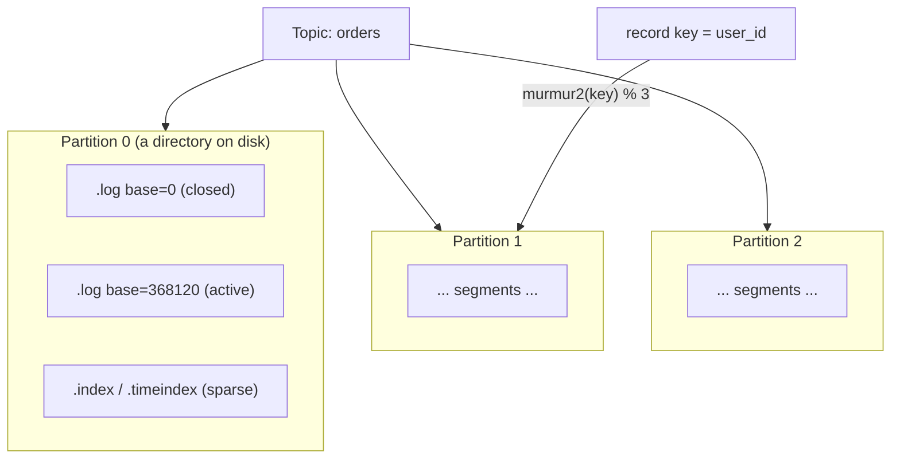

# Topic, partition, offset

> **Takeaway:** a partition is both the **unit of parallelism** and the **unit of ordering** — Kafka only guarantees ordering *within one partition*, never across partitions. On disk a partition is a chain of segments with a sparse index translating offsets into byte positions; to preserve ordering per entity you use a key, and increasing the partition count silently breaks the key→partition mapping.

This is Kafka's foundational model and also where most "why is the ordering all over the place" bugs come from. Understand these three concepts correctly and you understand 80% of Kafka.

## A topic splits into partitions

A **topic** is the logical name of a data stream. Physically the topic splits into several **partitions**, each partition being **one ordered, append-only log** living on a broker (and its replicas). Producers write to the end of a partition; each record gets an **offset** — a monotonically increasing integer, unique within that partition.

Because each partition is an independent log:

- **Parallelism**: N partitions allow up to N consumers in a group to process in parallel. This is how Kafka scales throughput.
- **Ordering**: Kafka **only** guarantees that reads follow write order **within the same partition**. Two messages in two different partitions — no guarantee at all about which came first.

Put differently: **parallelism and ordering are the same axis.** For more parallelism you add partitions, but the more partitions you have, the smaller the "unit of ordering" becomes.

## A partition on disk: segments, base offset, sparse index

A partition is **not** one enormous file. It's a directory holding a chain of **segments**, each segment consisting of three files with the same name (the name = the segment's base offset):

```text
topic-orders-3/                     ← partition 3 của topic "orders"
├── 00000000000000000000.log        ← dữ liệu record (base offset 0)
├── 00000000000000000000.index      ← offset → vị trí byte trong .log (THƯA)
├── 00000000000000000000.timeindex  ← timestamp → offset (THƯA)
├── 00000000000000368120.log        ← segment tiếp, base offset 368120
├── 00000000000000368120.index
├── 00000000000000368120.timeindex
└── ...
```

- **base offset**: the offset of the first record in the segment, and also the file name. Looking at the name tells you which offset range the segment covers.
- **`.log`**: holds record batches one after another.
- **`.index`** (the offset index): a **sparse** `relative offset → byte position` mapping. "Sparse" means it does **not** record every offset, only one entry per `index.interval.bytes` (4096 bytes by default) of data. In exchange the index is small and stays in the page cache.
- **`.timeindex`**: a sparse `timestamp → offset` mapping, serving time-based lookup (`offsetsForTimes`, "read from two hours ago").

### Looking up an offset through the sparse index

A consumer wants to read offset 368500 (say it's in the segment with base 368120). The mechanism:

1. **Pick the segment** by binary search over the file names (base offsets): 368500 falls between segment base 368120 and the next one → use segment 368120.
2. In that segment's `.index`, binary-search for the nearest entry **not exceeding** the relative offset `368500 - 368120 = 380`. The sparse index has no entry for exactly 380; it has, say, an entry for relative offset 352 → byte position 16480.
3. **Jump to byte 16480** in the `.log` and **scan sequentially** from there until it reaches offset 368500. Because that scan is at most `index.interval.bytes` long, the cost is tightly bounded.

That's the neat trick: a sparse index gives **near** O(log n) lookup while costing very little RAM/disk; the "near" is that short final linear scan.

### Active segment vs closed segments, and rolling

- **Active segment**: the last segment, where all new writes append. There's only one active segment per partition at a time.
- **Closed segments**: the earlier ones, immutable — read-only, and candidates for retention/compaction.

The active segment gets **closed (rolled)** and a new one opened when:

| Condition | Config | Common default |
|---|---|---|
| The segment is big enough | `segment.bytes` | 1 GiB |
| The segment is old enough | `segment.ms` | 7 days |

Retention (deleting by `retention.ms`/`retention.bytes`) and compaction only act on **closed segments** — the active segment is never deleted or compacted. This is why you sometimes see "data past retention that hasn't disappeared": it's still in an active segment that hasn't rolled.

## Kinds of offset: not just one number

Saying "offset" loosely hides several important offsets that exist simultaneously for one partition:

| Offset | Meaning | Who cares |
|---|---|---|
| **Log-end offset (LEO)** | The offset of the next record to be written (the end of the leader's log) | Producers |
| **High-watermark (HW)** | The highest offset **replicated to every ISR** — a `read_uncommitted` consumer can only read **below** the HW | Consumers, durability |
| **Last-stable-offset (LSO)** | The highest offset where **every transaction below it has ended** (committed/aborted) — a `read_committed` consumer only reads up to the LSO | Transactional consumers |
| **Committed offset** | The position a **consumer group** has finished processing (stored in `__consumer_offsets`) | Resuming, lag |

The core point: **a consumer usually cannot read all the way to the LEO.** With `read_uncommitted` it's capped at the HW (a record not yet sufficiently replicated hasn't "appeared" yet); with `read_committed` it's capped at the LSO (a record in an uncommitted transaction hasn't appeared yet). See [Delivery semantics](delivery-semantics.md) for the LSO and transactions.

**Leader epoch**: every time a partition changes leader, the epoch increments. Followers use the leader epoch to detect and truncate exactly the "ghost" records if they once followed an old leader that was lost — preventing log divergence when leadership bounces around. This replaces the older HW-based truncation mechanism, which had data-loss edge cases.

## An offset isn't a message counter

An easy mistake: if a topic is **compacted**, old values of a key get compacted away leaving **offset gaps** (offset 5 exists, offset 6 is compacted away, offset 7 exists). Offsets are still always **monotonically increasing** but **not contiguous**. Don't assume `offset = number of messages processed` or `lag = number of messages remaining` absolutely on a compacted topic.

## `__consumer_offsets`: where committed offsets live

Every consumer group's committed offsets are stored in a **compacted internal topic** named `__consumer_offsets` (50 partitions by default). It's compacted because we only need the **latest** value per `(group, topic, partition)`:

```text
key   = (group.id, topic, partition)
value = committed offset + metadata (leader epoch, timestamp, ...)
```

Compaction keeps the latest record per key → this topic doesn't grow without bound even when groups commit continuously. Because committed offsets are ordinary Kafka data in a topic, they're replicated and fault-tolerant like any other topic — no external store needed. (This is why offsets, once stored in ZooKeeper, have moved into Kafka itself.)

## The key decides the partition

When a producer sends a message with a **key**, Kafka picks the partition by hashing the key (the default algorithm is **murmur2**):

```text
partition = murmur2(key) % số_partition        # hành vi partitioner mặc định
```

More precisely: `toPositive(murmur2(serialized_key)) % numPartitions`. `toPositive` strips the sign. The crucial point: **same key → same partition → ordering preserved per entity.** For example, using `user_id` as the key puts all of a user's events in the same partition, guaranteeing they're processed in order for that user — even though ordering across the whole topic isn't guaranteed.

### A numeric example: 6 keys hashing into 3 partitions

Illustrative numbers — not run (the hash values are invented to illustrate the mechanism, not real murmur2 output):

```text
numPartitions = 3

key        murmur2(key) (minh hoạ)   % 3   → partition
"user-1"   1938472011                 → 0     p0
"user-2"   88213945                   → 1     p1
"user-3"   771230018                  → 2     p2
"user-4"   1120034877                 → 0     p0
"user-5"   455610232                  → 1     p1
"user-6"   9982110043                 → 1     p1     ← lệch: p1 nhận 3, p2 nhận 1
```

Two things to take away: (1) every "user-1" event **always** goes to p0 → ordering for user-1 is preserved; (2) the distribution is **not** perfectly even — with few keys it can skew (a hotspot). With millions of keys it evens out, but if a few keys are "hot" (one enormous seller) the partition holding it becomes a hotspot even with an even hash.

### Key = null → the sticky partitioner (KIP-480)

If the **key is null**: the default partitioner (in newer Kafka, KIP-480) uses **sticky partitioning** — it gathers a run of messages into **one partition** until the current batch is full/closed (`batch.size` or `linger.ms`), and only then **switches randomly** to another partition. Before KIP-480 it was round-robin **per message** → each partition got small batches, many requests, poor throughput.

What the sticky partitioner buys: **fuller batches → fewer requests → higher throughput and lower latency** at moderate load. What it loses: no key to anchor on → **no ordering guarantee per entity**. Over the long run the distribution across partitions is still even, because each switch is random.

## Diagram: topic → partitions → segments



## The big trap: increasing the partition count breaks the key→partition mapping

You **can** increase a topic's partition count (you can't decrease it). But `murmur2(key) % N` depends on `N`. Change `N` → the same key may map to a different partition. The **old** data stays in the old partition and **new** data with the same key lands in a new one → **ordering by key breaks at the moment of the reshard**.

For example: with 3 partitions, `user-42` always goes to p1. Increase to 4 partitions and `murmur2(user-42) % 4` may give p3. user-42's old events are in p1, its new ones in p3 → consumers process p1 and p3 independently, and user-42's overall ordering **breaks** right at the moment the partition count changed. Nothing reports an error. See the [case study on losing ordering by changing the key](../case-studies/mat-thu-tu-vi-doi-key.md).

### How to migrate when you're forced to "reshard"

Because increasing partitions in place breaks the semantics, the safe approach isn't to change the old topic but to **create a new topic with the right partition count and move over**:

1. **Create the new topic** `orders-v2` with the target partition count.
2. **Dual-write** (for a period): the producer writes to both `orders` and `orders-v2`, or **replay** all of `orders` into `orders-v2` with a copy job (MirrorMaker/Kafka Streams/Connect) — preserving the keys so the new mapping is consistent.
3. Let consumers catch up on `orders-v2` to the cutoff point.
4. **Cutover**: switch consumers to `orders-v2`, stop writing to `orders`, then retire it.

Accept that: during the replay/dual-write period, absolute ordering by key between old and new needs careful handling (usually you replay in old-partition order and make consumers idempotent). This is why **sizing partitions adequately from the start** is far cheaper than resharding later.

## Choosing the partition count

| You get (more partitions) | You lose | In exchange for |
|---|---|---|
| More parallelism, greater throughput | More files/segments → I/O overhead, open files, page cache spread thin | Operating cost |
| More consumers in a group | Slower rebalancing with many partitions | Recovery time |
| — | A smaller "unit of ordering" (overall ordering gets harder) | Ordering |
| — | Increasing it later breaks the key→partition mapping | Immutability |
| — | Each partition adds metadata at the controller | Cluster metadata pressure |

The pragmatic rule: choose enough partitions for the peak throughput you **expect over the topic's lifetime** from the start, because increasing it later is semantically expensive. A rough estimate: `partitions ≈ max(desired_throughput / throughput_per_consumer, desired_throughput / throughput_per_partition)`. Don't pick 100 partitions for a 10 msg/s topic — each partition is files, replicas, overhead.

## Common Mistakes

| Mistake | Consequence | Prevented by |
|---|---|---|
| Expecting ordering across a whole topic | Processing out of order across partitions | Accepting that ordering is only within a partition; using keys |
| Key = null but ordering per entity is needed | An entity's messages scatter across partitions | Setting the key per entity (`user_id`, `order_id`) |
| Increasing partitions on a topic that uses keys | Ordering by key silently breaks, with no error | Sizing adequately from the start; if forced to increase, create a new topic + replay/dual-write |
| Assuming offset = message count | Miscounting on a compacted topic (offset gaps) | Treating an offset as a position, not a counter |
| Thinking a consumer can read up to the LEO | Surprise that a new record "hasn't appeared" | Remembering the HW (read_uncommitted) and LSO (read_committed) cap reads |
| Few keys but many partitions, expecting evenness | A hotspot on a few partitions while the rest idle | Checking the key distribution; sizing partitions against key cardinality |

## FAQ

<details>
<summary>Should the number of consumers in a group equal the number of partitions?</summary>

The useful maximum = the partition count. More consumers than partitions and the surplus sit idle (each partition is served by only one consumer in the group). Fewer, and one consumer holds several partitions — it still works, just with less parallelism.

</details>

<details>
<summary>Can I write a custom partitioner?</summary>

Yes, write your own partitioner to control the mapping (e.g. keeping it stable when partitions are added, or avoiding hotspots). But in most cases the default murmur2 is enough, and rolling your own easily creates hotspots if the distribution skews.

</details>

<details>
<summary>Why is reading by offset fast even with billions of records in the log?</summary>

Thanks to the sparse index. Kafka binary-searches the segments by base offset (the file name), then binary-searches the `.index` to jump to an approximate byte position, then linearly scans a short stretch (at most `index.interval.bytes`) to the exact offset. Because the index is sparse it's small and fits comfortably in the page cache — offset lookup is near O(log n) at very little RAM cost.

</details>

## Related Topics

- [What Kafka is](what-is-kafka.md) — log vs queue, segments, page cache, zero-copy
- [Replication and durability](replication-durability.md) — each partition's leader/follower, ISR, high-watermark
- [Delivery semantics](delivery-semantics.md) — last-stable-offset, read_committed, PID + sequence
- [Losing ordering by changing the key](../case-studies/mat-thu-tu-vi-doi-key.md) — the key→partition trap in practice
- [Consumer groups](../skills/consumer-groups.md) — rebalancing, partition assignment
- [Kafka](../index.md) — the parent topic
