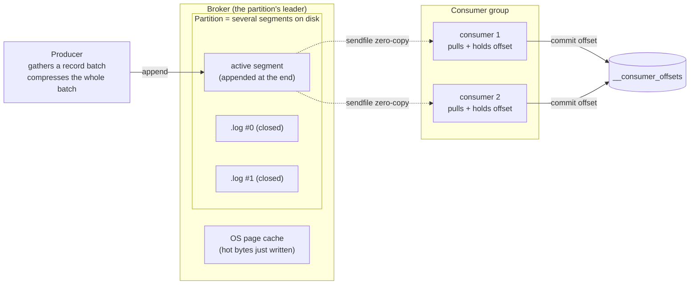

# What Kafka is

> **Takeaway:** Kafka is a **distributed append-only commit log** — not a message queue. Consumers hold their own offsets, the broker only appends to a file and pumps bytes out (dumb broker, smart consumer), so messages stay until retention expires, several consumers read independently, and throughput is high because of sequential I/O + zero-copy rather than magic.

The biggest mental trap coming from RabbitMQ/SQS: thinking Kafka is "a faster queue". It isn't. A traditional queue is a **destructive read** — the message leaves the queue when the consumer acks, and once read it's gone. Kafka is a **non-destructive read** — a consumer reads an offset and the data stays exactly where it is on disk. That one difference decides almost everything about how you design systems on Kafka.

## A log, not a queue

A Kafka topic is essentially one (or several) log files that only get appended to at the end (append-only). Every message written is assigned an **offset** — a monotonically increasing sequence number within the partition. The broker does **not** track who has read how far; the **consumer** stores its own offset (by default in the internal `__consumer_offsets` topic).

The direct consequences:

- **Several consumer groups read independently.** Group A is at offset 500 while group B is still at offset 20 — neither affects the other, because each holds its own offset. The same data serves several purposes: one group loads a data warehouse, another computes real-time metrics.
- **You can replay.** Want to reprocess from the beginning? Reset the offset to 0. With a traditional queue an acked message is gone; there's no "rewind".
- **Messages stay until retention expires**, not until somebody reads them. Retention is by default by time/size, not by consumption state.

## The log abstraction at the disk level: why Kafka is fast

This is the most-skipped part, yet it explains all of Kafka's performance characteristics. Kafka isn't fast because it's "written in optimised Scala" — it's fast because **its design hugs the way hardware likes to be used**.

### Segments: a partition is many files, not one file

Each partition on disk is a directory, split into several **segments**. The newest segment is the **active segment** — where all new writes land, always appended at the end. When the active segment gets big enough (`segment.bytes`, 1 GiB by default) or old enough (`segment.ms`), it's **closed** (rolled) and a new segment opens. Each segment consists of `.log` (data), `.index` (offset → byte position, sparse), and `.timeindex` (timestamp → offset). The details of this structure are in [Topic, partition, offset](topic-partition-offset.md).

Splitting into segments is what makes **deletion cheap**: when retention expires Kafka `unlink`s the whole segment file — an O(1) operation, not a scan through every message to delete it.

### Sequential I/O beats random I/O

Because a write is always an append to the end of the active segment, the disk only does **sequential writes**. On both HDDs and SSDs, sequential write throughput is tens to hundreds of times higher than random writes. Kafka turns "write a message" into "append to a file" — the operation the OS and the disk are most optimised for.

### Page cache instead of heap cache

Kafka does **not** cache messages in the JVM heap itself. It writes to a file and lets the **OS page cache** do the buffering. Data just written is still hot in the page cache; a consumer reading near the head of the log usually reads straight from RAM without touching disk. The benefit: the cache lives outside the heap → no GC pressure, and it isn't lost when the broker restarts (the page cache belongs to the OS). This is why Kafka brokers are usually configured with a modest heap (a few GB) yet use hundreds of GB of the machine's RAM — most of that RAM is page cache.

### Zero-copy `sendfile`: the broker never touches the payload

When a consumer reads, the broker calls `sendfile(2)`: the data goes straight from the **page cache → the network socket** inside the kernel, with **no** copy through user space and **no** message parsing. The ordinary path (without zero-copy) is: disk → kernel buffer → user buffer (app) → socket buffer → NIC — four copies and two context switches. `sendfile` cuts it to: page cache → NIC. The broker **doesn't decode the message** to send it — it only knows "send Y bytes starting at position X".

This is exactly what **"dumb broker, smart consumer"** means: the broker is *deliberately* stupid — it doesn't understand the schema, doesn't filter, doesn't route by content, doesn't transform. All the logic (deserialise, filter, join, aggregate) sits in the consumer. In exchange the broker is cheap, fast and easy to scale. Compared with RabbitMQ (a smart broker: routing by header, priority, per-message TTL) — Kafka pushes the smart part to the client.

The precondition for zero-copy to work: the message's on-disk format = the format sent over the wire. Kafka is designed exactly that way. But turn on **TLS**, or force the **broker to re-compress/decompress** (compression incompatible between the producer and the topic configuration), and the broker has to touch the payload in user space → **zero-copy is lost**. This is a real hidden cost of TLS on Kafka.

## The anatomy of a record batch

A producer does **not** send messages one at a time; it gathers them into a **record batch** before pushing. The unit of compression and the unit of transfer is the batch, not the message. The structure (v2 format, at the conceptual level):

```text
RecordBatch (được nén như một khối)
├── baseOffset          offset của record đầu batch
├── batchLength
├── partitionLeaderEpoch
├── magic (=2), CRC, attributes (mã nén: none/gzip/snappy/lz4/zstd)
├── lastOffsetDelta, baseTimestamp, maxTimestamp
├── producerId (PID), producerEpoch, baseSequence   ← nền của idempotence/transaction
└── Records[]
    └── Record
        ├── length, attributes
        ├── timestampDelta, offsetDelta   ← lưu delta so với base → tiết kiệm byte
        ├── key (bytes, có thể null)
        ├── value (bytes)
        └── headers[]  (key-value tuỳ ý, ví dụ trace-id, schema-id)
```

A few points worth remembering:

- **Compression is at batch level**, not message level. Many similar messages in one batch compress very well (JSON with repeated field names). The bigger the batch, the better the compression → a higher `linger.ms` trades latency for compression + throughput.
- **timestamps/offsets are stored as deltas** relative to the batch's base → a significant byte saving.
- **headers** carry metadata (trace context, schema id, content-type) without stuffing it into the value.
- `producerId`, `producerEpoch`, `baseSequence` sit right in the batch header — this is where the idempotent producer and transaction mechanisms hook in. See [Delivery semantics](delivery-semantics.md).

## Cluster architecture

- **Broker**: one Kafka server, holding partition data on disk and serving reads/writes. Each partition has one broker as its **leader** (taking all reads/writes) with other brokers holding **follower replicas**.
- **Cluster**: several brokers; partitions are distributed and replicated across brokers for fault tolerance. See [Replication and durability](replication-durability.md).
- **Controller**: a special role in the cluster, managing metadata — which brokers are alive, who leads each partition, and electing a new leader when one dies. Only one controller is active at a time.

### KRaft vs ZooKeeper

| | ZooKeeper (legacy) | KRaft |
|---|---|---|
| Cluster metadata storage | A separate ZooKeeper cluster, outside Kafka | Inside Kafka itself, an internal **metadata log** |
| Controller election | Via ZooKeeper | A **controller quorum** using Raft, electing a leader within the quorum |
| Systems to operate | Two (Kafka + ZooKeeper) | One (Kafka only) |
| Metadata propagation to brokers | Brokers watch ZooKeeper | Brokers read the metadata log like a topic (offset-based) |
| Controller recovery time | Slower (loading state from ZK) | Faster (metadata is already a log) |
| Status | Being phased out | The standard direction for new clusters |

KRaft (Kafka Raft) folds metadata management into Kafka itself: cluster metadata becomes an **event log** agreed on by a few "controller" nodes through the **Raft** algorithm (a quorum, usually 3 or 5 nodes). Brokers no longer watch ZooKeeper but **tail the metadata log** — the same log model Kafka uses for data. Dropping a stateful system you had to operate separately is a big operability win.

ZooKeeper is **legacy**; new projects should aim at KRaft. (Check the real version/mode with a command on your own cluster before asserting anything — don't guess the mode name or version.)

## Why consumers PULL rather than PUSH

Kafka has the **consumer actively pull** data from the broker (calling `fetch`), rather than the broker pushing to the consumer. That choice is deliberate:

- **Natural backpressure.** A slow consumer pulls slowly; the broker doesn't push faster than the consumer can process. In a push model a slow consumer gets flooded into overload (or the broker needs complex buffering/flow control).
- **Each consumer sets its own pace.** Every consumer reads as far as it can manage; a fast group and a slow group reading the same topic don't affect each other — each pulls at its own rate and keeps its own offset.
- **Efficient batching.** A consumer can pull a whole large batch in one fetch, optimising throughput, instead of the broker deciding how much to coalesce for a push.
- **Replay and rewind are simple.** Because the consumer decides which offset to read, "re-read from offset X" is just a fetch from X — the broker needn't keep any send state.

The downside of pull: with no data available the consumer has to poll repeatedly → wasteful. Kafka solves this with a **long poll**: a fetch can wait (`fetch.max.wait.ms`) until there's enough data (`fetch.min.bytes`) before returning, avoiding a busy loop.

## The overall flow: producer → broker → consumer group



The producer gathers a batch and compresses it, appending to the partition's active segment (through the leader broker). The bytes sit in the page cache. Consumers in the group **pull** data — the broker pumps the bytes straight out through `sendfile` without parsing. Each consumer commits its own offset to `__consumer_offsets`. The broker doesn't know whether a consumer "finished processing" — it only appends and pumps bytes.

## Compared with other message systems

| | Kafka | RabbitMQ | Apache Pulsar | AWS Kinesis |
|---|---|---|---|---|
| Model | Distributed commit log | Queue/broker (AMQP) | Log, compute/storage separated (BookKeeper) | Managed log (shards) |
| Storage | A log on the broker's disk, in segments | In-memory + disk, deleted on ack | Split: broker (compute) + BookKeeper (storage) | Managed, kept per retention |
| A read is | Non-destructive (holds an offset) | Destructive (acking loses it) | Non-destructive (a cursor) | Non-destructive (an iterator) |
| Ordering | Within a partition | Within a queue (weak with several consumers) | Within a partition | Within a shard |
| Retention | By time/size, replayable | Until acked (with a TTL) | By policy, tiered storage | Commonly a short default limit, extendable |
| Unit of scale | Partition | Queue/consumer | Partition (rebalancing is cheaper thanks to separated storage) | Shard (manual resharding) |
| Strength | Throughput, replay, a big ecosystem | Flexible routing, priority, RPC | Multi-tenancy, geo-replication, tiered storage | Not having to operate it yourself (managed) |
| Weakness | No priority, no deleting individual messages | Lower throughput, no historical replay | A smaller ecosystem/talent pool | Locked into AWS, manual resharding |

Short version: **Kafka** for high-throughput event streaming plus the ecosystem (Connect, Streams, Flink). **RabbitMQ** for task/job routing, priority, request-reply. **Pulsar** when you need heavy multi-tenancy and separated storage/compute (scaling independently). **Kinesis** when you want it fully managed inside AWS and accept trading operability for vendor lock-in.

## When NOT to use Kafka

- **You need synchronous RPC request/reply.** Kafka is one-way fire-and-forget; bolting request/reply onto it is a struggle — use gRPC/HTTP.
- **Small data, low throughput.** A few hundred messages a day isn't worth the operating cost of a cluster + replication + monitoring. A lightweight queue (SQS, Redis, RabbitMQ) or even a DB table is enough.
- **You need a priority queue or extremely low per-message latency.** Kafka has no priority queue; its latency is optimised for batched throughput, not for single-message tail latency.
- **You need to delete an individual message by content** (e.g. GDPR "delete user X's records"). Kafka deletes by **segment**, not by individual message. On a compacted topic you can write a tombstone per key, but that isn't arbitrary content-based deletion. If deleting individual records is a regular requirement, Kafka doesn't fit.

## Trade-offs

| You get | You lose | In exchange for |
|---|---|---|
| Replay, several independent consumers | No simple destructive read | Consumers must manage offsets themselves |
| Very high throughput (sequential I/O + zero-copy) | Per-message latency isn't a strength | Batching + throughput |
| A cheap, easily scaled broker (dumb broker) | No content-based filtering/routing at the broker | All logic pushed onto consumers |
| Long-term storage as a source of truth | No deleting individual messages by content | Retention/compaction by segment/key |
| Ordering within a partition | No ordering across a whole topic | Parallelism by partition |

## Common Mistakes

| Mistake | Consequence | Prevented by |
|---|---|---|
| Treating Kafka as a queue, expecting messages to "disappear after being read" | Surprise that the data is still there, unintended replay | Understanding that consumers hold the offset; clean up with retention/compaction |
| Giving the broker a huge JVM heap | Long GC pauses and wasted RAM — Kafka relies on the page cache, not the heap | A modest heap, leaving most RAM for the page cache |
| Turning on TLS then being surprised that throughput drops | TLS breaks zero-copy `sendfile` (the broker has to touch the payload) | Anticipating the cost; weighing TLS against throughput |
| Using Kafka for request/reply | A strained architecture, hard to debug | Using gRPC/HTTP for synchronous calls |
| Standing up a cluster for tiny throughput | Operating cost > value | Using a lightweight queue until you genuinely need more |
| Expecting to delete an individual user's records | A compliance requirement violated | Designing compaction by key + tombstones, or choosing a different technology |

## FAQ

<details>
<summary>Can Kafka replace a database?</summary>

Not as a direct replacement. Kafka is a log of events, not a store for arbitrary indexed queries. The usual approach is to use Kafka as an event-shaped "source of truth" and then materialise the state into a queryable store (a DB, a search engine).

</details>

<details>
<summary>How long do messages stay?</summary>

Until retention expires (the default is usually measured in time or size — treat that as a *common default* and check the real configuration on your own topic), or until compaction keeps only the latest value per key. Not "until somebody reads them".

</details>

<details>
<summary>What does "dumb broker, smart consumer" mean?</summary>

The broker is deliberately simple: it only appends bytes and pumps bytes out (`sendfile`), understanding no schema, doing no filtering, no content-based routing, no transformation. All logic (deserialise, filter, join, aggregate) sits in the consumer/stream processor. In exchange the broker is cheap and scales well. The opposite of RabbitMQ, where the broker is "smart" (routing by header, priority, TTL) but heavier.

</details>

<details>
<summary>Why doesn't a Kafka broker need much heap RAM?</summary>

Because it caches data in the **OS page cache**, not the JVM heap. The page cache lives outside the heap (causing no GC), survives a broker restart, and consumers reading near the head of the log usually hit the cache — reading from RAM rather than disk. So a broker machine can have a few GB of heap yet use hundreds of GB of RAM for page cache.

</details>

## Related Topics

- [Topic, partition, offset](topic-partition-offset.md) — the unit of parallelism and of ordering, the segment structure on disk
- [Retention and log compaction](retention-compaction.md) — the two ways of cleaning the log
- [Replication and durability](replication-durability.md) — leader/follower, ISR, acks
- [Delivery semantics](delivery-semantics.md) — at-most/at-least/exactly-once, PID + sequence
- [Kafka](../index.md) — the parent topic
