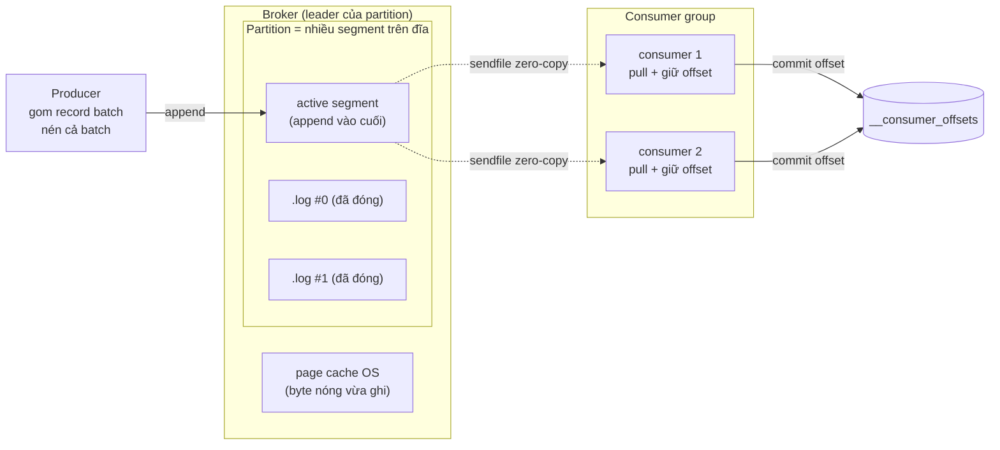

# Kafka là gì

> **Chốt:** Kafka là một **distributed append-only commit log** — không phải message queue. Consumer tự giữ offset, broker chỉ append vào file và bơm byte đi (dumb broker, smart consumer), nên message ở lại tới khi hết retention, nhiều consumer đọc độc lập, và throughput cao vì sequential I/O + zero-copy chứ không phải vì magic.

Cái bẫy tư duy lớn nhất khi đến từ RabbitMQ/SQS: nghĩ Kafka là "một cái hàng đợi nhanh hơn". Nó không phải. Một queue truyền thống là **destructive read** — message rời hàng khi consumer ack, đọc xong là mất. Kafka là **non-destructive read** — consumer đọc một offset, dữ liệu vẫn nằm nguyên trên đĩa. Chính khác biệt này quyết định gần như mọi thứ về cách bạn thiết kế hệ thống trên Kafka.

## Log, không phải queue

Một topic Kafka về bản chất là một (hoặc nhiều) file log chỉ ghi thêm vào cuối (append-only). Mỗi message ghi vào được cấp một **offset** — số thứ tự tăng đơn điệu trong partition. Broker **không** theo dõi ai đã đọc tới đâu; **consumer** tự lưu offset của mình (mặc định trong topic nội bộ `__consumer_offsets`).

Hệ quả trực tiếp:

- **Nhiều consumer group đọc độc lập.** Group A đọc tới offset 500, group B mới ở offset 20 — hai bên không ảnh hưởng nhau vì mỗi bên giữ offset riêng. Cùng một dữ liệu phục vụ nhiều mục đích: một group đổ vào data warehouse, một group tính real-time metrics.
- **Replay được.** Muốn xử lý lại từ đầu? Đặt lại offset về 0. Với queue truyền thống, message đã ack là biến mất, không có "tua lại".
- **Message ở lại tới khi hết retention**, không phải tới khi có người đọc. Retention mặc định là theo thời gian/dung lượng, không theo trạng thái consume.

## Trừu tượng log ở mức đĩa: vì sao Kafka nhanh

Đây là phần bị bỏ qua nhiều nhất nhưng lại giải thích toàn bộ đặc tính hiệu năng của Kafka. Kafka không nhanh vì nó "viết bằng Scala tối ưu" — nó nhanh vì **thiết kế bám sát cách phần cứng thích được dùng**.

### Segment: một partition là nhiều file, không phải một file

Mỗi partition trên đĩa là một thư mục, chia thành nhiều **segment**. Segment mới nhất là **active segment** — nơi mọi ghi mới rơi vào, luôn là append vào cuối. Khi active segment đủ lớn (`segment.bytes`, mặc định 1 GiB) hoặc đủ già (`segment.ms`), nó được **đóng** (roll) và một segment mới mở ra. Mỗi segment gồm `.log` (dữ liệu), `.index` (offset → vị trí byte, thưa), `.timeindex` (timestamp → offset). Chi tiết cấu trúc này ở [Topic, partition, offset](topic-partition-offset.md).

Chia segment là điều kiện để **xoá rẻ**: hết retention thì Kafka `unlink` cả file segment — một thao tác O(1), không phải quét từng message để xoá.

### Sequential I/O đánh bại random I/O

Vì ghi luôn là append vào cuối active segment, đĩa chỉ làm **sequential write**. Với cả HDD lẫn SSD, throughput ghi tuần tự cao hơn ghi ngẫu nhiên hàng chục tới hàng trăm lần. Kafka biến "ghi message" thành "append vào file" — thao tác mà OS và đĩa được tối ưu nhất.

### Page cache thay vì heap cache

Kafka **không** tự cache message trong heap JVM. Nó ghi vào file và để **page cache của OS** làm bộ nhớ đệm. Dữ liệu vừa ghi còn nóng trong page cache; consumer đọc gần đầu log thường đọc thẳng từ RAM, không chạm đĩa. Lợi ích: bộ nhớ đệm sống ngoài heap → không gây GC pressure, không mất khi broker restart (page cache thuộc OS). Đây là lý do broker Kafka thường cấu hình heap khiêm tốn (vài GB) nhưng dùng cả trăm GB RAM của máy — phần lớn RAM là page cache.

### Zero-copy `sendfile`: broker không đụng vào payload

Khi consumer đọc, broker gọi `sendfile(2)`: dữ liệu đi thẳng từ **page cache → network socket** trong kernel, **không** copy qua user space, **không** parse message. Đường thường (không zero-copy) là: đĩa → kernel buffer → user buffer (app) → socket buffer → NIC — bốn lần copy, hai lần chuyển context. `sendfile` cắt còn: page cache → NIC. Broker **không giải mã message** để gửi đi — nó chỉ biết "gửi khoảng byte từ vị trí X dài Y".

Đây chính là ý **"dumb broker, smart consumer"**: broker cố tình *ngu* — không hiểu schema, không lọc, không route theo nội dung, không transform. Mọi logic (deserialize, filter, join, aggregate) nằm ở consumer. Đổi lại broker rẻ, nhanh, dễ scale. So với RabbitMQ (broker thông minh: route theo header, priority, TTL per-message) — Kafka đẩy phần thông minh sang client.

Điều kiện để zero-copy hoạt động: format trên đĩa của message = format truyền trên mạng. Kafka thiết kế đúng vậy. Nhưng nếu bật **TLS** hoặc **broker phải nén/giải nén lại** (compression không tương thích giữa producer và cấu hình topic), broker buộc phải chạm payload trong user space → **mất zero-copy**. Đây là một chi phí ẩn thật của TLS trên Kafka.

## Giải phẫu một record batch

Producer **không** gửi từng message riêng lẻ mà gom thành **record batch** rồi mới đẩy đi. Đơn vị nén và đơn vị truyền là batch, không phải message. Cấu trúc (v2 format, mức khái niệm):

```text
RecordBatch (được nén như một khối)
├── baseOffset          offset của record đầu batch
├── batchLength
├── partitionLeaderEpoch
├── magic (=2), CRC, attributes (mã nén: none/gzip/snappy/lz4/zstd)
├── lastOffsetDelta, baseTimestamp, maxTimestamp
├── producerId (PID), producerEpoch, baseSequence   ← nền của idempotence/transaction
└── Records[]
    └── Record
        ├── length, attributes
        ├── timestampDelta, offsetDelta   ← lưu delta so với base → tiết kiệm byte
        ├── key (bytes, có thể null)
        ├── value (bytes)
        └── headers[]  (key-value tuỳ ý, ví dụ trace-id, schema-id)
```

Vài điểm đáng nhớ:

- **Nén ở mức batch**, không phải mức message. Nhiều message giống nhau trong một batch nén rất tốt (JSON lặp field). Batch càng lớn, nén càng lợi → `linger.ms` cao hơn đánh đổi latency lấy compression + throughput.
- **timestamp/offset lưu dạng delta** so với base của batch → tiết kiệm byte đáng kể.
- **headers** cho metadata (trace context, schema id, content-type) mà không nhét vào value.
- `producerId`, `producerEpoch`, `baseSequence` nằm ngay ở header batch — đây là nơi cơ chế idempotent producer và transaction bám vào. Xem [Delivery semantics](delivery-semantics.md).

## Kiến trúc cluster

- **Broker**: một server Kafka, giữ dữ liệu partition trên đĩa, phục vụ read/write. Mỗi partition có một broker làm **leader** (nhận mọi read/write) và các broker khác giữ **follower replica**.
- **Cluster**: nhiều broker; partition được phân tán và nhân bản (replicate) qua các broker để chịu lỗi. Xem [Replication và độ bền](replication-durability.md).
- **Controller**: một vai trò đặc biệt trong cluster, quản lý metadata — broker nào sống, ai là leader của mỗi partition, khi leader chết thì bầu leader mới. Chỉ một controller active tại một thời điểm.

### KRaft vs ZooKeeper

| | ZooKeeper (legacy) | KRaft |
|---|---|---|
| Lưu metadata cluster | Cluster ZooKeeper riêng, tách khỏi Kafka | Ngay trong Kafka, một **metadata log** nội bộ |
| Bầu controller | Qua ZooKeeper | **Controller quorum** dùng Raft, bầu leader trong quorum |
| Số hệ thống phải vận hành | Hai (Kafka + ZooKeeper) | Một (chỉ Kafka) |
| Metadata truyền tới broker | Broker watch ZooKeeper | Broker đọc metadata log như đọc một topic (offset-based) |
| Thời gian phục hồi controller | Chậm hơn (load state từ ZK) | Nhanh hơn (metadata đã ở dạng log) |
| Trạng thái | Đang bị loại bỏ dần | Hướng chuẩn cho cluster mới |

KRaft (Kafka Raft) gộp quản lý metadata vào chính Kafka: metadata cluster trở thành một **event log** được vài node "controller" đồng thuận qua thuật toán **Raft** (một quorum, thường 3 hoặc 5 node). Broker không còn watch ZooKeeper mà **tail metadata log** — cùng một mô hình log mà Kafka dùng cho dữ liệu. Bỏ được một hệ thống stateful phải vận hành riêng là thắng lợi lớn về operability.

ZooKeeper là **legacy**; dự án mới nên nhắm KRaft. (Kiểm phiên bản/chế độ thật bằng lệnh trên cluster của bạn trước khi khẳng định — đừng đoán tên mode hay version.)

## Vì sao consumer PULL, không PUSH

Kafka để **consumer chủ động pull** dữ liệu từ broker (gọi `fetch`), không phải broker push tới consumer. Lựa chọn này có chủ đích:

- **Backpressure tự nhiên.** Consumer chậm thì pull chậm; broker không đẩy quá tốc độ consumer xử lý được. Với mô hình push, một consumer chậm sẽ bị dồn message tới quá tải (hoặc broker phải giữ buffer/flow-control phức tạp).
- **Consumer tự nhịp.** Mỗi consumer đọc tới đâu tuỳ khả năng của nó; một group nhanh và một group chậm cùng đọc một topic không ảnh hưởng nhau — vì mỗi bên tự pull theo tốc độ riêng và giữ offset riêng.
- **Batch hiệu quả.** Consumer pull được cả một batch lớn trong một lần fetch, tối ưu throughput, thay vì broker phải quyết định gộp bao nhiêu để push.
- **Replay và tua lại đơn giản.** Vì consumer quyết định đọc offset nào, "đọc lại từ offset X" chỉ là fetch từ X — không cần broker giữ trạng thái gửi.

Nhược điểm của pull: khi không có dữ liệu, consumer phải poll lặp → lãng phí. Kafka giải bằng **long poll**: fetch có thể chờ (`fetch.max.wait.ms`) tới khi có đủ dữ liệu (`fetch.min.bytes`) mới trả về, tránh busy-loop.

## Luồng tổng: producer → broker → consumer group



Producer gom batch và nén, append vào active segment của partition (qua leader broker). Byte nằm trong page cache. Consumer trong group **pull** dữ liệu — broker bơm thẳng byte qua `sendfile` không parse. Mỗi consumer commit offset của mình vào `__consumer_offsets`. Broker không biết consumer "đã xử lý xong" hay chưa — nó chỉ append và bơm byte.

## So sánh với các message system khác

| | Kafka | RabbitMQ | Apache Pulsar | AWS Kinesis |
|---|---|---|---|---|
| Mô hình | Distributed commit log | Queue/broker (AMQP) | Log, tách compute/storage (BookKeeper) | Managed log (shard) |
| Lưu trữ | Log trên đĩa broker, segment | In-memory + đĩa, xoá khi ack | Tách: broker (compute) + BookKeeper (storage) | Managed, giữ theo retention |
| Đọc là | Non-destructive (giữ offset) | Destructive (ack là mất) | Non-destructive (cursor) | Non-destructive (iterator) |
| Ordering | Trong partition | Trong queue (yếu khi có nhiều consumer) | Trong partition | Trong shard |
| Retention | Theo time/size, replay được | Tới khi ack (có TTL) | Theo policy, tiered storage | Mặc định phổ biến giới hạn ngắn, mở rộng được |
| Scale đơn vị | Partition | Queue/consumer | Partition (rebalance rẻ hơn nhờ tách storage) | Shard (phải resharding thủ công) |
| Điểm mạnh | Throughput, replay, ecosystem lớn | Routing linh hoạt, priority, RPC | Multi-tenancy, geo-replication, tiered storage | Không phải tự vận hành (managed) |
| Điểm yếu | Không priority, không xoá message lẻ | Throughput thấp hơn, không replay lịch sử | Ecosystem/nhân lực ít hơn | Khoá vào AWS, resharding thủ công |

Rút gọn: **Kafka** cho event streaming throughput cao + ecosystem (Connect, Streams, Flink). **RabbitMQ** cho task/job routing, priority, request-reply. **Pulsar** khi cần multi-tenancy nặng và tách storage/compute (scale độc lập). **Kinesis** khi muốn managed hoàn toàn trong AWS và chấp nhận đánh đổi vận hành lấy khoá vendor.

## Khi nào KHÔNG nên dùng Kafka

- **Cần RPC request/reply đồng bộ.** Kafka là fire-and-forget một chiều; ghép request/reply lên nó là gồng, dùng gRPC/HTTP.
- **Dữ liệu nhỏ, throughput thấp.** Vài trăm message/ngày không đáng chi phí vận hành cluster + replication + monitoring. Một hàng đợi nhẹ (SQS, Redis, RabbitMQ) hoặc thậm chí một bảng DB là đủ.
- **Cần hàng đợi ưu tiên hoặc độ trễ cực thấp per-message.** Kafka không có priority queue; latency tối ưu cho throughput theo batch, không cho single-message tail latency.
- **Cần xoá một message lẻ theo nội dung** (ví dụ GDPR "xoá bản ghi của user X"). Kafka xoá theo **segment**, không xoá message đơn. Với compacted topic có thể ghi tombstone theo key, nhưng đó không phải xoá tuỳ ý theo nội dung. Nếu quyền xoá lẻ là bắt buộc thường xuyên, Kafka không hợp.

## Trade-offs

| Được | Mất | Đổi lấy |
|---|---|---|
| Replay, nhiều consumer độc lập | Không có destructive read đơn giản | Consumer phải tự quản offset |
| Throughput rất cao (sequential I/O + zero-copy) | Latency per-message không phải điểm mạnh | Batch + throughput |
| Broker rẻ, dễ scale (dumb broker) | Không lọc/route theo nội dung ở broker | Logic dồn hết sang consumer |
| Lưu trữ lâu dài như source of truth | Không xoá message lẻ theo nội dung | Retention/compaction theo segment/key |
| Ordering trong partition | Không ordering toàn topic | Song song hoá theo partition |

## Common Mistakes

| Lỗi | Hậu quả | Phòng bằng |
|---|---|---|
| Coi Kafka như queue, mong message "mất đi sau khi đọc" | Ngạc nhiên vì dữ liệu vẫn còn, replay ngoài ý muốn | Hiểu offset do consumer giữ; dọn bằng retention/compaction |
| Cấp heap JVM khổng lồ cho broker | GC pause dài, phí RAM — Kafka dựa page cache chứ không heap | Heap khiêm tốn, để phần lớn RAM cho page cache |
| Bật TLS rồi ngạc nhiên throughput tụt | TLS phá zero-copy `sendfile` (broker phải chạm payload) | Lường trước chi phí; cân TLS vs throughput |
| Dùng Kafka cho request/reply | Kiến trúc gồng, khó debug | Dùng gRPC/HTTP cho đồng bộ |
| Dựng cluster cho throughput bé xíu | Chi phí vận hành > giá trị | Dùng hàng đợi nhẹ tới khi thật sự cần |
| Trông đợi xoá bản ghi user lẻ | Vi phạm yêu cầu tuân thủ | Thiết kế compaction theo key + tombstone, hoặc chọn công nghệ khác |

## FAQ

<details>
<summary>Kafka thay thế database được không?</summary>

Không nên thay thế trực tiếp. Kafka là log của sự kiện, không phải store để query tuỳ ý theo index. Người ta thường dùng Kafka làm "source of truth" dạng sự kiện rồi vật chất hoá (materialize) trạng thái vào một store query được (DB, search engine).

</details>

<details>
<summary>Message ở lại bao lâu?</summary>

Tới khi hết retention (mặc định thường tính bằng thời gian hoặc dung lượng — coi đó là *mặc định phổ biến*, kiểm cấu hình thật trên topic của bạn), hoặc tới khi compaction giữ lại bản mới nhất mỗi key. Không phải "tới khi có người đọc".

</details>

<details>
<summary>"Dumb broker, smart consumer" nghĩa là sao?</summary>

Broker cố tình đơn giản: chỉ append byte và bơm byte ra (`sendfile`), không hiểu schema, không lọc, không route theo nội dung, không transform. Mọi logic (deserialize, filter, join, aggregate) nằm ở consumer/stream processor. Đổi lại broker rẻ và scale tốt. Ngược với RabbitMQ, nơi broker "thông minh" (route theo header, priority, TTL) nhưng nặng hơn.

</details>

<details>
<summary>Vì sao broker Kafka không cần nhiều heap RAM?</summary>

Vì nó cache dữ liệu trong **page cache của OS**, không trong heap JVM. Page cache sống ngoài heap (không gây GC), tồn tại qua broker restart, và consumer đọc gần đầu log thường trúng cache — đọc từ RAM chứ không đĩa. Nên máy broker có thể có heap vài GB nhưng dùng cả trăm GB RAM cho page cache.

</details>

## Related Topics

- [Topic, partition, offset](topic-partition-offset.md) — đơn vị song song và thứ tự, cấu trúc segment trên đĩa
- [Retention và log compaction](retention-compaction.md) — hai cách dọn log
- [Replication và độ bền](replication-durability.md) — leader/follower, ISR, acks
- [Delivery semantics](delivery-semantics.md) — at-most/at-least/exactly-once, PID + sequence
- [Kafka](../index.md) — chủ đề tổng
