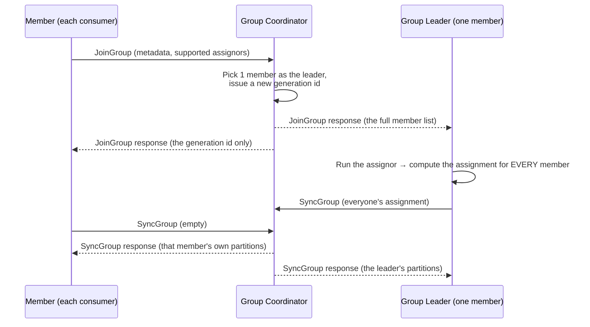
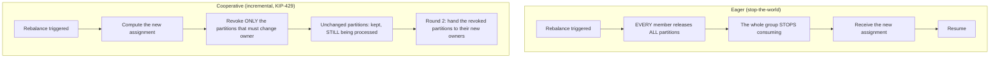
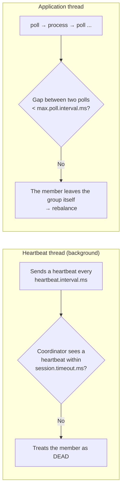

> **Takeaway:** a group divides partitions among its members; a rebalance is the redivision — and if your poll loop takes longer than `max.poll.interval.ms` to process, the coordinator thinks you've died, kicks you out, and the whole group rebalances.

Assumes you've got [topic, partition, offset](../reference/topic-partition-offset.md) and [delivery semantics](../reference/delivery-semantics.md). Here we discuss how a group divides work and the offset-commit traps.

## How a group divides partitions

Each consumer group has a **group coordinator** (a broker) tracking its members. The coordinator assigns each partition to exactly **one** member of the group. Which immediately implies:

- Several consumers in the same group read different partitions in parallel.
- The maximum useful consumer count = the partition count. Consumer N+1 (N = the partition count) sits idle.
- Two different groups read the same topic independently — each group has its own offsets.

### How the coordinator is chosen

The coordinator isn't picked at random: it's the **leader of the partition** holding this group's offsets in the internal `__consumer_offsets` topic. Specifically `partition = hash(group.id) % the partition count of __consumer_offsets`; the broker leading that partition becomes the coordinator. So every member with the same `group.id` always finds the same coordinator, and when that broker dies the coordinator moves to whichever broker's replica becomes the new leader.

## The rebalance protocol step by step

A rebalance isn't one monolithic action — it's a request/response sequence between the members and the coordinator:



The important pieces:

- **JoinGroup**: every member registers with the coordinator. The coordinator gathers them, picks **one** member as the **group leader** (usually the first to join), and issues a new **generation id**.
- **The leader computes the assignment, not the coordinator.** The coordinator only relays. This lets the assignment strategy run client-side, easily swapped for a custom assignor.
- **SyncGroup**: the leader sends the full assignment table to the coordinator; the coordinator hands each member exactly its own part.
- **The generation id** is the rebalance's version number. A request carrying an old generation is refused by the coordinator (`ILLEGAL_GENERATION`) — this mechanism stops a "stale" member committing over the new assignment.

## eager vs cooperative



- **Eager (stop-the-world)**: every member releases all its partitions, then gets a new assignment back. Meanwhile the whole group stops consuming. Simple but painful — the bigger the group, the longer the stoppage.
- **Cooperative / incremental** (KIP-429): the rebalance runs in two rounds. Round 1 only **revokes** the partitions that must change owner; a member keeps its unchanged part and **carries on processing**. Only round 2 hands the revoked part to its new owner. No stop-the-world. Enabled via the `cooperative-sticky` assignor.

### Partition assignors

```properties
partition.assignment.strategy=org.apache.kafka.clients.consumer.CooperativeStickyAssignor
```

| Assignor | How it divides | Notes |
|---|---|---|
| `range` | By partition range per topic | The old default; easily unbalanced with many topics |
| `roundrobin` | Spreads all partitions evenly | More balanced than range |
| `sticky` | Balanced, but tries to keep the old assignment | Less churn on a rebalance |
| `cooperative-sticky` | sticky + incremental rebalancing | Recommended for most new cases |

## session.timeout vs max.poll.interval

This is the most commonly confused point. There are **two** separate liveness mechanisms, checked by two different threads:



| Config | Default | Who checks it | Exceeding it means | When to change it |
|---|---|---|---|---|
| `session.timeout.ms` | `45000` | The background heartbeat thread | No heartbeat in this window → the coordinator treats it as dead | Increase it for long GC pauses or a flaky network |
| `heartbeat.interval.ms` | `3000` | The heartbeat send interval | (nothing to "exceed") | Keep it at ~1/3 of `session.timeout.ms` |
| `max.poll.interval.ms` | `300000` | The gap between two `poll()` calls | Processing a batch takes longer → treated as dead → rebalance | Increase it if a batch genuinely needs that long |
| `max.poll.records` | `500` | The records per `poll()` | A bigger batch → one loop takes longer | Lower it when each record is heavy to process |

The heartbeat runs on a background thread, so a consumer busy processing is still "alive" as far as `session.timeout.ms` is concerned. What kills you is **`max.poll.interval.ms`**: if processing a batch takes longer than that, you don't call `poll()` in time, the coordinator concludes you're stuck and starts a rebalance — even though the background thread is still heartbeating steadily.

The fixes when you're kicked out for slow processing:

- Lower `max.poll.records` so each poll loop processes less.
- Raise `max.poll.interval.ms` if a batch genuinely needs that long.
- Push the heavy processing onto another thread/queue and keep the poll loop short.

## When a rebalance happens

A rebalance is the process of reassigning partitions to members. It's triggered when:

- A member joins (scaling up, or a member just restarted).
- A member leaves (a crash, or leaving deliberately).
- A member is treated as dead (no heartbeat for longer than `session.timeout.ms`, or exceeding `max.poll.interval.ms`).
- A topic's partition count changes.

If rebalances repeat continuously, throughput collapses because the group keeps stopping to redivide. See the [continuous rebalancing case study](../case-studies/rebalance-lien-tuc.md).

## Static membership reduces rebalancing

```properties
group.instance.id=consumer-app-1   # ID cố định cho member này
```

With static membership, a member restarting quickly (a deploy, or a crash-and-return) within `session.timeout.ms` does **not** trigger a rebalance — when the member comes back with the same `group.instance.id`, the coordinator recognises it as the same instance and returns its assignment intact without touching the other members. Very useful in environments that roll-restart often.

The trade-off: if the member **really** dies (and doesn't come back), the coordinator still holds its place until `session.timeout.ms` expires before redividing — meaning its partitions are "frozen" longer than with dynamic membership.

## Committing offsets: the loss vs duplicate trap

A committed offset marks "processed up to here", stored in the internal `__consumer_offsets` topic. The order between committing and processing decides whether you lean towards loss or duplication.

```properties
enable.auto.commit=true            # tự commit theo chu kỳ
auto.commit.interval.ms=5000       # mỗi 5s
```

Auto-commit is convenient but commits on a **timer**, not on real processing progress — it commits at the start of the next `poll()`, including messages you polled but may not have finished processing. For processing that must be certain, turn it off and commit manually:

```java
// commit SAU khi xử lý xong batch → at-least-once (có thể trùng khi crash giữa chừng)
records = consumer.poll(Duration.ofMillis(500));
process(records);
consumer.commitSync();   // chỉ commit khi process xong
```

| Order | The result if you crash mid-way | Semantics |
|---|---|---|
| Commit **before** processing | **Loss** — the offset has advanced, and an unprocessed message is never re-read | at-most-once |
| Commit **after** processing | **Duplication** — re-reading from the old offset reprocesses already-processed messages → you need an idempotent consumer | at-least-once |

`commitSync` blocks and retries for certainty; `commitAsync` is faster but doesn't retry. The common pattern: `commitAsync` inside the loop (fast, and occasionally missing a commit is fine because a later commit overwrites it), plus a final `commitSync` in `finally` on close so the last commit isn't lost.

### auto.offset.reset

When a group has no stored offset (the first time, or the offset expired/was deleted):

```properties
auto.offset.reset=latest      # earliest | latest | none
```

- `earliest`: read from the start of the topic — use it when you need to process the full history.
- `latest` (the default): only read messages new since joining. The classic trap: a new group with `latest` **skips all the existing data** — if you expected it to read the history, you come up short.
- `none`: throw an error if there's no offset — forcing you to handle it explicitly.

Note: `auto.offset.reset` **only** applies when there's no committed offset. For a running group with offsets, this config is irrelevant.

## Common Mistakes

| Mistake | Consequence | Fix |
|---|---|---|
| Committing before processing | Messages lost on a crash | Commit afterwards, make the consumer idempotent |
| Heavy processing right inside the poll loop | Exceeding `max.poll.interval.ms` → a rebalance | Lower `max.poll.records` or split off a thread |
| Auto-commit with processing that must be certain | Silent loss | Turn auto off, `commitSync` after processing |
| A new group with `latest`, expecting the history | All the old data skipped | Set `earliest` when you need the history |
| Adding consumers beyond the partition count | The surplus consumers sit idle | Increase the partition count first, then scale |
| Rolling-restart without static membership | A rebalance per restart | Set `group.instance.id` |

## FAQ

<details>
<summary>What's the difference between session timeout and max.poll.interval?</summary>

`session.timeout.ms` is checked by the background heartbeat thread — a consumer busy processing still heartbeats and is still "alive". `max.poll.interval.ms` checks the gap between two `poll()` calls — process for too long, fail to poll in time, and you're treated as dead even with steady heartbeats.

</details>

<details>
<summary>Does cooperative-sticky have any downside?</summary>

A rebalance may need more than one round to converge, versus eager's single shot. In exchange there's no stop-the-world and the total disruption is far shorter — worth it for most workloads. Note: moving from eager to cooperative needs a proper rolling upgrade, because the two styles aren't directly compatible within one group.

</details>

<details>
<summary>What is the generation id for?</summary>

It's the rebalance's version. If a slow member (a GC pause) commits with an old generation after the group has rebalanced, the coordinator refuses it (`ILLEGAL_GENERATION`) rather than letting it commit over the new assignment — blocking a whole class of silent bug.

</details>

## Related Topics

- [Topic, partition, offset](../reference/topic-partition-offset.md)
- [Delivery semantics](../reference/delivery-semantics.md)
- [Producer tuning](producer-tuning.md)
- [Operations and consumer lag](operations-lag.md)
- [Case study — continuous rebalancing](../case-studies/rebalance-lien-tuc.md)
- [Kafka index](../index.md)
