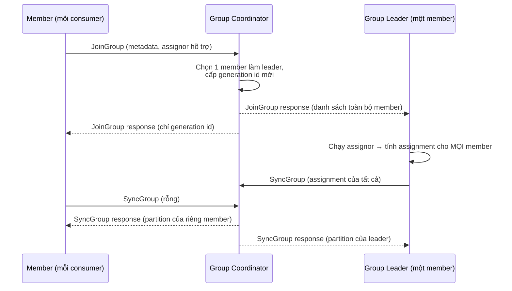
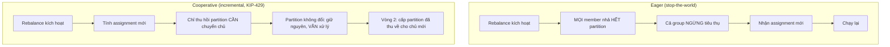
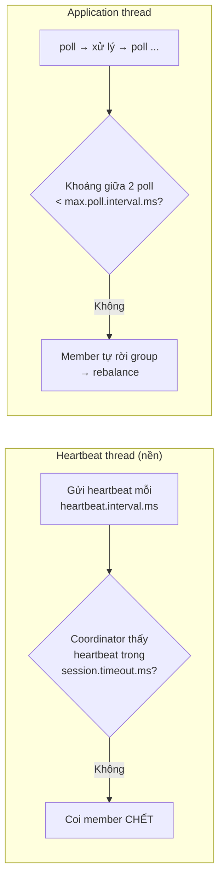

> **Chốt:** Group chia partition cho các member; rebalance là lúc chia lại — và nếu vòng poll của bạn xử lý lâu hơn `max.poll.interval.ms`, coordinator tưởng bạn chết, đá bạn ra và cả group rebalance.

Giả định đã nắm [topic, partition, offset](../reference/topic-partition-offset.md) và [delivery semantics](../reference/delivery-semantics.md). Ở đây bàn cách một group chia việc và các bẫy commit.

## Group chia partition thế nào

Mỗi consumer group có một **group coordinator** (một broker) theo dõi thành viên. Coordinator gán mỗi partition cho đúng **một** member trong group. Suy ra ngay:

- Nhiều consumer trong cùng group đọc song song các partition khác nhau.
- Số consumer hữu ích tối đa = số partition. Consumer thứ N+1 (N = số partition) ngồi không.
- Hai group khác nhau đọc độc lập cùng topic — mỗi group có offset riêng.

### Coordinator được chọn thế nào

Coordinator không phải chọn ngẫu nhiên: nó là **leader của partition** chứa offset của group này trong topic nội bộ `__consumer_offsets`. Cụ thể `partition = hash(group.id) % số_partition của __consumer_offsets`; broker giữ leader partition đó làm coordinator. Vì thế mọi member cùng `group.id` luôn tìm về cùng một coordinator, và khi broker đó chết, coordinator chuyển sang broker giữ replica mới lên leader.

## Giao thức rebalance mức bước

Rebalance không phải một hành động nguyên khối — nó là một trình tự request/response giữa member và coordinator:



Các mảnh quan trọng:

- **JoinGroup**: mọi member đăng ký với coordinator. Coordinator gom lại, chọn **một** member làm **group leader** (thường member join đầu), và cấp một **generation id** mới.
- **Leader tính assignment, không phải coordinator.** Coordinator chỉ chuyển tiếp. Điều này cho phép chiến lược assign chạy client-side, dễ thay bằng assignor tuỳ biến.
- **SyncGroup**: leader gửi bảng assignment đầy đủ lên coordinator; coordinator phát cho từng member đúng phần của nó.
- **Generation id** là con số version của lần rebalance. Request mang generation cũ bị coordinator từ chối (`ILLEGAL_GENERATION`) — cơ chế này chặn một member "lạc hậu" commit đè lên assignment mới.

## eager vs cooperative



- **Eager (stop-the-world)**: mọi member nhả hết partition, rồi nhận lại assignment mới. Trong lúc đó cả group ngừng tiêu thụ. Đơn giản nhưng đau — group càng lớn, khoảng ngừng càng dài.
- **Cooperative / incremental** (KIP-429): rebalance chạy hai vòng. Vòng 1 chỉ **thu hồi** những partition cần đổi chủ; member giữ nguyên phần không đổi và **tiếp tục xử lý**. Vòng 2 mới cấp phần vừa thu về cho chủ mới. Không stop-the-world. Bật qua assignor `cooperative-sticky`.

### Partition assignor

```properties
partition.assignment.strategy=org.apache.kafka.clients.consumer.CooperativeStickyAssignor
```

| Assignor | Cách chia | Ghi chú |
|---|---|---|
| `range` | Theo dải partition mỗi topic | Mặc định cũ; dễ lệch tải khi nhiều topic |
| `roundrobin` | Rải đều toàn bộ partition | Cân hơn range |
| `sticky` | Cân bằng nhưng cố giữ assignment cũ | Giảm xáo trộn khi rebalance |
| `cooperative-sticky` | sticky + incremental rebalance | Khuyến nghị cho hầu hết ca mới |

## session.timeout vs max.poll.interval

Đây là điểm nhầm lẫn hay gặp nhất. Có **hai** cơ chế "còn sống" tách biệt, kiểm bởi hai luồng khác nhau:



| Config | Mặc định | Ai kiểm | Vượt thì | Khi nào đổi |
|---|---|---|---|---|
| `session.timeout.ms` | `45000` | Heartbeat thread nền | Không heartbeat trong khoảng này → coordinator coi là chết | Tăng nếu GC pause dài hay mạng chập chờn |
| `heartbeat.interval.ms` | `3000` | Nhịp gửi heartbeat | (không "vượt") | Giữ ~1/3 `session.timeout.ms` |
| `max.poll.interval.ms` | `300000` | Khoảng giữa hai lần `poll()` | Xử lý một batch lâu hơn → coi là chết → rebalance | Tăng nếu mỗi batch thực sự cần lâu |
| `max.poll.records` | `500` | Số record mỗi `poll()` | Batch to → xử lý một vòng lâu hơn | Giảm khi mỗi record xử lý nặng |

Heartbeat chạy ở thread nền nên một consumer đang xử lý vẫn "sống" theo `session.timeout.ms`. Cái giết bạn là **`max.poll.interval.ms`**: nếu xử lý một batch mất lâu hơn nó, bạn không gọi `poll()` kịp, coordinator kết luận bạn treo và khởi động rebalance — dù thread nền vẫn heartbeat đều.

Sửa khi bị đá vì xử lý lâu:

- Giảm `max.poll.records` để mỗi vòng poll xử lý ít hơn.
- Tăng `max.poll.interval.ms` nếu mỗi batch thực sự cần lâu.
- Đẩy xử lý nặng sang thread/queue khác, giữ vòng poll ngắn.

## Rebalance xảy ra khi nào

Rebalance là quá trình gán lại partition cho member. Kích hoạt khi:

- Một member join (scale up, hoặc member vừa restart).
- Một member leave (crash, hoặc rời chủ động).
- Một member bị coi là chết (không heartbeat quá `session.timeout.ms`, hoặc vượt `max.poll.interval.ms`).
- Số partition của topic thay đổi.

Nếu rebalance lặp liên tục, throughput sập vì group cứ dừng để chia lại. Xem [case study rebalance liên tục](../case-studies/rebalance-lien-tuc.md).

## Static membership giảm rebalance

```properties
group.instance.id=consumer-app-1   # ID cố định cho member này
```

Với static membership, một member restart nhanh (deploy, crash rồi lên lại) trong `session.timeout.ms` **không** kích hoạt rebalance — khi member quay lại với đúng `group.instance.id`, coordinator nhận ra nó là instance cũ và trả nguyên assignment mà không đụng tới các member khác. Rất hữu ích cho môi trường hay rolling-restart.

Đánh đổi: nếu member chết **thật** (không lên lại), coordinator vẫn giữ chỗ cho nó tới hết `session.timeout.ms` mới chia lại — nghĩa là các partition của nó "đứng hình" lâu hơn so với dynamic membership.

## Commit offset: bẫy mất vs trùng

Offset đã commit đánh dấu "đã xử lý tới đây", lưu trong topic nội bộ `__consumer_offsets`. Thứ tự giữa commit và xử lý quyết định bạn nghiêng về mất hay trùng.

```properties
enable.auto.commit=true            # tự commit theo chu kỳ
auto.commit.interval.ms=5000       # mỗi 5s
```

Auto-commit tiện nhưng commit theo **thời gian**, không theo tiến độ xử lý thật — commit ở đầu `poll()` kế tiếp, gồm cả những message bạn poll về nhưng chưa chắc đã xử lý xong. Với xử lý cần chắc chắn, tắt và commit tay:

```java
// commit SAU khi xử lý xong batch → at-least-once (có thể trùng khi crash giữa chừng)
records = consumer.poll(Duration.ofMillis(500));
process(records);
consumer.commitSync();   // chỉ commit khi process xong
```

| Thứ tự | Kết quả nếu crash giữa chừng | Ngữ nghĩa |
|---|---|---|
| Commit **trước** khi xử lý | **Mất** — offset đã tiến, message chưa xử lý không đọc lại | at-most-once |
| Commit **sau** khi xử lý | **Trùng** — đọc lại từ offset cũ, xử lý message đã xử lý → cần consumer idempotent | at-least-once |

`commitSync` chặn và retry cho chắc; `commitAsync` nhanh hơn nhưng không retry. Mẫu thường dùng: `commitAsync` trong vòng lặp (nhanh, thỉnh thoảng lỡ một commit cũng được vì commit sau đè lên), và một `commitSync` cuối trong `finally` khi đóng để chắc chắn không mất commit chót.

### auto.offset.reset

Khi group chưa có offset đã lưu (lần đầu, hoặc offset hết hạn/bị xoá):

```properties
auto.offset.reset=latest      # earliest | latest | none
```

- `earliest`: đọc từ đầu topic — dùng khi cần xử lý toàn bộ lịch sử.
- `latest` (mặc định): chỉ đọc message mới từ lúc join. Bẫy kinh điển: group mới với `latest` **bỏ qua toàn bộ dữ liệu đã có** — nếu bạn tưởng nó sẽ đọc lại lịch sử thì hụt.
- `none`: ném lỗi nếu không có offset — buộc bạn xử lý tường minh.

Lưu ý: `auto.offset.reset` **chỉ** áp dụng khi không có committed offset. Nhóm đang chạy có offset thì config này vô can.

## Common Mistakes

| Sai | Hậu quả | Sửa |
|---|---|---|
| Commit trước khi xử lý | Mất message khi crash | Commit sau, làm consumer idempotent |
| Xử lý nặng ngay trong vòng poll | Vượt `max.poll.interval.ms` → rebalance | Giảm `max.poll.records` hoặc tách thread |
| Auto-commit với xử lý phải chắc chắn | Mất âm thầm | Tắt auto, `commitSync` sau xử lý |
| Group mới, `latest`, tưởng đọc lịch sử | Bỏ qua toàn bộ dữ liệu cũ | Đặt `earliest` khi cần lịch sử |
| Thêm consumer > số partition | Consumer thừa ngồi không | Tăng số partition trước, rồi mới scale |
| Rolling-restart mà không static membership | Mỗi restart một rebalance | Đặt `group.instance.id` |

## FAQ

<details>
<summary>Session timeout và max.poll.interval khác nhau chỗ nào?</summary>

`session.timeout.ms` do heartbeat thread nền kiểm — consumer đang xử lý vẫn heartbeat, vẫn "sống". `max.poll.interval.ms` kiểm khoảng giữa hai lần gọi `poll()` — xử lý lâu, không poll kịp, thì dù heartbeat đều bạn vẫn bị coi là chết.

</details>

<details>
<summary>Cooperative-sticky có nhược điểm gì không?</summary>

Rebalance có thể cần nhiều hơn một vòng để hội tụ so với eager một-phát. Đổi lại không stop-the-world, tổng thời gian gián đoạn nhỏ hơn nhiều — với đa số workload là đáng. Lưu ý: chuyển từ eager sang cooperative cần rolling upgrade đúng cách vì hai kiểu không tương thích trực tiếp trong một group.

</details>

<details>
<summary>Generation id để làm gì?</summary>

Nó là version của lần rebalance. Nếu một member chậm (GC pause) commit với generation cũ sau khi group đã rebalance, coordinator từ chối (`ILLEGAL_GENERATION`) thay vì để nó commit đè lên assignment mới — chặn một lớp lỗi âm thầm.

</details>

## Related Topics

- [Topic, partition, offset](../reference/topic-partition-offset.md)
- [Delivery semantics](../reference/delivery-semantics.md)
- [Producer tuning](producer-tuning.md)
- [Vận hành và consumer lag](operations-lag.md)
- [Case study — rebalance liên tục](../case-studies/rebalance-lien-tuc.md)
- [Kafka index](../index.md)
