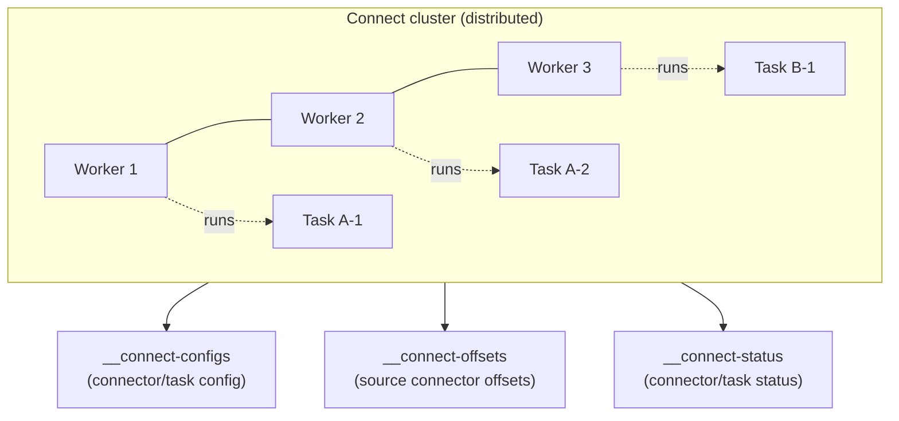
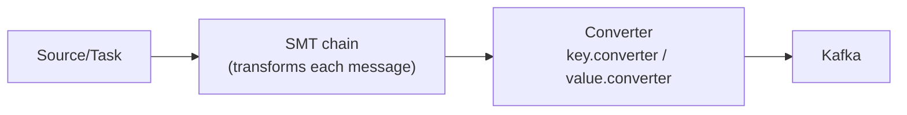
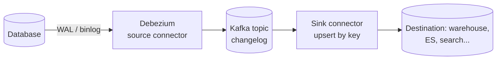
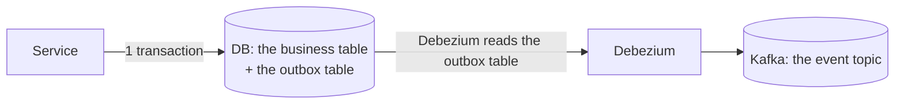

> **Takeaway:** Kafka Connect moves data between Kafka and external systems without writing code; CDC via Debezium reads the WAL/binlog, so it catches **both deletes and every change between two polls** — exactly what `SELECT ... WHERE updated_at ...` misses.

Assumes you've got [what Kafka is](../reference/what-is-kafka.md) and [retention/compaction](../reference/retention-compaction.md). This is how to get data in and out of Kafka and capture changes from a database.

## Connect's distributed architecture

Connect runs as its own cluster, with no logic to write — you configure a connector with JSON and it handles the rest (offset tracking, retries, scaling).



- **Worker**: the process running connectors/tasks. Several workers form a cluster, coordinating through Kafka (Connect needs no separate ZooKeeper).
- **Connector**: defines the source/destination and how to connect. Two kinds:
  - **Source connector**: external system → Kafka (e.g. Debezium reading a database).
  - **Sink connector**: Kafka → a destination (e.g. writing to S3, Elasticsearch, JDBC).
- **Task**: the actual unit of work; a connector splits into several tasks (`tasks.max`) to run in parallel across workers.

### The three internal topics

In distributed mode, Connect does **not** store state in local files — it stores it in three Kafka topics, so losing a worker loses nothing:

| Topic | What it holds | Characteristics |
|---|---|---|
| `config` (e.g. `__connect-configs`) | The config of every connector and task | Compacted; one partition |
| `offset` (e.g. `__connect-offsets`) | The **source** offsets of source connectors (e.g. the WAL/binlog position Debezium has read to) | Compacted; several partitions. This is NOT a sink's consumer offset |
| `status` (e.g. `__connect-status`) | The running/failed/paused status of connectors and tasks | Compacted |

> The `__connect-*` names are the **default convention**; they're set via `config.storage.topic`… — check the real configuration, don't invent other names.

### standalone vs distributed

| Mode | Characteristics | Use when |
|---|---|---|
| **standalone** | One process, offsets stored in a local file | Dev, experiments, one machine |
| **distributed** | Several workers, offsets/config/status stored in **Kafka topics**, a REST API, tasks rebalanced when workers join/leave | Production — always pick this |

In distributed mode, adding/removing a worker **rebalances tasks** much like a consumer group: workers form a group, and when one joins/leaves the tasks are redivided among the remaining workers. Don't run standalone in production; losing the machine loses the offsets with it.

## Converters and the SMT chain

Before entering/leaving Kafka, data passes through two important configuration layers:



- **Converter** (`key.converter`, `value.converter`): decides the **serialization format** into Kafka. E.g. `AvroConverter` (with Schema Registry), `JsonConverter`, `StringConverter`. Key and value are configured separately — a common trap is using Avro for the value while forgetting to set the key converter, so the key comes out in the wrong format.
- **SMT (Single Message Transform)**: a chain of lightweight transformations applied to **each** message, running before the converter (source) or after it (sink):
  - Renaming/dropping fields, casting types.
  - Extracting a field as the message key (important for compaction).
  - Routing topics by content.

SMTs suit simple single-message transformations. Joins, aggregations and windows are stream processing's job, not an SMT's — see [Flink connectors](../../flink/skills/connectors.md).

## CDC: why reading the log beats polling queries

The naive way to sync changes from a DB is periodic polling:

```sql
SELECT * FROM orders WHERE updated_at > :last_seen;
```

This breaks in three places:

- **It misses DELETEs** — a deleted row is no longer there for a `SELECT` to find.
- **It misses changes between two polls** — if a row changes twice within one cycle, you only see the final state and lose the intermediate step.
- **It's heavy and laggy** — polling often hammers the DB; polling rarely gives high latency.

CDC (Change Data Capture) reads the database's **transaction log** directly — the WAL (Postgres), the binlog (MySQL). The log records **every** change in exact commit order, including deletes. No polling, no queries hammering the table, nothing missed.



## Debezium

Debezium is the popular CDC source connector suite, running on Kafka Connect. It works in two phases: a **snapshot** to get a baseline, then **streaming** to follow the log.

### Snapshot modes

| Mode | What it does | Use when |
|---|---|---|
| `initial` (the default) | Snapshot the whole table once, then keep streaming | The first time, when you need both the current state and subsequent changes |
| `never` | Skip the snapshot, stream from the current log position | You only need changes from now on; the baseline came from elsewhere |
| `schema_only` | Capture only the **schema**, not the data, then stream | You don't need historical data but need the table structure to parse the log |
| `initial_only` | Snapshot and then stop, no streaming | A one-off backfill |

> Mode names may differ slightly between Debezium versions — check the docs for your version, don't invent them.

### Message structure

Each CDC message (the Debezium envelope) carries before/after, op, and source metadata:

```json
{
  "op": "u",
  "before": { "id": 42, "status": "pending" },
  "after":  { "id": 42, "status": "paid" },
  "source": { "db": "shop", "table": "orders", "lsn": 123456, "ts_ms": 1700000000000 },
  "ts_ms":  1700000000050
}
```

| Field | Meaning |
|---|---|
| `op` | `c` create · `u` update · `d` delete (`after` null) · `r` read (snapshot) |
| `before` | The state before the change (needs REPLICA IDENTITY FULL on Postgres to be complete) |
| `after` | The state after the change |
| `source` | Metadata: db, table, the log position (lsn/binlog), the commit ts at the source |
| `ts_ms` | When Debezium processed it (distinct from `source.ts_ms`, the commit moment) |

The default **topic naming**: `<topic.prefix>.<schema/db>.<table>` — one topic per table. For example `dbserver1.shop.orders`. Configure the prefix via `topic.prefix`.

For a DELETE, Debezium emits an `op=d` message (with a null `after`), usually followed by a **tombstone** (a message with a null value under the same key) so log compaction removes that key from the changelog entirely.

## at-least-once and duplicates on restart

Debezium/Connect guarantee **at-least-once**, not exactly-once. When a worker restarts it resumes from the offset stored in the `offset` topic — and may **re-emit** a few messages around the restart point (read from the log but not yet offset-committed). Which implies a hard rule:

> **The sink must be idempotent.** Write by primary key (upsert), not a blind insert. For deletes, apply by key. If the sink accumulates (increments), a duplicate message skews the numbers — you must deduplicate by key + version (e.g. `source.lsn`).

This is a common failure: standing up a CDC pipeline that "works fine" until one day a worker restarts, downstream receives duplicates, and the numbers drift.

## The OUTBOX pattern: avoiding dual writes

The "dual-write" problem: a service writes to the DB *and* publishes an event to Kafka in the same flow. Two writes to different systems with no shared transaction → the DB commits but the publish fails (or vice versa) → the data and the events diverge.

The **Outbox** pattern eliminates this by writing to only **one** transactional place:



- The service writes the business table **and** a row into the `outbox` table in the **same DB transaction**. Either both commit or both roll back — no divergence.
- Debezium CDC catches the insert into the `outbox` table and emits it as an event to Kafka.
- The result: the event is emitted **if and only if** the business transaction commits. No dual write.

## CDC pairs with compacted topics

Because CDC messages carry a key (the row's primary key) and you usually only care about each row's **latest state**, a [compacted topic](../reference/retention-compaction.md) is a great changelog: log compaction keeps the latest message per key, cleans out old values, and a tombstone (null value) removes a deleted key entirely. The result is a topic mirroring the table's current state, replayable from the start to rebuild the destination.

## Common Mistakes

| Mistake | Consequence | Fix |
|---|---|---|
| Using polling queries instead of CDC | Missing deletes and intermediate changes | Use CDC reading the WAL/binlog |
| A non-idempotent sink | Duplicates on worker restart → wrong numbers | Upsert by key, not a blind insert |
| Running standalone mode in production | Losing the machine loses the offsets | Distributed mode, offsets in topics |
| Writing to the DB and publishing to Kafka directly | A dual write diverging when one side fails | The Outbox pattern + CDC |
| Forgetting to set key.converter | The key comes out in the wrong format and compaction breaks | Configure both the key and value converters |
| Stuffing join/aggregate logic into an SMT | SMTs can't do it, and the pipeline bloats | Push it to a stream processor (Flink) |

## FAQ

<details>
<summary>Does CDC slow the source database down?</summary>

Far less than polling. Debezium reads the transaction log — something the database already writes for replication — so it adds no queries against the business tables. The main cost is keeping the log long enough that what the connector hasn't read yet isn't cleaned up (e.g. a Postgres replication slot holding WAL — the trap: the connector dies for a long time, WAL bloats, the disk fills).

</details>

<details>
<summary>Does the initial snapshot on a large table become a bottleneck?</summary>

It can be slow and resource-hungry because it has to read the whole table. Debezium has an **incremental snapshot** that chunks it into windows and runs alongside streaming without long locks; consider it when the source table is very large.

</details>

<details>
<summary>Do Connect's three internal topics need special configuration?</summary>

You should set a replication factor appropriate for production (not 1) and leave them **compacted** — because Connect relies on the latest value per config/offset/status key. The `offset` topic's partition count affects how much parallelism source tasks have for writing offsets.

</details>

## Related Topics

- [What Kafka is](../reference/what-is-kafka.md)
- [Retention and compaction](../reference/retention-compaction.md)
- [Schema Registry](schema-registry.md)
- [Delivery semantics](../reference/delivery-semantics.md)
- [Consumer groups and rebalance](consumer-groups.md)
- [Flink connectors](../../flink/skills/connectors.md)
- [Kafka index](../index.md)
