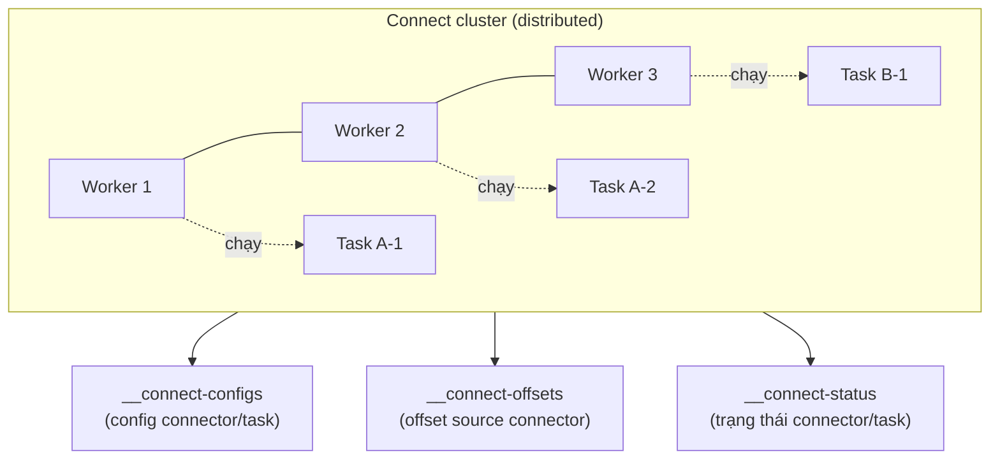
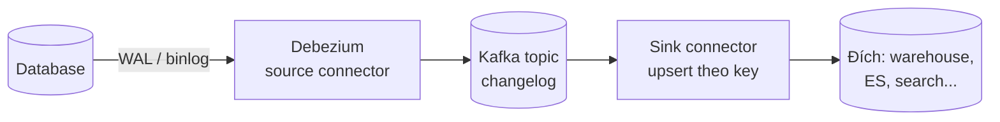
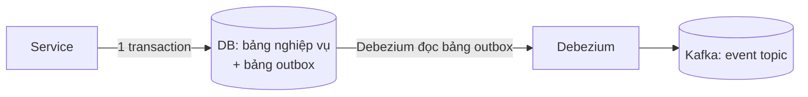

> **Chốt:** Kafka Connect chuyển dữ liệu giữa Kafka và hệ ngoài mà không viết code; CDC qua Debezium đọc WAL/binlog nên bắt được **cả delete và mọi thay đổi giữa hai lần poll** — thứ mà `SELECT ... WHERE updated_at ...` bỏ sót.

Giả định đã nắm [Kafka là gì](../reference/what-is-kafka.md) và [retention/compaction](../reference/retention-compaction.md). Đây là cách đưa dữ liệu vào/ra Kafka và bắt thay đổi từ database.

## Kiến trúc Connect distributed

Connect chạy như một cụm riêng, không viết logic — bạn cấu hình connector bằng JSON và nó lo phần còn lại (offset tracking, retry, scale).



- **Worker**: tiến trình chạy connector/task. Nhiều worker họp thành cluster, phối hợp qua Kafka (không cần ZooKeeper riêng cho Connect).
- **Connector**: định nghĩa nguồn/đích và cách nối. Hai loại:
  - **Source connector**: hệ ngoài → Kafka (ví dụ Debezium đọc database).
  - **Sink connector**: Kafka → đích (ví dụ ghi vào S3, Elasticsearch, JDBC).
- **Task**: đơn vị công việc thực tế; một connector chia thành nhiều task (`tasks.max`) để chạy song song trên nhiều worker.

### Ba topic nội bộ

Ở distributed mode, Connect **không** lưu trạng thái ra file cục bộ — nó lưu vào ba topic Kafka, nên mất một worker không mất gì:

| Topic | Chứa gì | Đặc điểm |
|---|---|---|
| `config` (ví dụ `__connect-configs`) | Config của mọi connector và task | Compacted; một partition |
| `offset` (ví dụ `__connect-offsets`) | Offset **nguồn** của source connector (ví dụ vị trí WAL/binlog Debezium đọc tới) | Compacted; nhiều partition. Đây KHÔNG phải offset consumer của sink |
| `status` (ví dụ `__connect-status`) | Trạng thái running/failed/paused của connector và task | Compacted |

> Tên `__connect-*` là **quy ước mặc định**; đặt bằng `config.storage.topic`... — kiểm cấu hình thật, đừng bịa tên khác.

### standalone vs distributed

| Mode | Đặc điểm | Dùng khi |
|---|---|---|
| **standalone** | Một process, offset lưu file cục bộ | Dev, thử nghiệm, một máy |
| **distributed** | Nhiều worker, offset/config/status lưu trong **topic Kafka**, có REST API, tự cân task khi worker join/leave | Production — luôn chọn cái này |

Ở distributed mode, thêm/bớt worker sẽ **rebalance task** tương tự consumer group: worker họp thành group, khi một worker join/leave thì task được chia lại giữa các worker còn lại. Đừng chạy standalone lên production; mất máy là mất luôn offset.

## Converter và SMT chain

Trước khi vào/ra Kafka, dữ liệu đi qua hai lớp cấu hình quan trọng:


- **Converter** (`key.converter`, `value.converter`): quyết định **định dạng serialize** ra Kafka. Ví dụ `AvroConverter` (kèm Schema Registry), `JsonConverter`, `StringConverter`. Key và value cấu hình riêng — bẫy hay gặp là để value dùng Avro nhưng quên set key converter, key ra sai định dạng.
- **SMT (Single Message Transform)**: chuỗi biến đổi nhẹ áp lên **từng** message, chạy trước converter (source) hoặc sau converter (sink):
  - Đổi tên/bỏ field, ép kiểu.
  - Trích một field làm message key (quan trọng cho compaction).
  - Định tuyến topic theo nội dung.

SMT hợp cho biến đổi đơn giản một-message. Cần join, aggregate, window thì đó là việc của stream processing, không phải SMT — xem [Flink connectors](../../flink/skills/connectors.md).

## CDC: vì sao đọc log thắng poll query

Cách ngây thơ để đồng bộ thay đổi từ DB là poll định kỳ:

```sql
SELECT * FROM orders WHERE updated_at > :last_seen;
```

Cách này hỏng ở ba điểm:

- **Bỏ sót DELETE** — hàng bị xoá thì không còn để `SELECT` thấy.
- **Bỏ sót thay đổi giữa hai lần poll** — nếu một hàng đổi hai lần trong một chu kỳ, chỉ thấy trạng thái cuối, mất bước trung gian.
- **Tải nặng và trễ** — poll thường xuyên thì đè DB; poll thưa thì trễ cao.

CDC (Change Data Capture) đọc thẳng **transaction log** của database — WAL (Postgres), binlog (MySQL). Log ghi lại **mọi** thay đổi theo đúng thứ tự commit, gồm cả delete. Không poll, không đè query lên bảng, không bỏ sót.



## Debezium

Debezium là bộ source connector CDC phổ biến, chạy trên Kafka Connect. Cơ chế hai pha: **snapshot** để có baseline, rồi **streaming** bám log.

### Snapshot modes

| Mode | Làm gì | Dùng khi |
|---|---|---|
| `initial` (mặc định) | Snapshot toàn bảng một lần, rồi stream tiếp | Lần đầu, cần cả trạng thái hiện tại lẫn thay đổi sau đó |
| `never` | Bỏ snapshot, stream từ vị trí log hiện tại | Chỉ cần thay đổi từ giờ; đã có baseline bằng cách khác |
| `schema_only` | Chỉ chụp **schema**, không chụp dữ liệu, rồi stream | Không cần dữ liệu quá khứ nhưng cần biết cấu trúc bảng để parse log |
| `initial_only` | Snapshot xong thì dừng, không stream | Backfill một lần |

> Tên mode có thể khác nhẹ giữa các version Debezium — kiểm doc đúng version, đừng bịa.

### Cấu trúc message

Mỗi message CDC (Debezium envelope) mang before/after, op, và metadata nguồn:

```json
{
  "op": "u",
  "before": { "id": 42, "status": "pending" },
  "after":  { "id": 42, "status": "paid" },
  "source": { "db": "shop", "table": "orders", "lsn": 123456, "ts_ms": 1700000000000 },
  "ts_ms":  1700000000050
}
```

| Field | Nghĩa |
|---|---|
| `op` | `c` create · `u` update · `d` delete (`after` null) · `r` read (snapshot) |
| `before` | Trạng thái trước thay đổi (cần cấu hình REPLICA IDENTITY FULL ở Postgres để đầy đủ) |
| `after` | Trạng thái sau thay đổi |
| `source` | Metadata: db, table, vị trí log (lsn/binlog), ts commit ở nguồn |
| `ts_ms` | Thời điểm Debezium xử lý (khác `source.ts_ms` là thời điểm commit) |

**Topic naming** mặc định: `<topic.prefix>.<schema/db>.<table>` — mỗi bảng một topic. Ví dụ `dbserver1.shop.orders`. Cấu hình prefix qua `topic.prefix`.

Với DELETE, Debezium phát message `op=d` (after null) rồi thường kèm một **tombstone** (message value = null cùng key) để log compaction xoá hẳn key đó khỏi changelog.

## at-least-once và trùng khi restart

Debezium/Connect đảm bảo **at-least-once**, không phải exactly-once. Khi worker restart, nó tiếp tục từ offset đã lưu trong topic `offset` — và có thể **phát lại** vài message quanh điểm restart (đã đọc log nhưng chưa kịp commit offset). Suy ra một luật cứng:

> **Sink phải idempotent.** Ghi theo primary key (upsert), không phải insert mù. Với delete, apply theo key. Nếu sink cộng dồn (increment) thì message trùng làm sai số — phải khử trùng bằng key + version (ví dụ `source.lsn`).

Đây là lỗi hay gặp: dựng CDC "chạy ngon" rồi một hôm worker restart, downstream nhận bản trùng và số liệu lệch.

## Mẫu OUTBOX: tránh dual-write

Bài toán "dual-write": service vừa ghi DB vừa publish sự kiện lên Kafka trong cùng một luồng. Hai ghi khác hệ thống, không có transaction chung → DB commit xong mà publish fail (hoặc ngược lại) → dữ liệu và sự kiện lệch nhau.

Mẫu **Outbox** khử điều này bằng cách chỉ ghi **một** nơi có transaction:



- Service ghi bảng nghiệp vụ **và** một dòng vào bảng `outbox` trong **cùng một transaction DB**. Hoặc cả hai commit, hoặc cả hai rollback — không lệch.
- Debezium CDC bắt insert vào bảng `outbox` và phát thành event lên Kafka.
- Kết quả: sự kiện được phát **đúng khi và chỉ khi** transaction nghiệp vụ commit. Không dual-write.

## CDC hợp với compacted topic

Vì message CDC mang key (primary key của row) và bạn thường chỉ quan tâm **trạng thái mới nhất** của mỗi row, một [compacted topic](../reference/retention-compaction.md) rất hợp làm changelog: log compaction giữ lại message mới nhất cho mỗi key, dọn bản cũ, và tombstone (value null) xoá hẳn key đã delete. Kết quả là topic phản chiếu trạng thái hiện tại của bảng, phát lại được từ đầu để dựng lại đích.

## Common Mistakes

| Sai | Hậu quả | Sửa |
|---|---|---|
| Dùng poll query thay CDC | Bỏ sót delete và thay đổi trung gian | Dùng CDC đọc WAL/binlog |
| Sink không idempotent | Trùng khi worker restart → số liệu sai | Upsert theo key, không insert mù |
| Chạy standalone mode lên production | Mất máy là mất offset | Distributed mode, offset trong topic |
| Vừa ghi DB vừa publish Kafka trực tiếp | Dual-write lệch khi một bên fail | Mẫu Outbox + CDC |
| Quên set key.converter | Key ra sai định dạng, compaction hỏng | Cấu hình cả key và value converter |
| Nhét logic join/aggregate vào SMT | SMT không làm được, pipeline phình | Đẩy sang stream processor (Flink) |

## FAQ

<details>
<summary>CDC có làm chậm database nguồn không?</summary>

Nhẹ hơn poll nhiều. Debezium đọc transaction log — thứ database đã ghi sẵn cho replication — nên không thêm query lên bảng nghiệp vụ. Chi phí chính là giữ log đủ lâu để connector chưa kịp đọc không bị dọn (ví dụ replication slot ở Postgres giữ WAL — bẫy: connector chết lâu, WAL phình, đầy đĩa).

</details>

<details>
<summary>Snapshot ban đầu trên bảng lớn có nghẽn không?</summary>

Có thể lâu và tốn tài nguyên vì phải đọc toàn bảng. Debezium có **incremental snapshot** để chia nhỏ theo cửa sổ và chạy song song với streaming, không khoá lâu; cân nhắc khi bảng nguồn rất lớn.

</details>

<details>
<summary>Ba topic nội bộ của Connect có cần cấu hình đặc biệt không?</summary>

Nên đặt replication factor phù hợp production (không để 1) và để chúng **compacted** — vì Connect dựa vào bản mới nhất cho mỗi key config/offset/status. Số partition topic `offset` ảnh hưởng độ song song ghi offset của source task.

</details>

## Related Topics

- [Kafka là gì](../reference/what-is-kafka.md)
- [Retention và compaction](../reference/retention-compaction.md)
- [Schema Registry](schema-registry.md)
- [Delivery semantics](../reference/delivery-semantics.md)
- [Consumer group và rebalance](consumer-groups.md)
- [Flink connectors](../../flink/skills/connectors.md)
- [Kafka index](../index.md)
