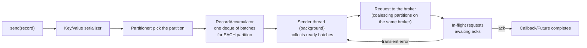

> **Takeaway:** the choice of `acks` decides durability, `linger.ms`/`batch.size` decide throughput; turn on `enable.idempotence=true` so retries don't create duplicates — and never leave `max.in.flight` above 1 without idempotence.

This document assumes you've got [replication and durability](../reference/replication-durability.md) and [delivery semantics](../reference/delivery-semantics.md). Here we only discuss: given a specific goal, which knob to turn.

## A record's journey through the producer

Before tuning knobs you have to know where a record passes through — because each config attaches to a specific stage.



Four things to take from this flow:

- **The accumulator batches per partition.** Each partition has its own queue of batches. `batch.size` is the ceiling on **one** batch for **one** partition, not a producer-wide ceiling.
- **`send()` doesn't mean "sent".** It only drops the record into the accumulator and returns a `Future` immediately. The sender thread is what actually pushes it out. That's why `linger.ms` is "waiting in the accumulator", not waiting on the network.
- **The sender coalesces several partitions on the same broker into one request.** Fewer TCP requests than partitions.
- **`buffer.memory` is the accumulator's total memory.** When it's full, `send()` blocks for up to `max.block.ms`.

## The full producer config table

| Config | Default | What it does | When to change it |
|---|---|---|---|
| `acks` | `all` (newer versions) | How many replicas confirm before the write counts as done | `0`/`1` only when you accept loss in exchange for throughput/latency |
| `enable.idempotence` | `true` (newer versions) | Attaches a PID + sequence so the broker deduplicates retries | Almost always leave it `true`; only turn it off for an old broker that doesn't support it |
| `retries` | `2147483647` | The number of attempts on a transient error | Rarely changed; the real limit is `delivery.timeout.ms` |
| `delivery.timeout.ms` | `120000` | The ceiling on total time from `send()` to success/giving up (retries included) | Increase it if the broker is often slow; this is the real "give up" knob, not `retries` |
| `request.timeout.ms` | `30000` | The maximum wait for **one** request to the broker before treating it as failed (then retrying) | Increase it when the network/broker is slow; it must be below `delivery.timeout.ms` |
| `linger.ms` | `0` | The maximum wait to gather more records into a batch before sending | Raise it to 5–20 for bigger batches and higher throughput |
| `batch.size` | `16384` (16 KB) | The ceiling on one batch per partition, in bytes | Increase it when records are small and numerous; it's a ceiling, not a target |
| `buffer.memory` | `33554432` (32 MB) | Total memory for the accumulator | Increase it when the producer is fast and the broker/network slow, to avoid blocking `send()` |
| `max.block.ms` | `60000` | How long `send()` blocks at most when the buffer is full or metadata isn't available | Lower it if you'd rather fail fast than hang |
| `max.in.flight.requests.per.connection` | `5` | The number of unacked requests allowed concurrently on one connection | Force it to `1` if you need ordering WITHOUT idempotence |
| `compression.type` | `none` | Batch compression: `none`/`lz4`/`zstd`/`snappy`/`gzip` | Turn on `lz4`/`zstd` to cut network use and increase the effective batch capacity |

> The "Default" column gives the **default** for the official client; older Kafka versions may differ — check the docs for your exact version, don't invent them.

## Situation → what to tune

### You want no lost messages → `acks`

`acks` is the number of replicas that must confirm before the producer treats the write as successful.

| `acks` | Meaning | The risk |
|---|---|---|
| `0` | Fire and forget, no waiting for an ack | Lost the moment a broker drops or the network fails. Only for metrics/logs where loss is acceptable |
| `1` | The leader having written is enough | Lost if the leader dies before a follower copies it — see the [acks=1 data-loss case study](../case-studies/mat-du-lieu-acks-1.md) |
| `all` (`-1`) | Wait for every replica in the ISR to confirm | The most durable. Only meaningful when paired with `min.insync.replicas` at the broker/topic |

The common trap: setting `acks=all` while leaving `min.insync.replicas=1`. Then "all" is just one replica in the ISR, and durability drops to the level of `acks=1` with nobody reporting it. For real durability you want `acks=all` + `min.insync.replicas=2` (with replication factor 3).

### You want retries not to create duplicates → idempotence

```properties
enable.idempotence=true
```

In recent Kafka versions this is the **default**. When enabled, each producer has a PID (Producer ID) and each message on each partition carries an incrementing sequence number. The broker remembers the last sequence written for each `(PID, partition)`:

- The sequence is exactly "the next one expected" → write it.
- The sequence **duplicates** one already written (a retry after a timeout) → the broker skips it and returns as if it succeeded. No duplicate created.
- The sequence **jumps** (something missing in between) → the broker throws `OutOfOrderSequenceException`, forcing explicit handling instead of silently losing ordering.

Idempotence constrains three things, and the producer will either set them itself or error out if you configure the opposite:

```properties
enable.idempotence=true
acks=all                                   # bắt buộc
max.in.flight.requests.per.connection=5    # tối đa 5 để vẫn giữ thứ tự
retries=2147483647                         # >0, thường để rất lớn
```

Note: idempotence only prevents duplicates **within one producer session**, not end-to-end exactly-once. Exactly-once across several topics/partitions needs transactions (`transactional.id` + `initTransactions`), which is outside this note's scope.

## Idempotence ↔ ordering ↔ max.in.flight

`max.in.flight.requests.per.connection` is the number of unacked requests the producer allows to be in flight concurrently on one connection. This is where three concepts intersect, and also the easiest place to lose ordering silently.

- **Not idempotent + `max.in.flight` above 1**: if request 1 fails and gets retried while request 2 (sent later) has already succeeded, the ordering on the partition inverts — the later message ends up before the earlier one. Nothing reports an error.
- **Idempotence on**: the broker uses sequence numbers to detect gaps and reject out-of-order batches, forcing the client to resend in the right sequence. So `max.in.flight` up to 5 is still safe for ordering.

A concrete reordering scenario (illustrative, not run), with a **non**-idempotent producer and `max.in.flight=2`:

```text
t0  gửi batch A (msg 1,2)  và batch B (msg 3,4)  song song
t1  broker nhận B trước, ghi 3,4
t2  A gặp lỗi tạm (timeout), producer retry
t3  broker ghi A → 1,2  ĐỨNG SAU 3,4
     partition log: [3,4,1,2]   ← thứ tự vỡ, không exception
```

The conclusion: if for some reason you don't enable idempotence but still need ordering, you must force `max.in.flight.requests.per.connection=1` — and pay for it in throughput.

## Batching: linger.ms and batch.size

The producer gathers messages into batches per partition. The two main knobs:

```properties
linger.ms=10          # chờ tối đa 10ms gom thêm message trước khi gửi
batch.size=32768      # kích thước batch tối đa mỗi partition, byte (mặc định 16384)
```

- `linger.ms=0` (the default) sends as soon as the sender is free — the lowest latency, small batches, poor throughput.
- Raising `linger.ms` to 5–20ms allows larger batches: fewer requests, better compression, higher throughput, in exchange for a few extra ms of latency. This is the central trade-off.
- `batch.size` is a ceiling, not a target. If messages arrive fast, the batch fills before `linger.ms` elapses and is sent right away.

### Sizing with a numeric example (illustrative, not run)

Suppose each record is ~1 KB and you're aiming at ~32 KB batches for efficient compression and requests:

```text
# Số minh hoạ — chưa chạy
Throughput mục tiêu:  10.000 msg/s  ×  1 KB  = ~10 MB/s
batch.size:           32 KB  ≈  32 record một batch
Thời gian gom đủ 32:  32 / 10.000  ≈  3,2 ms

→ đặt linger.ms = 5 (hơi dư 3,2ms) để batch thường đầy trước khi hết linger
→ nếu đặt linger.ms = 50: batch vẫn ~32 record (đầy trước), chỉ tăng latency vô ích
→ nếu traffic tụt còn 1.000 msg/s: batch chỉ gom được ~5 record trong 5ms
    muốn batch to lại thì phải tăng linger.ms, đổi latency lấy throughput
```

The takeaway: `linger.ms` only "bites" when traffic is **lower** than the rate that fills a batch. At high traffic the batch fills first and `linger.ms` is nearly irrelevant — raising it then only hurts latency.

## Compression: CPU vs network vs batch capacity

Compression happens at the producer, over a whole **batch** (not per message), and the broker usually stores it compressed exactly as received — the consumer decompresses. Because the whole batch is compressed, bigger batches compress better (more repeated data to exploit).

| `compression.type` | Producer CPU | Compression ratio | Notes |
|---|---|---|---|
| `none` | 0 | 1× | The lowest latency, the highest network use |
| `lz4` | Low | Medium | A good balance, a pragmatic default for many cases |
| `snappy` | Low | Medium-low | Very light on CPU, moderate compression |
| `zstd` | Medium | High | The best ratio of the group at acceptable CPU — good when the network is the bottleneck |
| `gzip` | High | High | Strong compression but CPU-hungry, rarely worth it over zstd |

A three-way trade-off:

- **The network is the bottleneck** → `zstd` (strong compression, fewer bytes on the wire).
- **Producer CPU is tight** → `lz4`/`snappy`.
- **Latency above all, network to spare** → `none`.

The trap: effective compression needs sufficiently large batches. Compressing with `linger.ms=0` and sporadic records gives a poor ratio while still burning CPU — compression and batching belong together.

## The partitioner: the same key to the same partition

The partitioner decides which partition a message goes to:

- **With a key**: `partition = hash(key) % partition_count`. Same key → same partition → ordering preserved for that key. This is the mechanism you rely on for per-key ordering.
- **Key null**: newer versions use a **sticky partitioner** — piling into one partition until the batch is full and only then switching, so batches are bigger rather than being spread message by message. The result: higher throughput than the old round-robin while still balancing over the long run.

The deadly trap: **changing a topic's partition count changes the result of `hash(key) % N`**, so an old key can jump to a different partition and historical ordering breaks. See the [case study on losing ordering by changing the key](../case-studies/mat-thu-tu-vi-doi-key.md). For data that needs per-key ordering, treat the partition count as effectively immutable.

## The "want X → tune Y" table

| Want | Tune |
|---|---|
| No lost messages | `acks=all` + `min.insync.replicas=2` |
| Retries without duplicates | `enable.idempotence=true` (which pulls in `acks=all`, `retries>0`, `max.in.flight` at most 5) |
| High throughput | raise `linger.ms` (5–20), raise `batch.size`, turn on `compression.type=lz4/zstd` |
| The lowest latency | `linger.ms=0`, no compression |
| No hanging when the buffer is full | lower `max.block.ms`, or raise `buffer.memory` |
| Not giving up too early on a slow broker | raise `delivery.timeout.ms` (with `request.timeout.ms` smaller inside it) |
| Per-key ordering | send with a key + keep the partition count unchanged |
| Ordering WITHOUT idempotence | `max.in.flight.requests.per.connection=1` |

## Common Mistakes

| Mistake | Consequence | Fix |
|---|---|---|
| `acks=all` but `min.insync.replicas=1` | Real durability is only the level of `acks=1` | Set `min.insync.replicas=2` |
| Idempotence off with `max.in.flight=5` | Reordering on retry | Turn idempotence on, or force `max.in.flight=1` |
| Raising `linger.ms` very high to be "faster" | End-to-end latency balloons | 5–20ms is enough for most cases |
| Setting `retries` low to "fail fast" | Meaningless — `delivery.timeout.ms` is the real ceiling | Tune `delivery.timeout.ms` |
| Compressing with `linger.ms=0` and sporadic records | Wasted CPU, a poor ratio | Pair compression with batching |
| Changing the partition count on a keyed topic | Historical per-key ordering breaks | Fix the partition count when ordering matters |

## FAQ

<details>
<summary>Should I set retries=0 to keep things "clean"?</summary>

No. `retries=0` turns every transient error (a leader election, a network timeout) into a lost message. Leave retries high and turn on idempotence so retries don't duplicate. The knob that genuinely means "give up" is `delivery.timeout.ms`, not `retries`.

</details>

<details>
<summary>Is a bigger batch.size always faster?</summary>

Not linearly. Batches that are too large consume buffer memory and can increase latency if `linger.ms` is also high. The real latency dial is `linger.ms`; `batch.size` is only a ceiling.

</details>

<details>
<summary>Can a message still be lost after send() returned a Future?</summary>

Yes. The `Future` only means "it's in the accumulator", not "it's written at the broker". To know whether it was really written you have to wait for the callback/`.get()` to succeed. And with `acks=0`, even a successful callback doesn't guarantee durability.

</details>

## Related Topics

- [Replication and durability](../reference/replication-durability.md)
- [Delivery semantics](../reference/delivery-semantics.md)
- [Topic, partition, offset](../reference/topic-partition-offset.md)
- [Consumer groups and rebalance](consumer-groups.md)
- [Operations and consumer lag](operations-lag.md)
- [Case study — losing data with acks=1](../case-studies/mat-du-lieu-acks-1.md)
- [Case study — losing ordering by changing the key](../case-studies/mat-thu-tu-vi-doi-key.md)
- [Kafka index](../index.md)
