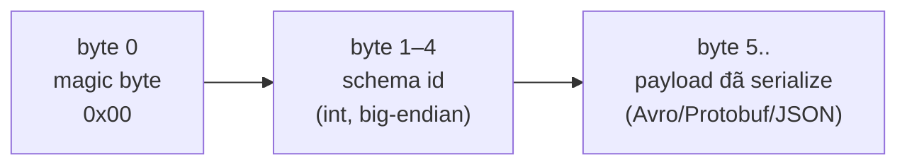

> **Chốt:** Message Kafka chỉ là byte; không có schema chung, producer đổi một field là consumer chết lặng lẽ. Schema Registry biến schema thành hợp đồng có luật tương thích cưỡng chế — và `BACKWARD` (mặc định) là hàng rào bạn tựa vào.

Giả định đã nắm [Kafka là gì](../reference/what-is-kafka.md) và [topic, partition, offset](../reference/topic-partition-offset.md). Đây là cách xử lý bài toán: nhiều team đọc/ghi cùng topic và schema sẽ đổi theo thời gian.

## Vì sao cần

Broker không hiểu nội dung message — với nó tất cả là byte. Nếu producer và consumer chỉ ngầm hiểu format:

- Producer thêm một field, đổi kiểu `int` thành `string`, hay bỏ field bắt buộc.
- Consumer parse theo format cũ → hoặc ném exception, hoặc tệ hơn, đọc rác **không báo lỗi**.

Không có nơi nào cưỡng chế "format mới phải tương thích format cũ". Schema Registry là nơi đó.

## Wire format: byte-level

Confluent Schema Registry là một service riêng lưu các phiên bản schema, gán mỗi schema một **id** toàn cục (int). Message không nhét cả schema vào payload (tốn chỗ) mà chỉ mang id ở 5 byte đầu:



```text
+--------+------------------+-----------------------------+
| 0x00   | schema id (4B)   | payload serialize (Avro...) |
+--------+------------------+-----------------------------+
  1 byte      4 byte                 phần còn lại
```

- **Magic byte `0x00`**: đánh dấu định dạng Confluent wire format. Byte khác → serializer không phải của Confluent, deserialize sẽ lỗi.
- **Schema id (4 byte, big-endian)**: id toàn cục của schema trong Registry, **không** phải version trong subject. Cùng một schema đăng ký ở nhiều subject vẫn dùng chung một id.
- **Payload**: với Avro là dữ liệu binary thuần, **không tự mô tả** — bắt buộc phải có schema (tra từ id) mới đọc được.

Luồng: producer đăng ký schema → Registry trả id → serializer đóng id vào 5 byte đầu. Consumer đọc id → hỏi Registry lấy đúng writer schema → deserialize (kết hợp với reader schema của chính consumer). Registry cache theo id nên không phải mỗi message một round-trip; chỉ id **mới lạ** mới gọi Registry.

## Chọn format

| Format | Ưu | Nhược |
|---|---|---|
| **Avro** | Gọn, schema evolution mạnh, hệ sinh thái Kafka trưởng thành | Cần schema để đọc (không tự mô tả) |
| **Protobuf** | Nhanh, đa ngôn ngữ, quen với team gRPC | Luật evolution khác Avro, cần chú ý |
| **JSON Schema** | Người đọc được, dễ debug | To hơn, chậm hơn, ràng buộc lỏng hơn |

Mặc định chọn Avro nếu không có lý do khác; Protobuf nếu tổ chức đã chuẩn hoá quanh nó.

## Subject naming strategies

Registry kiểm tương thích theo **subject**, không theo topic trực tiếp. Chiến lược đặt tên subject quyết định "cái gì phải tương thích với cái gì".

| Strategy | Subject = | Hệ quả | Dùng khi |
|---|---|---|---|
| **TopicNameStrategy** (mặc định) | `<topic>-value` (và `<topic>-key`) | Một topic một schema value; kiểm tương thích trong phạm vi topic | Mặc định, một loại event mỗi topic |
| **RecordNameStrategy** | tên đầy đủ của record | Nhiều loại record cùng topic; tương thích kiểm theo **loại record** xuyên topic | Nhiều loại event trong một topic |
| **TopicRecordNameStrategy** | `<topic>-<tên record>` | Nhiều loại record trong một topic, nhưng phạm vi tương thích bó trong topic đó | Nhiều event/topic nhưng muốn cô lập theo topic |

Đa số ca dùng mặc định TopicNameStrategy; chỉ đổi khi thực sự cần nhiều loại event trong một topic (ví dụ giữ thứ tự giữa các loại event liên quan trên cùng partition).

## Ma trận compatibility

Đây là phần cốt lõi. Mode quyết định thay đổi schema nào Registry chấp nhận, và **ai** (producer hay consumer) an toàn khi deploy trước.

| Mode | Ai được bảo vệ | Cho phép |
|---|---|---|
| `BACKWARD` (mặc định) | **Consumer mới** đọc được **dữ liệu cũ** | Thêm field **có default**, xoá field |
| `FORWARD` | **Consumer cũ** đọc được **dữ liệu mới** | Thêm field, xoá field **có default** |
| `FULL` | Cả hai chiều | Chỉ thêm/xoá field có default |
| `NONE` | Không kiểm gì | Mọi thay đổi — nguy hiểm |

Biến thể `_TRANSITIVE` (ví dụ `BACKWARD_TRANSITIVE`) kiểm tương thích với **mọi** phiên bản trước, không chỉ phiên bản liền kề. Không transitive chỉ kiểm với version ngay trước — dễ lọt lỗi khi qua nhiều bậc (mỗi bậc hợp lệ nhưng v1 và v3 không còn tương thích).

### Thao tác × mode: an toàn hay phá

| Thao tác trên schema | `BACKWARD` | `FORWARD` | `FULL` | Deploy bên nào trước |
|---|---|---|---|---|
| Thêm field **có default** | An toàn | An toàn | An toàn | (bất kỳ) |
| Thêm field **không default** | **Phá** | An toàn | **Phá** | producer trước (nếu FORWARD) |
| Xoá field **có default** | An toàn | An toàn | An toàn | (bất kỳ) |
| Xoá field **không default** | An toàn | **Phá** | **Phá** | consumer trước (nếu BACKWARD) |
| Đổi type (`int`→`string`) | **Phá** | **Phá** | **Phá** | không làm; thêm field mới |
| Đổi tên field (không alias) | **Phá** | **Phá** | **Phá** | dùng `aliases` hoặc field mới |
| Đổi nghĩa/đơn vị (schema y hệt) | Lọt (không bắt được) | Lọt | Lọt | Registry không cứu — đổi tên field |

Quy tắc "deploy bên nào trước" gắn với ai được mode bảo vệ:

- `BACKWARD` bảo vệ **consumer mới đọc dữ liệu cũ** → deploy **consumer trước**, vì trong topic vẫn còn dữ liệu format cũ mà consumer mới phải đọc được.
- `FORWARD` bảo vệ **consumer cũ đọc dữ liệu mới** → deploy **producer trước** an toàn, vì consumer cũ còn chạy phải nuốt được dữ liệu format mới.
- `FULL` an toàn hai chiều → thứ tự deploy không quan trọng, đổi lại evolve gò bó hơn (chỉ thêm/xoá field có default).

## References: schema tham chiếu schema

Một schema có thể **tham chiếu** schema khác thay vì lặp lại định nghĩa (ví dụ nhiều event dùng chung một record `Address`). Đăng ký `Address` thành một subject/version riêng, rồi schema `Order` khai báo một reference tới nó theo tên + subject + version.

- Lợi: một định nghĩa dùng chung nhiều nơi, evolve `Address` một chỗ.
- Bẫy: khi resolve, Registry phải kéo cả cây reference; version của schema được tham chiếu bị "ghim" — đổi `Address` không tự động cập nhật các schema đang tham chiếu version cũ.

## Ví dụ evolve (minh hoạ, chưa chạy)

Thêm một field `email` có default vào schema `User`, dưới mode `BACKWARD`:

```json
// v1 (minh hoạ — chưa chạy)
{
  "type": "record",
  "name": "User",
  "fields": [
    { "name": "id",   "type": "long" },
    { "name": "name", "type": "string" }
  ]
}
```

```json
// v2 — thêm email CÓ default → hợp lệ BACKWARD (minh hoạ — chưa chạy)
{
  "type": "record",
  "name": "User",
  "fields": [
    { "name": "id",    "type": "long" },
    { "name": "name",  "type": "string" },
    { "name": "email", "type": "string", "default": "" }
  ]
}
```

Vì sao an toàn dưới `BACKWARD`: consumer dùng reader schema v2 gặp dữ liệu cũ (không có `email`) sẽ điền `default` `""` — không lỗi. Nếu bỏ `"default"` đi, Registry **từ chối** đăng ký v2 vì phá BACKWARD (consumer v2 không có gì để điền cho dữ liệu v1).

## Trade-offs

| Được | Trả giá |
|---|---|
| Bắt lỗi schema lúc deploy thay vì lúc chạy production | Thêm một service phải vận hành và HA |
| Message gọn (chỉ mang id, không mang schema) | Consumer phụ thuộc Registry để deserialize |
| Hợp đồng tường minh giữa team | Kỷ luật evolve; team phải hiểu compatibility mode |

## Common Mistakes

| Sai | Hậu quả | Sửa |
|---|---|---|
| Thêm field **bắt buộc** (không default) | Phá `BACKWARD`, Registry từ chối hoặc consumer cũ chết | Field mới luôn có default |
| Đặt mode `NONE` cho "linh hoạt" | Mất toàn bộ bảo vệ, chết production sau này | Giữ ít nhất `BACKWARD` |
| Đổi type field âm thầm | Deserialize lỗi | Thêm field mới thay vì đổi type |
| Đổi nghĩa/đơn vị nhưng giữ schema hợp lệ | Downstream tính sai, không lỗi nào báo | Đổi tên field khi đổi nghĩa |
| Dùng non-transitive rồi nhảy nhiều version | v1 và v3 lệch nhau dù mỗi bậc hợp lệ | Cân nhắc `_TRANSITIVE` khi evolve dài |
| Deploy sai bên trước so với mode | Consumer/producer đọc không được dữ liệu | Khớp thứ tự deploy với mode (bảng trên) |

## FAQ

<details>
<summary>BACKWARD hay FORWARD, chọn theo tiêu chí nào?</summary>

Theo thứ tự deploy. Nếu consumer lên trước producer, consumer mới phải đọc được dữ liệu cũ còn trong topic → `BACKWARD`. Nếu producer lên trước, consumer cũ còn chạy phải đọc dữ liệu mới → `FORWARD`. Không kiểm soát được thứ tự thì `FULL`.

</details>

<details>
<summary>Vì sao chỉ mang schema id chứ không nhét cả schema vào message?</summary>

Schema có thể hàng KB; nhân với hàng triệu message là lãng phí khổng lồ. Mang một int 4 byte id, để consumer tra Registry (có cache) rẻ hơn nhiều.

</details>

<details>
<summary>Schema id trong message có phải là version của subject không?</summary>

Không. Id là **toàn cục** trong Registry; version là số thứ tự **trong một subject**. Cùng một schema chia sẻ giữa nhiều subject vẫn một id nhưng có thể là version khác nhau ở mỗi subject.

</details>

## Related Topics

- [Kafka là gì](../reference/what-is-kafka.md)
- [Topic, partition, offset](../reference/topic-partition-offset.md)
- [Kafka Connect và CDC](kafka-connect-cdc.md)
- [Consumer group và rebalance](consumer-groups.md)
- [Delivery semantics](../reference/delivery-semantics.md)
- [Kafka index](../index.md)
