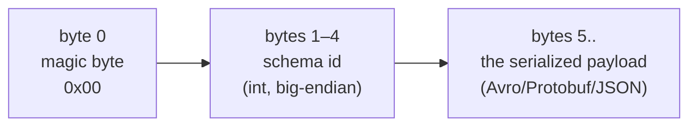

> **Takeaway:** Kafka messages are just bytes; with no shared schema, a producer changing one field kills consumers silently. Schema Registry turns the schema into a contract with enforced compatibility rules — and `BACKWARD` (the default) is the fence you lean on.

Assumes you've got [what Kafka is](../reference/what-is-kafka.md) and [topic, partition, offset](../reference/topic-partition-offset.md). This is how to handle the problem: several teams reading/writing the same topic while the schema changes over time.

## Why you need it

The broker doesn't understand message content — to it everything is bytes. If the producer and consumer only have an implicit agreement about the format:

- The producer adds a field, changes an `int` to a `string`, or drops a mandatory field.
- The consumer parses with the old format → either it throws an exception, or worse, it reads garbage **without reporting anything**.

Nothing anywhere enforces "the new format must be compatible with the old". Schema Registry is that place.

## Wire format: at the byte level

Confluent Schema Registry is a separate service storing schema versions and assigning each schema a global **id** (an int). Messages don't stuff the whole schema into the payload (wasteful) but only carry the id in the first 5 bytes:



```text
+--------+------------------+-----------------------------+
| 0x00   | schema id (4B)   | payload serialize (Avro...) |
+--------+------------------+-----------------------------+
  1 byte      4 byte                 phần còn lại
```

- **Magic byte `0x00`**: marks the Confluent wire format. A different byte → the serializer isn't Confluent's, and deserialization will fail.
- **Schema id (4 bytes, big-endian)**: the schema's global id in the Registry, **not** its version within a subject. The same schema registered under several subjects still shares one id.
- **Payload**: with Avro this is pure binary data, **not self-describing** — you must have the schema (looked up by id) to read it.

The flow: the producer registers the schema → the Registry returns an id → the serializer packs the id into the first 5 bytes. The consumer reads the id → asks the Registry for the exact writer schema → deserializes (combining it with the consumer's own reader schema). The Registry is cached by id, so it isn't a round trip per message; only an **unfamiliar** id calls the Registry.

## Choosing a format

| Format | Pros | Cons |
|---|---|---|
| **Avro** | Compact, strong schema evolution, a mature Kafka ecosystem | Needs the schema to read (not self-describing) |
| **Protobuf** | Fast, multi-language, familiar to gRPC teams | Different evolution rules from Avro, needs attention |
| **JSON Schema** | Human-readable, easy to debug | Larger, slower, looser constraints |

Default to Avro absent a reason otherwise; Protobuf if the organisation has standardised around it.

## Subject naming strategies

The Registry checks compatibility per **subject**, not directly per topic. The subject naming strategy decides "what has to be compatible with what".

| Strategy | Subject = | Consequence | Use when |
|---|---|---|---|
| **TopicNameStrategy** (the default) | `<topic>-value` (and `<topic>-key`) | One topic, one value schema; compatibility checked within the topic | The default, one event type per topic |
| **RecordNameStrategy** | the record's full name | Several record types in one topic; compatibility checked per **record type** across topics | Several event types in one topic |
| **TopicRecordNameStrategy** | `<topic>-<record name>` | Several record types in one topic, but the compatibility scope is bounded to that topic | Several events per topic while isolating per topic |

Most cases use the default TopicNameStrategy; only change it when you genuinely need several event types in one topic (e.g. preserving ordering between related event types on the same partition).

## The compatibility matrix

This is the core part. The mode decides which schema changes the Registry accepts, and **which side** (producer or consumer) is safe to deploy first.

| Mode | Who's protected | Allows |
|---|---|---|
| `BACKWARD` (the default) | **New consumers** reading **old data** | Adding a field **with a default**, deleting a field |
| `FORWARD` | **Old consumers** reading **new data** | Adding a field, deleting a field **with a default** |
| `FULL` | Both directions | Only adding/deleting fields with defaults |
| `NONE` | No checking at all | Any change — dangerous |

The `_TRANSITIVE` variants (e.g. `BACKWARD_TRANSITIVE`) check compatibility against **every** earlier version, not just the immediately preceding one. Non-transitive only checks against the version right before — easily letting a bug through across several steps (each step valid, but v1 and v3 no longer compatible).

### Operation × mode: safe or breaking

| Schema operation | `BACKWARD` | `FORWARD` | `FULL` | Which side to deploy first |
|---|---|---|---|---|
| Adding a field **with a default** | Safe | Safe | Safe | (either) |
| Adding a field **without a default** | **Breaks** | Safe | **Breaks** | the producer first (if FORWARD) |
| Deleting a field **with a default** | Safe | Safe | Safe | (either) |
| Deleting a field **without a default** | Safe | **Breaks** | **Breaks** | the consumer first (if BACKWARD) |
| Changing a type (`int`→`string`) | **Breaks** | **Breaks** | **Breaks** | don't; add a new field instead |
| Renaming a field (no alias) | **Breaks** | **Breaks** | **Breaks** | use `aliases` or a new field |
| Changing the meaning/unit (identical schema) | Slips through (not caught) | Slips through | Slips through | the Registry can't save you — rename the field |

The "which side first" rule follows from who the mode protects:

- `BACKWARD` protects **new consumers reading old data** → deploy the **consumer first**, because the topic still holds old-format data the new consumer must be able to read.
- `FORWARD` protects **old consumers reading new data** → deploying the **producer first** is safe, because the still-running old consumers must be able to swallow new-format data.
- `FULL` is safe in both directions → deploy order doesn't matter, in exchange for more constrained evolution (only adding/deleting fields with defaults).

## References: schemas referencing schemas

A schema can **reference** another schema instead of repeating its definition (e.g. several events sharing an `Address` record). You register `Address` as its own subject/version, then the `Order` schema declares a reference to it by name + subject + version.

- The benefit: one definition shared in many places, evolving `Address` in one spot.
- The trap: when resolving, the Registry has to pull the whole reference tree; the referenced schema's version is "pinned" — changing `Address` doesn't automatically update schemas referencing the old version.

## An evolution example (illustrative, not run)

Adding an `email` field with a default to the `User` schema, under `BACKWARD` mode:

```json
// v1 (minh hoạ — chưa chạy)
{
  "type": "record",
  "name": "User",
  "fields": [
    { "name": "id",   "type": "long" },
    { "name": "name", "type": "string" }
  ]
}
```

```json
// v2 — thêm email CÓ default → hợp lệ BACKWARD (minh hoạ — chưa chạy)
{
  "type": "record",
  "name": "User",
  "fields": [
    { "name": "id",    "type": "long" },
    { "name": "name",  "type": "string" },
    { "name": "email", "type": "string", "default": "" }
  ]
}
```

Why it's safe under `BACKWARD`: a consumer with reader schema v2 meeting old data (with no `email`) fills in the `default` `""` — no error. Drop the `"default"` and the Registry **refuses** to register v2 because it breaks BACKWARD (a v2 consumer has nothing to fill in for v1 data).

## Trade-offs

| You get | You pay |
|---|---|
| Catching schema errors at deploy time rather than in production | Another service to operate and keep highly available |
| Compact messages (carrying only an id, not the schema) | Consumers depend on the Registry to deserialize |
| An explicit contract between teams | Evolution discipline; the team must understand compatibility modes |

## Common Mistakes

| Mistake | Consequence | Fix |
|---|---|---|
| Adding a **mandatory** field (no default) | Breaks `BACKWARD`; the Registry refuses it or old consumers die | New fields always have a default |
| Setting mode `NONE` for "flexibility" | Losing all protection, and dying in production later | Keep at least `BACKWARD` |
| Silently changing a field's type | Deserialization errors | Add a new field instead of changing the type |
| Changing the meaning/unit while keeping the schema valid | Downstream computes wrongly, with nothing reported | Rename the field when the meaning changes |
| Using non-transitive and then jumping several versions | v1 and v3 diverge even though each step was valid | Consider `_TRANSITIVE` for long-running evolution |
| Deploying the wrong side first for the mode | Consumers/producers can't read the data | Match the deploy order to the mode (the table above) |

## FAQ

<details>
<summary>BACKWARD or FORWARD — what's the criterion?</summary>

The deploy order. If the consumer goes up before the producer, the new consumer must be able to read the old data still in the topic → `BACKWARD`. If the producer goes first, the still-running old consumers must read the new data → `FORWARD`. If you can't control the order, `FULL`.

</details>

<details>
<summary>Why carry only a schema id rather than stuffing the schema into the message?</summary>

A schema can be several KB; multiplied by millions of messages that's enormous waste. Carrying a 4-byte int id and letting the consumer look it up in the Registry (with a cache) is far cheaper.

</details>

<details>
<summary>Is the schema id in the message the subject's version?</summary>

No. The id is **global** within the Registry; the version is the sequence number **within a subject**. The same schema shared between several subjects keeps one id but may be a different version in each subject.

</details>

## Related Topics

- [What Kafka is](../reference/what-is-kafka.md)
- [Topic, partition, offset](../reference/topic-partition-offset.md)
- [Kafka Connect and CDC](kafka-connect-cdc.md)
- [Consumer groups and rebalance](consumer-groups.md)
- [Delivery semantics](../reference/delivery-semantics.md)
- [Kafka index](../index.md)
