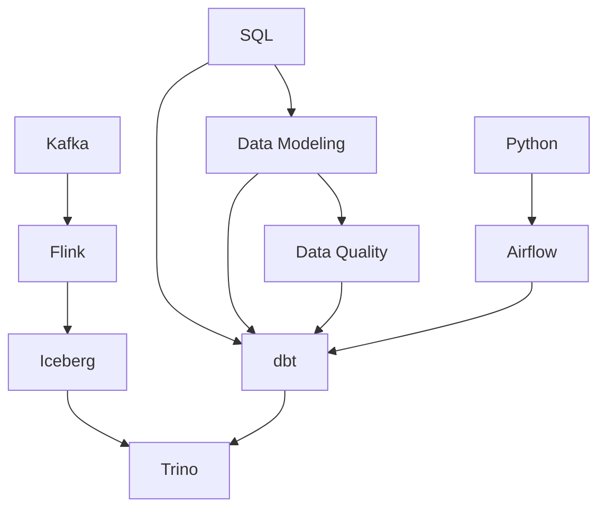

# `docs/` table of contents

This page lists **every file** in `docs/` in one place, so you don't have to open each
child `index.md` in turn. Each technology directory still has its own `index.md` with a
concept map and a detailed learning path — this page only answers *"which file holds the
thing I need"*.

**Symbols:** ✅ run by hand · 📝 theory, unverified · 🟡 outline + pitfalls only · 🗂️ index

> **Two ways into the same set of files.** This page groups by **topic**. To group by
> **document type** — reference / exercises / case study / cheatsheet — see
> [`catalog.md`](catalog.md). To slice by both at once, use a tag page, for example
> [`/tags/data-modeling`](/tags/data-modeling).

## Data Modeling

Table design. Read [`grain`](data-modeling/reference/grain.md) before anything else.

| File | Answers the question | St |
|---|---|---|
| [data-modeling/index](data-modeling/index.md) | Concept map + reading order | 🗂️ |
| [grain](data-modeling/reference/grain.md) | What a single row of this table represents | ✅ |
| [fact-and-dimension](data-modeling/reference/fact-and-dimension.md) | What goes in a fact, what goes in a dimension; three fact types and additivity | 📝 |
| [scd](data-modeling/skills/scd.md) | When an attribute changes, which value do past reports use — eight ways (Type 0–7) | 📝 |
| [scd-change-detection](data-modeling/skills/scd-change-detection.md) | Four ways to know which row changed, and hashing's four traps | 🟡 |
| [junk-dimension](data-modeling/skills/junk-dimension.md) | Low-cardinality columns: leave them in the fact, split into a dimension, or combine | 🟡 |
| [mini-dimension](data-modeling/skills/mini-dimension.md) | Split fast-changing columns out of a big dim — history moves to the fact | 🟡 |
| [role-playing-dimension](data-modeling/skills/role-playing-dimension.md) | One dim, many roles — use clearly named views, don't copy the table | 🟡 |
| [conformed-dimension](data-modeling/skills/conformed-dimension.md) | Only the same key with the same meaning lets you combine numbers across two facts | 🟡 |
| [bridge-table](data-modeling/skills/bridge-table.md) | Many-to-many: allocation factors so the total doesn't inflate | 🟡 |
| [design-process](data-modeling/reference/design-process.md) | From a vague business requirement to a working table, in four steps | 📝 |
| [star-snowflake-obt](data-modeling/reference/star-snowflake-obt.md) | Three layouts; measured OBT vs star: 0.76× or 10.23× depending on cardinality | 📝 |
| [date-dimension](data-modeling/reference/date-dimension.md) | Why the calendar has to be a table — fiscal quarters are off by 202% if you use `quarter()` | 📝 |
| [degenerate-dimension](data-modeling/skills/degenerate-dimension.md) | The order number stays in the fact; building a dim for it means a table at the fact's own grain | 📝 |
| [hierarchy](data-modeling/skills/hierarchy.md) | Ragged trees: fixed flattening loses 50% of rows, a path bridge doesn't | 📝 |
| [late-arriving](data-modeling/skills/late-arriving.md) | A late fact gets the wrong dim version; for a late dim, use an inferred member | 📝 |
| [aggregate-fact-table](data-modeling/skills/aggregate-fact-table.md) | An aggregate table stores only additive numbers; shrunken dims are derived from the base dims | 📝 |
| [multi-currency-uom](data-modeling/skills/multi-currency-uom.md) | Freeze both the local and the converted amount into the fact, along with the rate used | 📝 |
| [audit-dimension](data-modeling/skills/audit-dimension.md) | Every fact row points back to the run that produced it; an error event schema for rejected rows | 📝 |
| [Lab: star schema on DuckDB](data-modeling/tutorials/star-schema-duckdb.md) | Build 3 facts + shared dims from raw data, with 4 mandatory checks | 📝 |
| [Lab: SCD with dbt snapshot](data-modeling/tutorials/scd-bang-dbt-snapshot.md) | `dbt snapshot` only records history from its first run — an as-was join returns 0 rows | 📝 |
| [Lab: fundamentals](data-modeling/tutorials/lab-nen-tang-grain-fact-dim.md) | Reproduce then fix: mixed grain (+77.5%), joining two facts, a dim at the fact's grain (+44.1%), joining Type 2 on the natural key (+26.9%) | 📝 |
| [Lab: dimensions](data-modeling/tutorials/lab-dimension.md) | A `NULL` key loses 17.3%, a `<>` filter swallows rows, fixed flattening drops shallow branches | 📝 |
| [Lab: advanced facts](data-modeling/tutorials/lab-fact-nang-cao.md) | A 1-unit rounding error, a YTD column inflating 3.38×, avg-of-avg off by 5.7%, a 7-key centipede | 📝 |
| [Lab: integration](data-modeling/tutorials/lab-tich-hop.md) | Two revenue definitions differing by 3.9%; drill-across in three passes; the bus matrix as a measurable table | 📝 |
| [Lab: operations](data-modeling/tutorials/lab-van-hanh.md) | A double load inflating 25%; with no audit you delete 10 rows to kill 5; hot partitions | 📝 |
| [26 exercises with known answers](data-modeling/tutorials/bai-tap-co-dap-so.md) | Write the SQL yourself, the answer is given, the solution hides in `
` — self-graded | 📝 |
| [Seed appendix](data-modeling/tutorials/bt-00-seed.md) | Ten new seed tables for the exercise sets, with each table's deliberate trap | 📝 |
| [Exercise set 1: fundamentals](data-modeling/tutorials/bt-01-nen-tang.md) | 23 exercises: grain across 7 tables, semi-additive, surrogate keys, star vs OBT, the 4-step process | 📝 |
| [Exercise set 2: dimensions over time](data-modeling/tutorials/bt-02-dimension-thoi-gian.md) | 22 exercises: SCD 1/2/3/6, three ways `updated_at` lies, mini-dim, role-playing, late arrival | 📝 |
| [Exercise set 3: columns and tables](data-modeling/tutorials/bt-03-cot-va-bang.md) | 23 exercises: junk 4/24 combinations, degenerate, a 19-key centipede, `NOT IN` returning 0 rows | 📝 |
| [Exercise set 4: relationships and trees](data-modeling/tutorials/bt-04-quan-he-va-cay.md) | 16 exercises: a bridge inflating 72% then missing 90,000, ragged trees, 63.9% empty cells | 📝 |
| [Exercise set 5: advanced facts](data-modeling/tutorials/bt-05-fact-nang-cao.md) | 19 exercises: allocation losing 1 unit, YTD inflating 3.38×, avg-of-avg, behavior | 📝 |
| [Exercise set 6: integration](data-modeling/tutorials/bt-06-tich-hop.md) | 18 exercises: joining on group name returns 0 rows, drill-across, bus matrix, 2/7 foreign-currency orders lost | 📝 |
| [Exercise set 7: operations](data-modeling/tutorials/bt-07-van-hanh.md) | 14 exercises: the `-1` row of `dim_ngay`, a double load at +45.5%, today's date isn't complete yet | 📝 |
| [bus-architecture](data-modeling/reference/bus-architecture.md) | The bus matrix is a data table, not a slide; value chains and drill-across along the chain | 📝 |
| [null-handling](data-modeling/skills/null-handling.md) | `NULL <> 'x'` returns `UNKNOWN` — the filter swallows rows without warning | 📝 |
| [conformed-facts](data-modeling/skills/conformed-facts.md) | The same name must mean the same thing; if it isn't conformed, you must rename it | 📝 |
| [dimension-attribute-design](data-modeling/skills/dimension-attribute-design.md) | Textual flags, several parallel hierarchies, drill down, text comments | 📝 |
| [allocated-facts](data-modeling/skills/allocated-facts.md) | Header/line, allocation by weight, and P&L down to product level | 📝 |
| [centipede-fact](data-modeling/skills/centipede-fact.md) | 8 foreign keys for 2 real dimensions; an outrigger breaks Type 2's as-was | 📝 |
| [ytd-timespan-facts](data-modeling/skills/ytd-timespan-facts.md) | Don't store running totals, do store effective ranges; surrogate keys for fact rows | 📝 |
| [behavior-dimension](data-modeling/skills/behavior-dimension.md) | Aggregates as attributes, dynamic bucketing, study groups, steps | 📝 |
| [heterogeneous-schema](data-modeling/skills/heterogeneous-schema.md) | Supertype/subtype, the measure type dimension, and two techniques to avoid | 📝 |
| [real-time-fact](data-modeling/skills/real-time-fact.md) | Hot partitions: an incomplete day still counts as a whole day | 📝 |
| [CS: past reports change their numbers](data-modeling/case-studies/bao-cao-qua-khu-tu-doi-so.md) | Type 1 makes a closed-book report change its numbers on a rerun | 📝 |
| [CS: joining two facts inflates the total](data-modeling/case-studies/join-hai-fact-lam-phong-tong.md) | Two facts at different grains joined directly — revenue inflated 67% | 📝 |
| [CS: a dimension inflated 365×](data-modeling/case-studies/dimension-phinh-365-lan.md) | Type 2 on a daily-changing column: 100k customers become 36.5M rows | 📝 |
| [CS: two marts that won't combine](data-modeling/case-studies/hai-mart-khong-ghep-duoc.md) | No conformed dimension — the cross-cutting question is impossible | 📝 |
| [CS: adding an eighth status](data-modeling/case-studies/them-trang-thai-thu-tam.md) | A hardcoded status list in the WHERE clause — 21% of revenue missing | 📝 |
| [CS: half the orders vanished](data-modeling/case-studies/don-dang-giao-bien-mat.md) | `JOIN` wipes out undelivered orders — 4 orders become 2 | 📝 |
| [CS: chose OBT, then needed as-is](data-modeling/case-studies/chon-obt-roi-can-as-is.md) | OBT has no notion of versions, so as-is is impossible | 📝 |
| [CS: fiscal quarter off by 202%](data-modeling/case-studies/bao-cao-quy-tai-chinh-lech.md) | `quarter()` answers about calendar quarters — nobody asked that question | 📝 |
| [CS: the order dim inflates by 40%](data-modeling/case-studies/dim-don-hang-lam-phong-doanh-thu.md) | A dimension at the fact's grain duplicates rows | 📝 |
| [CS: level-3 report loses half](data-modeling/case-studies/bao-cao-cap-3-mat-mot-nua.md) | A ragged tree flattened to fixed depth — shallow branches fall into `NULL` and get filtered out | 📝 |
| [CS: the North region reads 0](data-modeling/case-studies/fact-den-muon-gan-sai-khu-vuc.md) | `AND la_hien_tai` disables Type 2; `INNER JOIN` loses 28% of revenue | 📝 |
| [CS: dashboard says 800, hand query says 1,000](data-modeling/case-studies/bang-tong-hop-lech-so.md) | The aggregate table stores an `avg` and isn't reloaded over the same window | 📝 |
| [CS: revenue drops 10% on its own](data-modeling/case-studies/doanh-thu-doi-theo-ty-gia.md) | Converting currency at read time makes the past move with the exchange rate | 📝 |
| [CS: loaded twice, can't trace it](data-modeling/case-studies/nap-hai-lan-khong-truy-duoc.md) | With no audit dimension you can only delete by date range | 📝 |
| [CS: filtering "not cancelled" loses a quarter](data-modeling/case-studies/loc-khac-huy-mat-mot-phan-tu.md) | Three-valued logic: `NULL <> 'huy'` is not `TRUE` | 📝 |
| [CS: two departments, two revenues](data-modeling/case-studies/hai-phong-hai-doanh-thu.md) | Same column name, different formula — a plausible and meaningless 89.4% | 📝 |
| [CS: a dashboard full of Y, N and y](data-modeling/case-studies/co-y-n-tren-dashboard.md) | Source-system codes go straight to the report; one concept becomes three groups | 📝 |
| [CS: shipping fees inflated 133%](data-modeling/case-studies/phi-ship-phong-133-phan-tram.md) | An order-level measure duplicated down to order lines, while goods value still matches | 📝 |
| [CS: a fact with eight foreign keys](data-modeling/case-studies/fact-hai-chuc-khoa-ngoai.md) | Every level of one hierarchy becomes its own dimension | 📝 |
| [CS: summing a running-total column](data-modeling/case-studies/cong-cot-luy-ke.md) | The YTD column looks exactly like the revenue column — inflated 2.13× | 📝 |
| [CS: summing an aggregate column in a dim](data-modeling/case-studies/cong-cot-tong-hop-trong-dim.md) | Right column, right join, right fact — result inflated 1.99× | 📝 |
| [CS: dim_san_pham is 67% empty cells](data-modeling/case-studies/bang-san-pham-hai-phan-ba-o-trong.md) | Several entity types in one table, so you can't set `NOT NULL` | 📝 |
| [CS: today's numbers jump all day](data-modeling/case-studies/so-hom-nay-nhay-suot-ngay.md) | An incomplete day is still a denominator of 1 — 862.5 at 11:00, 1,050 at 21:00 | 📝 |
| [CS: five marts that won't combine](data-modeling/case-studies/moi-mart-mot-dim-khach.md) | Marts built before the dimensions were agreed on | 📝 |
| [surrogate-key](data-modeling/reference/surrogate-key.md) | Why not to use the business code directly as the dimension key | 🟡 |

## Data Quality

| File | Answers the question | St |
|---|---|---|
| [data-quality/index](data-quality/index.md) | Three layers of data protection, tool-independent | 🗂️ |
| [six-dimensions](data-quality/six-dimensions.md) | Uniqueness, completeness, validity, integrity, timeliness, accuracy | 📝 |

## Design Patterns

The 23 GoF patterns in C#. Read [`what-is-a-pattern`](patterns/reference/what-is-a-pattern.md)
and [`choosing-a-pattern`](patterns/reference/choosing-a-pattern.md) first; the other 23 pages
are **lookup** material, not a course to read front to back.

| File | Answers the question | St |
|---|---|---|
| [patterns/index](patterns/index.md) | Concept map + reading order | 🗂️ |
| [what-is-a-pattern](patterns/reference/what-is-a-pattern.md) | What a pattern is, the three groups, and **when not to use one** | 📝 |
| [solid](patterns/reference/solid.md) | Five principles, each with a violation that produces a real bug | 📝 |
| [composition-over-inheritance](patterns/reference/composition-over-inheritance.md) | Inheritance multiplies classes, composition adds them — 72 versus 11 | 📝 |
| [coupling-cohesion](patterns/reference/coupling-cohesion.md) | Measuring fan-out with reflection; 7 versus 3 after splitting a god class | 📝 |
| [choosing-a-pattern](patterns/reference/choosing-a-pattern.md) | Look up a pattern name from the symptom | 📝 |
| [singleton](patterns/skills/singleton.md) | Hand-rolled lazy init creates 8 instances; hidden fan-out you can't measure | 📝 |
| [factory-method](patterns/skills/factory-method.md) | Two parallel `switch` statements will drift apart sooner or later | 📝 |
| [abstract-factory](patterns/skills/abstract-factory.md) | One product family has to match; mixing families throws no error | 📝 |
| [builder](patterns/skills/builder.md) | A 4-parameter constructor of the same type: 183 sheets of paper become 242 | 📝 |
| [prototype](patterns/skills/prototype.md) | `MemberwiseClone` **and** `record with` are both shallow copies | 📝 |
| [adapter](patterns/skills/adapter.md) | `catch { return null; }` turns an incident into wrong data | 📝 |
| [bridge](patterns/skills/bridge.md) | Two axes: `n × m` classes become `n + m`; 48 versus 14 | 📝 |
| [composite](patterns/skills/composite.md) | A cycle in the tree → `StackOverflow`, uncatchable | 📝 |
| [decorator](patterns/skills/decorator.md) | Wrapping order changes the semantics: caching outside the permission check is a hole | 📝 |
| [facade](patterns/skills/facade.md) | Cutting the caller's fan-out from 5 to 1; and the god-object bloat trap | 📝 |
| [flyweight](patterns/skills/flyweight.md) | 500k cells: 112 MB down to 24 MB, measured with `GC.GetTotalMemory` | 📝 |
| [proxy](patterns/skills/proxy.md) | Lazy proxy: 1 query when untouched, 501 when touched | 📝 |
| [chain-of-responsibility](patterns/skills/chain-of-responsibility.md) | Nobody handles it, so it returns `null` — the request vanishes silently | 📝 |
| [command](patterns/skills/command.md) | `HoanTac` recomputes in reverse by formula: stock of 10 becomes 24 | 📝 |
| [interpreter](patterns/skills/interpreter.md) | One tree, many outputs — evaluating and generating SQL at once | 📝 |
| [iterator](patterns/skills/iterator.md) | Mutating while iterating; and re-iterating lazily means recomputing | 📝 |
| [mediator](patterns/skills/mediator.md) | `n(n-1)/2` becomes `n`: 190 links down to 20 | 📝 |
| [memento](patterns/skills/memento.md) | Snapshot state without breaking encapsulation; the shallow-snapshot trap | 📝 |
| [observer](patterns/skills/observer.md) | Forgetting `-=` leaks; one throwing observer blocks the ones after it | 📝 |
| [state](patterns/skills/state.md) | Transition rules get a place where they can be enforced | 📝 |
| [strategy](patterns/skills/strategy.md) | If there's still a `switch` picking the strategy, it isn't Strategy yet | 📝 |
| [template-method](patterns/skills/template-method.md) | A subclass forgetting to call `base` makes the shared rule disappear | 📝 |
| [visitor](patterns/skills/visitor.md) | Adding an operation is cheap, adding a node type is expensive — but *loudly* expensive | 📝 |
| [Lab: refactoring a switch into a pattern](patterns/tutorials/refactor-switch-sang-pattern.md) | Four escalating steps, and knowing **which step to stop at** | 📝 |
| [Cheatsheet: 23 GoF](patterns/cheatsheets/gof-23.md) | One-page table: intent, when to use / avoid, incarnations in .NET | 📝 |
| [CS: green apart, red together](patterns/case-studies/test-xanh-rieng-do-chung.md) | A singleton keeping state between tests; renaming a test changes the result | 📝 |
| [CS: a fifth type, six missed spots](patterns/case-studies/them-loai-thu-nam-sua-bay-cho.md) | Six parallel `switch` statements, the default branch hiding all of it | 📝 |
| [CS: printing 183 sheets became 242](patterns/case-studies/constructor-chin-tham-so-hoan-vi.md) | Two adjacent `int` parameters swapped, compiling cleanly | 📝 |
| [CS: edit the copy, the original changes](patterns/case-studies/nhan-ban-doi-tuong-dung-chung-list.md) | `ReferenceEquals(r1.Cot, r2.Cot) == True` after a `with` | 📝 |
| [CS: the report is 4.2 million short](patterns/case-studies/adapter-nuot-loi-thanh-danh-sach-rong.md) | The adapter swallows the error; monitoring has nothing to count | 📝 |
| [CS: one more option, 36 classes](patterns/case-studies/mot-tram-lop-con-cho-mot-tinh-nang.md) | Combinatorial explosion: 6 classes become 72 after three axes | 📝 |
| [CS: the process dies without logging](patterns/case-studies/duyet-cay-khong-bao-gio-dung.md) | A cycle in the composite tree; `StackOverflow` can't be caught | 📝 |
| [CS: the intern can read payroll](patterns/case-studies/doi-thu-tu-decorator-mat-cache.md) | Swapping two wiring lines punches a hole in authorization | 📝 |
| [CS: a 1-method facade became 31](patterns/case-studies/facade-phinh-thanh-god-object.md) | Grouping by category gives you no natural limit | 📝 |
| [CS: colour one cell, the whole table turns red](patterns/case-studies/flyweight-chia-se-nham-trang-thai.md) | A shared flyweight with a setter: 6/6 cells change colour | 📝 |
| [CS: one property becomes 501 queries](patterns/case-studies/lazy-proxy-sinh-n-cong-mot-query.md) | N+1: 1002ms versus 2ms, and the result is still correct | 📝 |
| [CS: the request vanishes, nobody reports it](patterns/case-studies/request-roi-qua-het-chain.md) | A chain with no terminal link; HTTP still returns 200 | 📝 |
| [CS: undo turns stock of 10 into 24](patterns/case-studies/undo-khong-tra-lai-trang-thai-cu.md) | Only wrong when you hit the upper bound — tidy test data won't catch it | 📝 |
| [CS: 8.4 MB leaked after 2000 opens](patterns/case-studies/su-kien-giu-doi-tuong-khong-cho-gc.md) | The source holds the observer; `WeakReference.IsAlive` is still `True` after a GC | 📝 |
| [CS: shipped before payment](patterns/case-studies/chuyen-trang-thai-trai-phep.md) | 8/12 illegal state transitions nobody had tested | 📝 |
| [CS: the subclass accepts broken rows too](patterns/case-studies/lop-con-quen-goi-base.md) | `override` replaces the shared rule rather than adding to it | 📝 |
| [CS: one more operator, six places to edit](patterns/case-studies/them-node-moi-sua-moi-visitor.md) | Does the compiler remind you, or does production | 📝 |
| [CS: the nightly job dies on `RemoveAll`](patterns/case-studies/sua-list-dang-duyet.md) | And the harder case: `Count()` then iterate = calling the API twice | 📝 |
| [CS: six ways of working for two](patterns/case-studies/abstract-factory-cho-mot-hien-thuc.md) | Over-engineering makes **every** quality metric look better | 📝 |

## ETL & Streaming

### dbt — [`etl/dbt/`](etl/dbt/index.md)

The lab lives at `~/Documents/learn-lab/dbt` (outside this repo): its own venv, `dbt-duckdb`,
seeds ready to go.

| # | File | Answers the question | St |
|---|---|---|---|
| — | [etl/dbt/index](etl/dbt/index.md) | Concept map + learning path | 🗂️ |
| 01 | [what-is-dbt](etl/dbt/reference/what-is-dbt.md) | What the SQL dbt generates actually looks like | ✅ |
| 02 | [project-structure](etl/dbt/reference/project-structure.md) | `dbt_project.yml`, `profiles.yml`; how `compiled/` differs from `run/` | 📝 |
| 03 | [models-and-ref](etl/dbt/reference/models-and-ref.md) | `ref()` is the only way to declare a dependency; DAG selectors, ephemeral, cycles | 📝 |
| 04 | [sources-seeds-snapshots](etl/dbt/reference/sources-seeds-snapshots.md) | Source freshness, seeds, and why a lost snapshot is lost for good | 📝 |
| 05 | [materializations](etl/dbt/reference/materializations.md) | Same SELECT, different DDL; `is_incremental()` before/after, four questions | 📝 |
| 06 | [testing](etl/dbt/reference/testing.md) | Three layers: test · contract · unit test | 📝 |
| 07 | [macros-jinja-packages](etl/dbt/reference/macros-jinja-packages.md) | Jinja disappears in the compiled SQL; macros, run_query, hooks | 📝 |
| 08 | [docs-and-lineage](etl/dbt/reference/docs-and-lineage.md) | manifest = intent, catalog = reality; `state:modified` for CI | 📝 |
| SK | [skills/implementing-tests](etl/dbt/skills/implementing-tests.md) | Six kinds of dbt test: generic, package, singular, custom, unit test, contract | 📝 |
| CS | [case-studies/ai-sinh-sai-ten-catalog-trino](etl/dbt/case-studies/ai-sinh-sai-ten-catalog-trino.md) | Why `verified_at` exists — an AI invented a catalog name and cost an afternoon | 📝 |

Hands-on exercises: [`etl/dbt/tutorials/dbt-lab-duckdb.md`](etl/dbt/tutorials/dbt-lab-duckdb.md).

### Kafka — [`etl/kafka/`](etl/kafka/index.md)

A distributed append-only log. Output in the reference/skills groups is **illustrative, not run**
(it needs a cluster); only the [Docker exercise](etl/kafka/tutorials/kafka-lab.md) is really run.

| File | Answers the question | St |
|---|---|---|
| [etl/kafka/index](etl/kafka/index.md) | Concept map + learning path | 🗂️ |
| [what-is-kafka](etl/kafka/reference/what-is-kafka.md) | Log vs queue: the message isn't gone once it's read | 📝 |
| [topic-partition-offset](etl/kafka/reference/topic-partition-offset.md) | A partition is the unit of parallelism **and** of ordering | 📝 |
| [replication-durability](etl/kafka/reference/replication-durability.md) | `acks=all` + `min.insync.replicas=2` is what durable means | 📝 |
| [retention-compaction](etl/kafka/reference/retention-compaction.md) | Deleting by time vs keeping the latest value per key | 📝 |
| [delivery-semantics](etl/kafka/reference/delivery-semantics.md) | At-most/at-least/exactly-once; idempotence, transactions | 📝 |
| [producer-tuning](etl/kafka/skills/producer-tuning.md) | `acks`, idempotence, batching, the partitioner | 📝 |
| [consumer-groups](etl/kafka/skills/consumer-groups.md) | Rebalance, committing offsets, getting kicked out for being slow | 📝 |
| [schema-registry](etl/kafka/skills/schema-registry.md) | Avro/Protobuf and the compatibility rules when a schema changes | 📝 |
| [kafka-connect-cdc](etl/kafka/skills/kafka-connect-cdc.md) | Debezium captures changes from the database, no code | 📝 |
| [operations-lag](etl/kafka/skills/operations-lag.md) | Consumer lag is health metric number one | 📝 |
| [Cheatsheet: CLI and config](etl/kafka/cheatsheets/cli-and-config.md) | Quick lookup for the `kafka-*` commands and config | 📝 |
| [Lab: Kafka on Docker](etl/kafka/tutorials/kafka-lab.md) | Produce, consume, rebalance, compaction with your own eyes | 📝 |
| [CS: ordering lost by changing the key](etl/kafka/case-studies/mat-thu-tu-vi-doi-key.md) | The key decides the partition; ordering breaks when the key changes | 📝 |
| [CS: the rebalance that never ends](etl/kafka/case-studies/rebalance-lien-tuc.md) | Processing longer than `max.poll.interval.ms` → you get kicked out | 📝 |
| [CS: data loss with acks=1](etl/kafka/case-studies/mat-du-lieu-acks-1.md) | The leader dies before a follower has copied the data | 📝 |
| [CS: compaction isn't what you expected](etl/kafka/case-studies/compaction-khong-nhu-mong-doi.md) | Compaction is a background process, not an instant one | 📝 |

### Flink — [`etl/flink/`](etl/flink/index.md)

A stateful stream processing engine. Output in reference/skills is **illustrative, not run**
(it needs a cluster); only the [Docker exercise](etl/flink/tutorials/flink-lab.md) is really run.

| File | Answers the question | St |
|---|---|---|
| [etl/flink/index](etl/flink/index.md) | Concept map + learning path | 🗂️ |
| [what-is-flink](etl/flink/reference/what-is-flink.md) | Stream vs batch; bounded vs unbounded | 📝 |
| [architecture](etl/flink/reference/architecture.md) | JobManager, TaskManager, slots, parallelism | 📝 |
| [event-time-watermark](etl/flink/reference/event-time-watermark.md) | Why processing time gives wrong numbers quietly | 📝 |
| [state-and-checkpoint](etl/flink/reference/state-and-checkpoint.md) | Where state is kept; recovering after a crash | 📝 |
| [exactly-once](etl/flink/reference/exactly-once.md) | Two-phase commit; what the sink has to support | 📝 |
| [datastream-vs-table-sql](etl/flink/skills/datastream-vs-table-sql.md) | Which API for which job | 📝 |
| [windows](etl/flink/skills/windows.md) | Tumbling/sliding/session; allowed lateness | 📝 |
| [savepoint-upgrade](etl/flink/skills/savepoint-upgrade.md) | Changing code without losing state; why you need `uid()` | 📝 |
| [connectors](etl/flink/skills/connectors.md) | Kafka source/sink, Iceberg sink, CDC | 📝 |
| [backpressure-tuning](etl/flink/skills/backpressure-tuning.md) | Reading backpressure, tuning parallelism | 📝 |
| [Cheatsheet: config and SQL](etl/flink/cheatsheets/config-and-sql.md) | Config by group + watermark/window syntax | 📝 |
| [Lab: Flink SQL on Docker](etl/flink/tutorials/flink-lab.md) | Windowed aggregation, watermarks, late data | 📝 |
| [CS: the window never fires](etl/flink/case-studies/cua-so-khong-chay-idle-partition.md) | A silent partition holds the watermark still | 📝 |
| [CS: wrong numbers from processing time](etl/flink/case-studies/so-sai-vi-processing-time.md) | Late arrivals land in the wrong window, with no error raised | 📝 |
| [CS: state keeps growing](etl/flink/case-studies/state-phinh-thieu-ttl.md) | With no TTL, keyed state only goes up | 📝 |
| [CS: duplicates at the sink](etl/flink/case-studies/trung-lap-vi-sink-khong-transaction.md) | Exactly-once doesn't propagate to a sink without 2PC | 📝 |

## Storage · Query Engines · Orchestration

| File | One-line takeaway | St |
|---|---|---|
| [storage/iceberg/index](storage/iceberg/index.md) | A table format — a metadata layer, not a file format, not an engine | 🟡 |
| [query-engines/trino/index](query-engines/trino/index.md) | A distributed query engine that stores no data; reads many sources through connectors | 🟡 |
| [orchestration/airflow/index](orchestration/airflow/index.md) | Airflow coordinates, it doesn't process — `logical_date` is not "now" | 🟡 |

## Bash

Shell scripting — rewritten from [behitek/hoc-bash](https://github.com/behitek/hoc-bash),
but each entry answers *why* and *where the traps are*. Start at
[`shell-la-gi`](bash/reference/shell-la-gi.md); the two most expensive mistakes are in
[`quoting`](bash/reference/quoting-va-expansion.md) and
[`exit-code`](bash/reference/exit-code-va-control-flow.md).

| File | Answers the question | St |
|---|---|---|
| [bash/index](bash/index.md) | Concept map + learning path | 🗂️ |
| [shell-la-gi](bash/reference/shell-la-gi.md) | The shell turns text into processes; bash vs sh vs zsh | 📝 |
| [streams-va-redirection](bash/reference/streams-va-redirection.md) | The three streams stdin/stdout/stderr and how to reconnect them; the `2>&1` ordering trap | 📝 |
| [quoting-va-expansion](bash/reference/quoting-va-expansion.md) | Word splitting, globbing, and why you always double-quote a variable | 📝 |
| [exit-code-va-control-flow](bash/reference/exit-code-va-control-flow.md) | `if cmd` runs on success/failure, not true/false; `pipefail` | 📝 |
| [file-permissions](bash/reference/file-permissions.md) | Reading `-rwxr-xr-x` and changing it in octal | 📝 |
| [process-va-job-control](bash/reference/process-va-job-control.md) | `&`, `nohup`, signals, `kill` — how a background job lives and dies | 📝 |
| [text-processing](bash/skills/text-processing.md) | Composing `grep`/`awk`/`sed`/`sort`/`uniq` into a pipeline | 📝 |
| [find-va-xargs](bash/skills/find-va-xargs.md) | Walking a directory tree, running in bulk, safe with names containing spaces | 📝 |
| [variables-arrays-expansion](bash/skills/variables-arrays-expansion.md) | Variables, arrays, defaults and string slicing via parameter expansion | 📝 |
| [conditionals-va-loops](bash/skills/conditionals-va-loops.md) | `[[ ]]`, `case`, and reading a file properly with `while read` | 📝 |
| [functions](bash/skills/functions.md) | `echo` returns data, `return` returns an exit code, `local` | 📝 |
| [viet-script-an-toan](bash/skills/viet-script-an-toan.md) | `set -euo pipefail`, quoting, `trap` — the skeleton of every script | 📝 |
| [bash-lab-text-processing](bash/tutorials/bash-lab-text-processing.md) | Lab: a pipeline answering questions from `access.log`, with real output | 📝 |
| [bash-lab-first-script](bash/tutorials/bash-lab-first-script.md) | Lab: from `hello.sh` to a script with `trap`, debugging with `bash -x` | 📝 |
| [cheatsheets/commands](bash/cheatsheets/commands.md) | Command lookup table by group | 🗂️ |
| [cheatsheets/test-operators](bash/cheatsheets/test-operators-va-expansion.md) | Test operators, parameter expansion, special variables | 🗂️ |
| [cs: word splitting](bash/case-studies/bien-khong-nhay-word-splitting.md) | A filename with a space deletes a whole directory by mistake | 📝 |
| [cs: the pipe swallows the exit code](bash/case-studies/pipe-nuot-exit-code.md) | A falsely green pipeline — the error in the middle is swallowed | 📝 |
| [cs: the glob doesn't match](bash/case-studies/glob-khong-khop.md) | The loop runs once with a literal asterisk | 📝 |
| [cs: set -e doesn't catch it](bash/case-studies/set-e-khong-bat.md) | `set -e` is on but the script keeps running after an error | 📝 |

## Foundations

| File | One-line takeaway | St |
|---|---|---|
| [databases/sql/index](databases/sql/index.md) | The SQL that dbt and Trino demand you be solid on: grain, joins, window functions, plans | 🟡 |
| [languages/python/index](languages/python/index.md) | The part of Python data infrastructure actually uses — and when **not** to use pandas | 🟡 |

## Other document types

**Exercises, case studies and cheatsheets live *inside* each topic**, no longer collected in
a global directory — open dbt and you immediately see dbt's exercises and case studies.

| Type | Where | Example |
|---|---|---|
| Exercises | `docs/<topic>/tutorials/` | [etl/dbt/tutorials/](etl/dbt/tutorials/index.md) |
| Case study | `docs/<topic>/case-studies/` | [etl/dbt/case-studies/](etl/dbt/case-studies/index.md) |
| Cheatsheet | `docs/<topic>/cheatsheets/` | [data-modeling/cheatsheets/](data-modeling/cheatsheets/index.md) |
| FAQ | global — cuts across topics | [faqs/](faqs/index.md) |
| Glossary | global — cuts across topics | [glossary/](glossary/index.md) |

`inbox/`, `templates/` and `anki/` sit **outside** `docs/` so they don't reach the site — they
serve repo operations and review, not knowledge content. `anki/` holds 313 TSV cards generated
from data-modeling and dbt; see `anki/README.md`.

## Dependency path

Learn along the arrows — each step assumes the previous one is solid.

