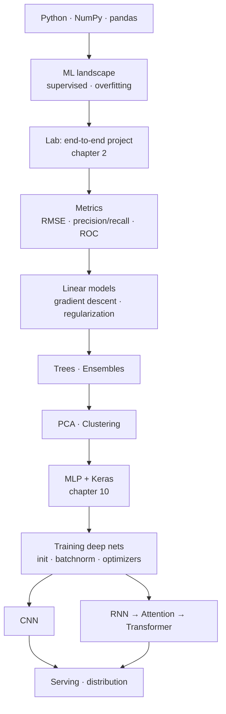

# Machine Learning

**This is a *concept* group that comes with tools.** It differs from data-modeling in
that everything here has to run — a model that never trains into a number gives you
nothing to trust. It differs from dbt/Kafka in that the theory (bias/variance, gradient
descent, attention) **decays very slowly**, while the APIs (`tf.keras`, `sklearn`) change
every release.

So this section splits in two, and **invests differently in each half**: the theory is
written carefully once, the API only lives in `cheatsheets/` — look it up, then throw it away.

> This section answers **"how a model learns, and why it goes wrong"**. Getting data to
> where the model can read it lives in [ETL](../etl/index.md) and
> [Data Modeling](../data-modeling/index.md).

Status: **not started**. Every table below is a planned table of contents — no file written yet.

## Source

Aurélien Géron — *Hands-On Machine Learning with Scikit-Learn, Keras & TensorFlow*,
3rd edition (2022). **19 chapters · 310 lessons · 1,550 multiple-choice questions**, read
on an internal learning platform.

Picking one book as the backbone instead of collecting scattered material is deliberate:
once there is an order that has been road-tested, you can measure *how much is still
missing*. The [Coverage](#coverage-against-homl3) table below exists to answer exactly that.

## Two sub-topics

| Topic | HOML3 chapters | Content | Status |
|---|---|---|---|
| [**Foundations**](foundations/index.md) | 1–9 | Scikit-Learn — regression, classification, SVM, trees, ensembles, PCA, clustering | ⬜ not started |
| [**Deep Learning**](deep-learning/index.md) | 10–19 | Keras / TensorFlow — MLP, CNN, RNN, transformers, GANs, RL, deployment | ⬜ not started |

**The split lands on the 9/10 boundary because that is the book's own boundary** — Part I
stops where everything still fits inside `sklearn`, Part II starts when you have to write
the training loop yourself. Folding all 19 chapters into one directory gives `reference/`
more than 25 files and a table of contents nobody can read.

## Learning path

**Shortest path to something usable: ML landscape → end-to-end lab → metrics → linear
models → ensembles.** Those five steps are enough for a real tabular problem. Deep
learning only pays off when the data is images, text, or sequences — on tables, gradient
boosting still wins.

## The big traps, stated up front

| Trap | Consequence | Lives in |
|---|---|---|
| Fitting a scaler/imputer **before** splitting off the test set | Beautiful fake test score, production collapses | [Foundations · case study](foundations/index.md) |
| Using accuracy on class-imbalanced data | Always answering "no" also scores 99% | [Foundations · metrics](foundations/index.md) |
| Choosing hyperparameters on the test set | The test set becomes a second training set | [Foundations · cross-validation](foundations/index.md) |
| An RNN forecasting a time series by repeating the last value | A pretty forecast curve that is useless | [Deep Learning · RNN](deep-learning/index.md) |
| Preprocessing at serving time differing from training time | Training/serving skew — right model, wrong output | [Deep Learning · serving](deep-learning/index.md) |

None of the five is **a coding error**. The program runs green, the loss drops nicely.
The mistake happened before the call to `.fit()`.

## Coverage against HOML3

| Ch. | Title | Lessons | Topic | Status |
|---|---|---|---|---|
| 1 | The Machine Learning Landscape | 11 | Foundations | ⬜ |
| 2 | End-to-End Machine Learning Project | 20 | Foundations | ⬜ |
| 3 | Classification | 12 | Foundations | ⬜ |
| 4 | Training Models | 15 | Foundations | ⬜ |
| 5 | Support Vector Machines | 9 | Foundations | ⬜ |
| 6 | Decision Trees | 9 | Foundations | ⬜ |
| 7 | Ensemble Learning and Random Forests | 12 | Foundations | ⬜ |
| 8 | Dimensionality Reduction | 11 | Foundations | ⬜ |
| 9 | Unsupervised Learning Techniques | 16 | Foundations | ⬜ |
| 10 | Introduction to ANN with Keras | 22 | Deep Learning | ⬜ |
| 11 | Training Deep Neural Networks | 17 | Deep Learning | ⬜ |
| 12 | Custom Models and Training with TensorFlow | 12 | Deep Learning | ⬜ |
| 13 | Loading and Preprocessing Data with TensorFlow | 20 | Deep Learning | ⬜ |
| 14 | Deep Computer Vision Using CNNs | 24 | Deep Learning | ⬜ |
| 15 | Processing Sequences Using RNNs and CNNs | 15 | Deep Learning | ⬜ |
| 16 | NLP with RNNs and Attention | 18 | Deep Learning | ⬜ |
| 17 | Autoencoders, GANs, and Diffusion Models | 16 | Deep Learning | ⬜ |
| 18 | Reinforcement Learning | 12 | Deep Learning | ⬜ |
| 19 | Training and Deploying TF Models at Scale | 20 | Deep Learning | ⬜ |

**291 theory lessons + 19 end-of-chapter exercise sets = 310.** The *Status* column turns
🟡 once a chapter has at least one file, and ✅ once its lab has been run by hand into real numbers.

Covering all 19 chapters is **not** the goal. Chapter 12 (custom TF) and 18 (RL) may stop
at a single reference file — they come up so rarely that writing a case study would mean
inventing a scenario, which is exactly what rule
[R15](https://github.com/vuhoang001/knowledge/blob/main/ROUTING.md) exists to prevent.

## Where the labs run

Same convention as the rest of this repo: **code lives outside the repo**, in
`~/learn-lab/ml/` (its own venv, `scikit-learn` + `tensorflow`). The repo keeps only the
**inputs** and the **results pasted back in**.

One difference from the dbt lab: the HOML3 datasets (California housing, MNIST,
Fashion-MNIST, CIFAR-10) download through library functions, so no seeds are needed in
`lab-starter/`. What must be recorded instead is **the random seed and the library
versions** — without those two, a number pasted into a note cannot be reproduced, and the
note loses its value as evidence.

## Related Topics

- [Python](../languages/python/index.md) — NumPy, pandas, the base of everything here
- [Data Quality](../data-quality/index.md) — dirty data in, dirty model out
- [Data Modeling](../data-modeling/index.md) — which table the features come from, at which grain
- [Glossary](../glossary/index.md)
