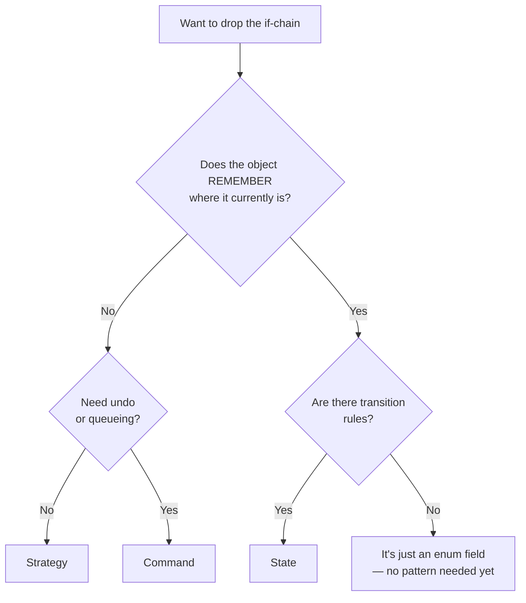

# Which pattern to choose — start from the symptom, not the list

> **Takeaway:** Don't ask *"which pattern is good?"*. Ask *"where does my code hurt?"* and look it
> up backwards. Three patterns look identical in UML — Strategy, State, Command — and answer three
> completely different questions; there's runnable evidence below.

## Goal

Turn 23 names into a lookup table you can use while actually fixing code, instead of a list you have
to memorise.

## Starting from the symptom

Find the row describing what's bothering you. The right-hand column is where to read next.

### Symptoms about creating objects

| Symptom in the code | Pattern |
|---|---|
| A `switch` on a type code purely to `new` the corresponding class | [Factory Method](../skills/factory-method.md) |
| Several product families that must match (button + input + menu of the same theme) | [Abstract Factory](../skills/abstract-factory.md) |
| A 9-parameter constructor, half of them `null`, that still compiles when called in the wrong order | [Builder](../skills/builder.md) |
| Creation is very expensive (file reads, queries) and you need many near-identical copies | [Prototype](../skills/prototype.md) |
| You need exactly one instance shared across the whole application | [Singleton](../skills/singleton.md) — read the "when not to" part carefully |

### Symptoms about how objects are assembled

| Symptom in the code | Pattern |
|---|---|
| An external library has an API that doesn't match what you need | [Adapter](../skills/adapter.md) |
| Subclass names combining two categories (`MysqlBaoCaoPdf`, `PostgresBaoCaoExcel`) | [Bridge](../skills/bridge.md) |
| Handling "one thing" and "a group of things" with two different code branches | [Composite](../skills/composite.md) |
| You want to add behaviour (logging, caching, retries) without touching the original class | [Decorator](../skills/decorator.md) |
| A caller has to know 6 classes and the right calling order to get one job done | [Facade](../skills/facade.md) |
| Millions of near-identical objects eating all the RAM | [Flyweight](../skills/flyweight.md) |
| You need to step in before the real object is touched (lazy loading, permission checks, remote calls) | [Proxy](../skills/proxy.md) |

### Symptoms about how they talk to each other

| Symptom in the code | Pattern |
|---|---|
| A chain of `if`s checking many conditions, each with its own handler | [Chain of Responsibility](../skills/chain-of-responsibility.md) |
| You need undo/redo, an operation queue, or a record of operations to replay | [Command](../skills/command.md) |
| There's a small language to parse (filter expressions, formulas) | [Interpreter](../skills/interpreter.md) |
| You want to traverse a structure without exposing how it's stored inside | [Iterator](../skills/iterator.md) |
| n classes all know each other, forming an n×n web | [Mediator](../skills/mediator.md) |
| You need to restore a previous state without breaking encapsulation | [Memento](../skills/memento.md) |
| One place changes, many places need to know, and the number of "many places" varies | [Observer](../skills/observer.md) |
| `if (trangThai == ...)` repeated across many methods, with transition rules | [State](../skills/state.md) |
| Several algorithms with the same purpose, one chosen at run time | [Strategy](../skills/strategy.md) |
| Several similar flows differing in just a few steps in the middle | [Template Method](../skills/template-method.md) |
| You need to add a **new operation** over a tree of fixed types | [Visitor](../skills/visitor.md) |

## A decision tree for the three most-confused patterns



Branch `H` is the most frequently forgotten one, and also the most frequently correct answer.

## Worked example — evidence the three patterns don't substitute for each other

In UML, Strategy / State / Command are all *"one interface, several implementing classes"*. In a picture
they look identical. Put **the same sequence of operations** through all three, and the results say
clearly where they differ.

Run with `dotnet run 05-choosing.cs` on .NET 11.0.0. The sequence: press three times.

```csharp
var day = new[] { "nhan", "nhan", "nhan" };
```

### Strategy — each call is independent

```csharp
interface IGiamGia { decimal Ap(decimal gia); }
sealed class GiamPhanTram(int pt) : IGiamGia { public decimal Ap(decimal gia) => gia * (100 - pt) / 100m; }
```

### State — the object remembers where it is

```csharp
sealed class DenGiaoThong
{
    public string TrangThai { get; private set; } = "Do";
    public void Nhan() => TrangThai = TrangThai switch { "Do" => "Xanh", "Xanh" => "Vang", _ => "Do" };
}
```

### Command — the request is an object, so it can be undone

```csharp
interface ILenh { void ThucThi(); void HoanTac(); }
sealed class RutTien(TaiKhoan tk, decimal tien) : ILenh
{
    public void ThucThi() => tk.So -= tien;
    public void HoanTac() => tk.So += tien;
}
```

### The results

```text
Strategy — moi lan goi doc lap:
  gia 100.000 -> 90,000
  gia 100.000 -> 90,000
  gia 100.000 -> 90,000
State — cung mot thao tac, ket qua doi theo lich su:
  nhan -> Xanh
  nhan -> Vang
  nhan -> Do
Command — hoan tac duoc vi yeu cau la doi tuong:
  rut 20.000 -> so du 80,000
  rut 20.000 -> so du 60,000
  rut 20.000 -> so du 40,000
  hoan tac    -> so du 60,000
  hoan tac    -> so du 80,000
  hoan tac    -> so du 100,000

pattern      nho trang thai?   hoan tac?    ai chon nhanh?
----------------------------------------------------------
Strategy               khong       khong         nguoi goi
State                     co       khong   chinh doi tuong
Command         co (de undo)          co         nguoi goi
```

**Three presses, three kinds of result.** Strategy gives three identical lines — it has no memory.
State gives three different lines — the same `Nhan()` call produces three results because the object
remembers its history. Command gives six lines — three doings and three undoings in reverse, because each
operation was made into an object holding enough information to reverse itself.

### The distinguishing table

| Question | Strategy | State | Command |
|---|---|---|---|
| Who decides which branch to use | The caller | The object itself | The caller |
| Does this branch know the next one | No | **Yes** — that's the transition rule | No |
| Do two consecutive calls give the same result | Yes | **No** | No (external state already changed) |
| Can it be stored and run later | Meaningless | No | **Yes** |
| What breaks if you mistake it for this one | Using Strategy for a flow with transition rules → the rules scatter across the callers | Using State for a pure algorithm → a useless extra layer | Using Command with no need for undo → every command has to write an empty `HoanTac` |

The last row is the one worth remembering. A failure from mistakenly using Strategy for a state machine:
[An illegal state transition](../case-studies/chuyen-trang-thai-trai-phep.md).

## When the right answer is "no pattern at all"

Three situations, all three more common than people think:

| Situation | Why not to |
|---|---|
| There's only **one** variant, and nobody has promised a second | Abstracting from one sample nearly always picks the wrong axis of variation |
| The list of branches is decided by a programmer and used in one place | An inline `switch` reads faster, and the compiler can check its exhaustiveness |
| Nobody on the team has ever read that pattern | The cost of explaining exceeds the problem's cost; a pattern is vocabulary, and vocabulary only has value when shared |

See also [When not to use a pattern](what-is-a-pattern.md#when-not-to-use-a-pattern)
and the failure case [Abstract Factory for one implementation](../case-studies/abstract-factory-cho-mot-hien-thuc.md).

## The commonly confused pairs

| Pair | They differ in |
|---|---|
| [Adapter](../skills/adapter.md) ↔ [Facade](../skills/facade.md) | Adapter changes an API's **shape** to fit; Facade **hides** several APIs behind one door |
| [Decorator](../skills/decorator.md) ↔ [Proxy](../skills/proxy.md) | Decorator **adds behaviour**, and the caller chooses how many layers to wrap; Proxy **controls access**, usually one layer, and the caller doesn't know |
| [Strategy](../skills/strategy.md) ↔ [Template Method](../skills/template-method.md) | Strategy plugs an object in at run time; Template Method fixes it by inheritance at compile time |
| [Composite](../skills/composite.md) ↔ [Decorator](../skills/decorator.md) | The same tree structure, but Composite has **many** children and Decorator has **exactly one** |
| [Mediator](../skills/mediator.md) ↔ [Observer](../skills/observer.md) | Mediator knows everyone and coordinates; Observer only emits a signal and doesn't know who's listening |
| [Builder](../skills/builder.md) ↔ [Abstract Factory](../skills/abstract-factory.md) | Builder constructs **one** complex object over several steps; Abstract Factory constructs **a family** of objects in one go |
| [State](../skills/state.md) ↔ [Strategy](../skills/strategy.md) | See the table above — State knows the next state, Strategy doesn't |

## Trade-offs

| What reverse lookup from a symptom gains you | What you lose |
|---|---|
| You don't have to remember 23 names | You have to be able to describe the symptom — which means reading the code carefully first |
| You avoid applying a pattern before there's a problem | The lookup table can point you at a pattern too heavy for a small problem |
| You talk to the team in problems, not solutions | One symptom sometimes maps to 2–3 patterns; you still have to read the consequences |

## Common Mistakes

| Mistake | Consequence |
|---|---|
| Choosing the pattern you just finished learning | Every problem looks like a nail |
| Stopping at the lookup table and not reading that pattern's "when NOT to use it" | The right recipe, the wrong context |
| Using Strategy for a flow with transition rules | The transition rules scatter across every caller, owned by nobody |
| Using Command with no need for undo/queueing | Every command needs an empty `HoanTac()` — dead code |
| Stacking two patterns on the same point of pain | You can't remove either one when the problem changes |

## FAQ

<details>
<summary>One symptom points at two patterns — how do I choose?</summary>

Choose the **weaker** one first. The escalation order commonly used:

an inline `switch` → a delegate/`Func` → Strategy with classes → Factory + Strategy → Abstract Factory

Stop at the first level that solves today's problem. Climbing one step up is always easier than climbing
back down, because coming down means removing an abstraction the whole team has got used to.

</details>

<details>
<summary>Does this lookup table hold for non-object-oriented code?</summary>

Mostly yes, only the incarnation changes. In modern C#:

- Strategy → `Func<T, TResult>`
- Command → a `record` + a `Xu Ly` function
- Template Method → a function taking delegates for the varying steps
- Observer → `event` or `IObservable<T>`

The symptoms and the consequences don't change; only the amount of code drops. That's why this table is
indexed by symptom rather than by class diagram.

</details>

<details>
<summary>Should I put the pattern name in the class name?</summary>

Only when the name **helps the reader predict correctly**. `PhiShipStrategy` does add the information
that there are several variants and they're interchangeable — that's real information.

Conversely `OrderManagerFactoryStrategy` doesn't say what the class *does*. The rule: the name must answer
"what does it do" first, "how is it arranged" second, and only if there's room left.

</details>

## Related Topics

- [What a design pattern is](what-is-a-pattern.md) — the "when not to use one" section
- [SOLID](solid.md) — the reason behind most of the entries in the table
- [Coupling and cohesion](coupling-cohesion.md) — the price paid for each step up the escalation
- [Cheatsheet: the 23 GoF](../cheatsheets/gof-23.md) — the one-page table, for looking things up while coding
- [Exercise: refactoring a switch into a pattern](../tutorials/refactor-switch-sang-pattern.md) — really doing three of the escalation steps

## References

- GoF — *Design Patterns*, the "Design Aliases" appendix and the chapter 1 classification table
