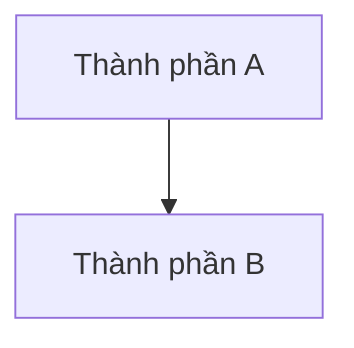

# <Tên chủ đề>

> **Chốt:** <một câu duy nhất. Nếu sáu tháng sau chỉ nhớ được một dòng, dòng đó là đây.>

## Mục tiêu

<Kiến thức này giải quyết vấn đề gì? Viết bằng vấn đề, không bằng định nghĩa.>

## Tổng quan

<3–5 câu. Đọc xong đoạn này phải trả lời được "nó là cái gì" mà không cần đọc tiếp.>

## Vì sao cần

<Chuyện gì xảy ra nếu KHÔNG có nó. Đây là chỗ giá trị thật, không phải mục "tính năng".>

## Kiến trúc

<Sơ đồ Mermaid nếu có nhiều hơn hai thành phần.>



## Thành phần

| Thành phần | Là gì | Khi nào chạm tới |
|---|---|---|
| | | |

## Luồng hoạt động

<Đi từ đầu vào tới đầu ra, đánh số bước.>

## Ví dụ

<Code chạy được, có output thật dán vào. Ví dụ bịa không tính.>

## Khi nào nên dùng

## Khi nào KHÔNG nên dùng

<Mục này quan trọng ngang mục trên. Thiếu nó là tài liệu quảng cáo, không phải tài liệu kỹ thuật.>

## Ưu điểm

## Nhược điểm

## Trade-offs

| Được | Mất | Đổi lấy |
|---|---|---|
| | | |

## Best Practices

## Common Mistakes

| Lỗi | Hậu quả | Phòng bằng |
|---|---|---|
| | | |

## FAQ

<details>
<summary>Câu hỏi?</summary>

Trả lời.

</details>

## Interview Questions

1. <Câu hỏi mức hiểu>
2. <Câu hỏi mức đánh đổi — đây mới là chỗ phân loại>

## Feynman Explanation

<Giải thích cho người chưa biết gì, không dùng thuật ngữ chưa định nghĩa. Chỗ nào
phải nói vòng vo là chỗ mình chưa thật sự hiểu.>

## Flashcards

```text
Q: <câu hỏi>
A: <trả lời>
---
Q: <câu hỏi>
A: <trả lời>
```

## Case Study

<Trường hợp thật đã gặp, kèm cái SAI lúc đầu — không chỉ cách đúng cuối cùng.>

## Learning Path

```text
<Prerequisite> → <Chủ đề này> → <Chủ đề kế>
```

## Related Topics

## Prerequisites

## Next Topics

## References

## Further Reading
